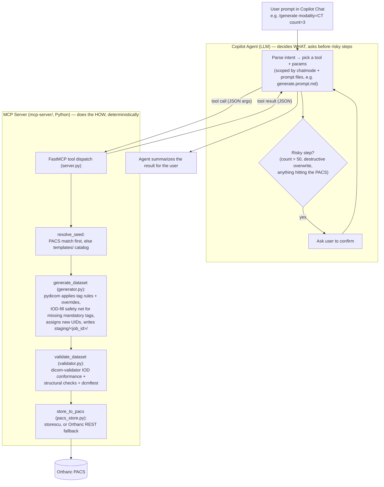

# Pixel-Atlas
Generate realistic, customizable DICOM test dataset for development, testing and training.

## How it works

Two things split the work: the **Copilot agent** (the LLM, in VS Code chat)
decides *what* to do and confirms risky steps with you; the **MCP server**
(`mcp-server/`, plain Python) does the *how*, deterministically — no LLM
involved once a tool is called.



- **Agent (LLM) responsibilities:** understand the request, choose which MCP
  tool(s) to call and with what arguments, resolve natural-language DICOM
  terms to tag keywords (e.g. "Modality LUT" → `ModalityLUTSequence`), and
  gate anything risky — large batches, destructive overwrites, and every
  PACS store — behind an explicit confirmation. It never touches DICOM files
  or the PACS directly.
- **MCP server responsibilities:** everything after a tool is called is
  plain, testable Python — load a seed (template or PACS), apply tag rules
  with `pydicom`, assign UIDs, validate against the DICOM standard, and
  store. Every call is logged to `.pixel-atlas/logs/agent.log` regardless of
  which side (agent or server) is at fault if something goes wrong.
- Chat mode + prompt files (`.github/chatmodes/`, `.github/prompts/`) are
  what keep the agent from wandering — each slash command scopes the model
  down to only the tools that command needs, rather than leaving every tool
  visible for every request.

## Setup guides

- [VS Code, Git, and Claude setup](docs/vscode-git-claude-setup.md)
- [Docker with WSL setup (without Docker Compose)](docs/docker-wsl-setup.md)
- [Orthanc setup (without Docker Compose)](docs/orthanc-setup.md)

Each guide includes step-by-step instructions and a verification section for the relevant setup steps.

## Project layout

Each folder has its own README with details on its contents:

| Folder | Contents |
|---|---|
| [docs/](docs/README.md) | Design docs, execution plan, setup guides |
| [mcp-server/](mcp-server/README.md) | The Pixel Atlas MCP server (Python) |
| [templates/](templates/README.md) | Tag template catalog + fallback seed data |
| [.vscode/](.vscode/README.md) | MCP server registration for VS Code |
| [.github/](.github/README.md) | Copilot chat mode, instructions, and slash-command prompt files |
| [staging/](staging/README.md) | Scratch output for in-progress generation jobs (gitignored) |
| [scripts/](scripts/README.md) | `setup.ps1` — happy-path environment bootstrap |
| `.pixel-atlas/logs/` | Runtime audit log (`agent.log`, gitignored) — see [solution-design.md §13](docs/solution-design.md#13-status--observability) |

## Copilot agent design docs

Design for the GitHub Copilot agent that generates/modifies test DICOM data on request:

- [Use cases](docs/use-cases.md) — actors, commands, and detailed use cases
- [Solution design](docs/solution-design.md) — workflow, template system, validation, token economy
- [Architecture](docs/architecture.md) — components, MCP server spec, deployment, and diagrams
- [execution plan](docs/execution-plan-phases1-3.md) — implementation scope/schedule for the current build
- [Demo script](docs/demo-script.md) — end-to-end walkthrough of every implemented command
- [Sample prompts](docs/sample-prompts.md) — 3-4 example Copilot Chat prompts per use case, for ad hoc manual testing

### Local dev environment for the MCP server

```powershell
python -m venv .venv
.venv\Scripts\pip install -r mcp-server\requirements.txt
```

Orthanc is expected to already be running per [orthanc-setup.md](docs/orthanc-setup.md)
(`http://localhost:8042`, DICOM port 4242, credentials `orthanc`/`orthanc`).
Override via `ORTHANC_URL` / `ORTHANC_USER` / `ORTHANC_PASSWORD` env vars if different.

Run the server directly for a quick check (it will idle waiting for stdio input — Ctrl+C to exit):

```powershell
.venv\Scripts\python mcp-server\server.py
```

Normally it's launched automatically by VS Code via `.vscode/mcp.json` when the
`Pixel Atlas` chat mode is selected.

### Testing with Copilot Chat

Once the venv is set up and Orthanc is running, you can test the read-only tools via Copilot Chat:

**Prerequisites:**
- VS Code with GitHub Copilot Chat extension installed and signed in
- Copilot **Agent Mode** enabled (org policy controlled — check Copilot settings)
- **MCP Servers** enabled in Copilot settings (usually enabled by default once Agent Mode is on)

**Steps:**

1. **Reload VS Code** to pick up the MCP server registration from `.vscode/mcp.json`:
   - Press `Ctrl+R` or go to View → Command Palette → "Developer: Reload Window"
   - You should see the MCP server start (check the Output panel, Copilot channel, for any errors)

2. **Open Copilot Chat**:
   - Press `Ctrl+Shift+I` or click the Copilot Chat icon in the Activity Bar

3. **Switch to the Pixel Atlas chat mode** (dropdown at the top of the Chat panel):
   - Click the mode selector and choose **Pixel Atlas**
   - This restricts the available tools to `pixel-atlas/*` only

4. **Test the read-only commands**:

   ```
   /list-templates
   ```
   Expected: a table with the four generic IOD templates we've implemented — `ct-image` (CT), `mr-image` (MR), `us-image` (US), `mg-image` (MG) — each with blank `body_part`/`orientation` (generic, IOD-level) and `has_seed_data` (true).

   ```
   /status
   ```
   Expected: a status table showing:
   - `mcp_server`: ok
   - `orthanc_reachable`: true (with Orthanc version and URL)
   - `dcmtk_binaries_on_path`: `dcmodify`/`storescu`/`findscu`/`dcmftest` true, `dciodvfy` false (expected — IOD conformance is covered by `dicom-validator` instead, see Phase 3 status above)
   - `template_count`: 4 (one generic IOD template each for CT/MR/US/MG)

   ```
   /status job=does-not-exist
   ```
   Expected: an error message saying no job found with that id (since the job registry is empty until a `/generate` job populates it).

5. **Test generation** (make sure DCMTK's `bin` folder, e.g.
   `C:\tools\dcmtk-3.7.0-win64-dynamic\bin`, is on PATH before launching VS Code
   so `storescu` is available to the MCP server process):

   ```
   /generate modality=CT count=3 orientation=axial body_part=CHEST
   ```
   Expected: since Orthanc has no CHEST/axial CT data yet, the agent reports no
   PACS match and asks to confirm falling back to the `ct-image` template
   seed (CT Image IOD, generic — CHEST/axial come from the requested
   overrides). On confirmation, it generates 3 instances and validates them (reporting
   `passed: true` with `iod_conformance.files_with_errors: 0`), then — **before
   storing anything** — shows a summary and asks you to confirm the store.
   Only after that confirmation does it call `store_to_pacs(..., confirm_store=True)`
   and summarize job_id/study_uid/stored_count. This store confirmation
   happens on every `/generate` call, not just large ones.

   ```
   /generate modality=CT count=200 orientation=axial body_part=CHEST
   ```
   Expected: same as above, plus an explicit >50-instance confirmation prompt
   before generation starts.

   ```
   /generate modality=CT count=2 prior_of=<study_uid from the previous /generate> days_before=90
   ```
   Expected: the agent generates 2 instances that share the referenced study's
   `PatientID` and have a `StudyDate` 90 days earlier, with their own new
   `StudyInstanceUID`. The summary should call out the shared PatientID and
   computed StudyDate explicitly.

6. **Test the generic PACS feature lookup** (natural language, or the
   `/check-feature` slash command — see the troubleshooting note below on
   why the slash-command form is more reliable):

   ```
   Do we have any CT study with a Modality LUT?
   ```
   Expected: the agent recognizes "Modality LUT" as `ModalityLUTSequence`
   (tag `0028,3000`) itself, calls `check_pacs_feature(tag="ModalityLUTSequence", modality="CT")`,
   and reports 0 matches (none of our synthetic seeds include one).

   ```
   Is there a study where RescaleSlope is 1?
   ```
   Expected: the agent calls `check_pacs_feature(tag="RescaleSlope", value="1")`
   and reports the matching studies (should exclude the one pre-existing real
   study that lacks `RescaleSlope`).

**Troubleshooting:**

| Problem | Check |
|---|---|
| Chat mode dropdown doesn't show Pixel Atlas | `.github/chatmodes/pixel-atlas.chatmode.md` exists and is valid YAML; try reloading VS Code |
| "MCP server not found" error in chat | Check Copilot Output panel (View → Output → Copilot) for stderr from the server; verify `.vscode/mcp.json` path is correct |
| `/list-templates` times out or returns empty | Check `mcp-server/server.py` starts without error: `.venv\Scripts\python mcp-server\server.py` (Ctrl+C to exit); verify `templates/catalog.yaml` exists |
| `/status` shows `orthanc_reachable: false` | Verify Orthanc container is running (`docker ps`) and listening on `localhost:8042`; check `ORTHANC_URL`/`ORTHANC_USER`/`ORTHANC_PASSWORD` in `.vscode/mcp.json` match your setup |
| `store_to_pacs` reports `method: orthanc_rest` instead of `storescu` | `storescu` isn't on PATH for the process VS Code launched the MCP server from — add DCMTK's `bin` folder to the system/user PATH (not just the current shell) and reload VS Code |
| Agent says a tool (e.g. `check_pacs_feature`) "is not available in this session", or loops calling an unrelated tool (e.g. `get_job_status` with a made-up job id) instead of the one it needs | Fully **restart** VS Code (not just "Reload Window") and start a **new** chat conversation — a stale session can cache an older tool list. Verify in the chat's tools picker (wrench icon) that the tool is checked/enabled for the `pixel-atlas` server. If it's still missing, check View → Output → the MCP output channel for the actual `tools/list` response. Prefer the slash-command form (e.g. `/check-feature`) over free-form phrasing when this happens — slash commands scope the model to only the tools that command needs, which is what actually prevents the wandering. |
| Agent maps your phrase to the wrong DICOM tag (e.g. treats "Modality LUT" as `RescaleSlope`) | This was a real bug in `pixel-atlas.chatmode.md`'s own wording (two unrelated example tags mentioned in the same sentence, which the model conflated) — fixed, but if you see it recur with a different tag pair, it's the same class of issue: report which phrase/tag pair, so the chatmode instructions can be tightened further. |
