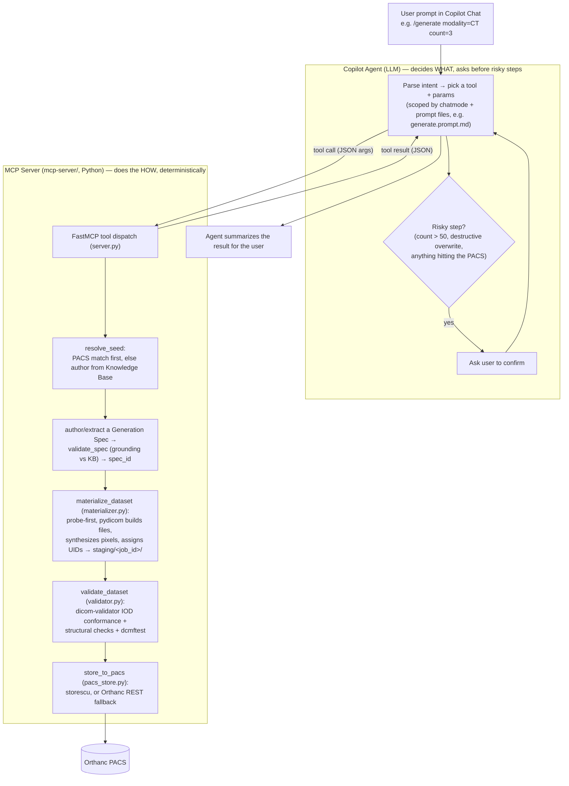

# Pixel-Atlas
Generate realistic, customizable DICOM test dataset for development, testing and training.

## How it works

Two things split the work: the **Copilot agent** (the LLM, in VS Code chat)
decides *what* to do and confirms risky steps with you; the **MCP server**
(`mcp-server/`, plain Python) does the *how*, deterministically — no LLM
involved once a tool is called.

- **Agent (LLM) responsibilities:** understand the request, choose which MCP
  tool(s) to call and with what arguments, resolve natural-language DICOM
  terms to tag keywords (e.g. "Modality LUT" → `ModalityLUTSequence`), and
  gate anything risky — large batches, destructive overwrites, and every
  PACS store — behind an explicit confirmation. It never touches DICOM files
  or the PACS directly.
- **MCP server responsibilities:** everything after a tool is called is
  plain, testable Python — ground the spec against the standard-derived
  Knowledge Base, build the dataset with `pydicom`, synthesize pixels, assign
  UIDs, validate against the DICOM standard, and store. Every call is logged to
  `.pixel-atlas/logs/agent.log`.
- Chat mode + prompt files (`.github/chatmodes/`, `.github/prompts/`) are
  what keep the agent from wandering — each slash command scopes the model
  down to only the tools that command needs, rather than leaving every tool
  visible for every request.

## Setup guides

- [VS Code, Git, and Claude setup](../docs/vscode-git-claude-setup.md)
- [Docker with WSL setup (without Docker Compose)](../docs/docker-wsl-setup.md)
- [Orthanc setup (without Docker Compose)](../docs/orthanc-setup.md)

Each guide includes step-by-step instructions and a verification section for the relevant setup steps.

## Project layout

Each folder has its own README with details on its contents:

| Folder | Contents |
|---|---|
| [../docs/](../docs/README.md) | Design docs, execution plan, setup guides |
| [mcp-server/](mcp-server/README.md) | The Pixel Atlas MCP server (Python) |
| `recipes/` | Auto-grown cache of validated Generation Specs (created on first successful generation) |
| [.vscode/](.vscode/README.md) | MCP server registration for VS Code |
| [.github/](.github/README.md) | Copilot chat mode, instructions, and slash-command prompt files |
| [staging/](staging/README.md) | Scratch output for in-progress generation jobs (gitignored) |
| [scripts/](scripts/README.md) | `setup.ps1` — happy-path environment bootstrap |
| `.pixel-atlas/logs/` | Runtime audit log (`agent.log`, gitignored) — see [solution-design.md](../docs/solution-design.md) |

## Copilot agent design docs

Design for the GitHub Copilot agent that generates/modifies test DICOM data on request:

- [Solution design](../docs/solution-design.md) — Knowledge Base, Generation Spec, materialization, token economy
- [Architecture](../docs/architecture.md) — components, tool contract, diagrams
- [Simple overview](../docs/ai-driven-simple-overview.md) — plain-English explanation
- [Comprehensive build plan](../docs/ai-driven-comprehensive-plan.md) — full scope, spec format, decisions ledger

Historical (template-based, superseded): [use cases](../docs/use-cases.md).

## Status

The AI-driven pipeline is implemented and verified end-to-end (single-frame,
multi-frame, PR, KO — all pass DICOM conformance; live `extract_spec`/`modify`
against Orthanc). The one thing never exercised in a live Copilot Chat session is
the interactive agent loop itself — every check has been a direct tool call.
