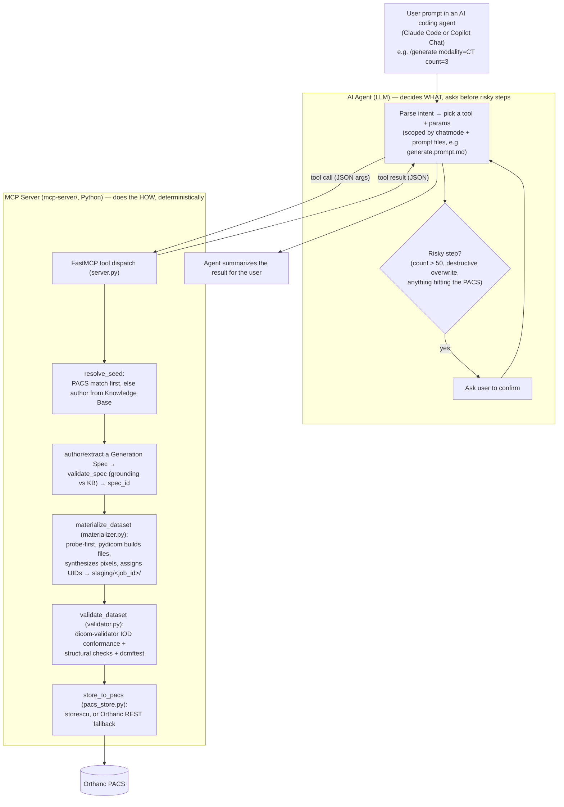

# Pixel-Atlas
Generate realistic, customizable DICOM test dataset for development, testing and training.

## How it works

Two things split the work: the **AI coding agent** (Claude Code or Copilot
Chat, in VS Code) decides *what* to do and confirms risky steps with you; the
**MCP server** (`mcp-server/`, plain Python) does the *how*, deterministically
— no LLM involved once a tool is called. See
[docs/ai-driven-simple-overview.md](docs/ai-driven-simple-overview.md) for a
plain-English walkthrough with diagrams and real token-cost numbers.



- **Agent (LLM) responsibilities:** understand the request, choose which MCP
  tool(s) to call and with what arguments, resolve natural-language DICOM
  terms to tag keywords (e.g. "Modality LUT" → `ModalityLUTSequence`), and
  gate anything risky — large batches, destructive overwrites, and every
  PACS store — behind an explicit confirmation. It never touches DICOM files
  or the PACS directly.
- **MCP server responsibilities:** everything after a tool is called is
  plain, testable Python — ground the spec against the Knowledge Base, build the
  dataset and synthesize pixels with `pydicom`, assign UIDs, validate against the
  DICOM standard, and store. Every call is logged to `.pixel-atlas/logs/agent.log`.
- Chat mode + prompt files (`.github/chatmodes/`, `.github/prompts/`) are
  what keep the agent from wandering — each slash command scopes the model
  down to only the tools that command needs, rather than leaving every tool
  visible for every request.

## Quick Start

1. **[Complete Setup (one guide)](docs/SETUP.md)** — WSL, Docker, Git, VS Code, Python, Orthanc, MCP
2. **[Usage Examples](docs/QUICKSTART.md)** — Basic generation, multi-series, PR/KO, common commands

**First time?** Start with [docs/SETUP.md](docs/SETUP.md) (30 min), then [docs/QUICKSTART.md](docs/QUICKSTART.md).

## Project layout

Each folder has its own README with details on its contents:

| Folder | Contents |
|---|---|
| [docs/](docs/README.md) | Design docs, execution plan, setup guides |
| [mcp-server/](mcp-server/README.md) | The Pixel Atlas MCP server (Python) |
| `recipes/` | Auto-grown cache of validated Generation Specs (gitignored) |
| [.vscode/](.vscode/README.md) | MCP server registration for VS Code |
| [.github/](.github/README.md) | Copilot chat mode, instructions, and slash-command prompt files |
| [staging/](staging/README.md) | Scratch output for in-progress generation jobs (gitignored) |
| [scripts/](scripts/README.md) | `setup.ps1` — happy-path environment bootstrap |
| `.pixel-atlas/logs/` | Runtime audit log (`agent.log`, gitignored) — see [solution-design.md](docs/solution-design.md) |

## How to generate (30-second version)

```
User: "100 axial CT instances"
  ↓
Claude Code (via MCP)
  ↓
generate_study(modality="CT", count=100, orientation="axial")
  ↓
[MCP server: validate spec, synthesize pixels, assign UIDs, save .dcm files]
  ↓
validate_dataset [IOD conformance check]
  ↓
store_to_pacs [copy to Orthanc]
  ↓
✓ Study in PACS
```

## How it works (deeper dive)

- **[Solution Design](docs/solution-design.md)** — Knowledge Base, Generation Spec format, Materializer, token economy
- **[Architecture](docs/architecture.md)** — Components, MCP tool reference, data flow diagrams
- **[Simple Overview](docs/ai-driven-simple-overview.md)** — 10-minute plain-English explanation

## Full Documentation

See [docs/README.md](docs/README.md) for the complete guide index.
