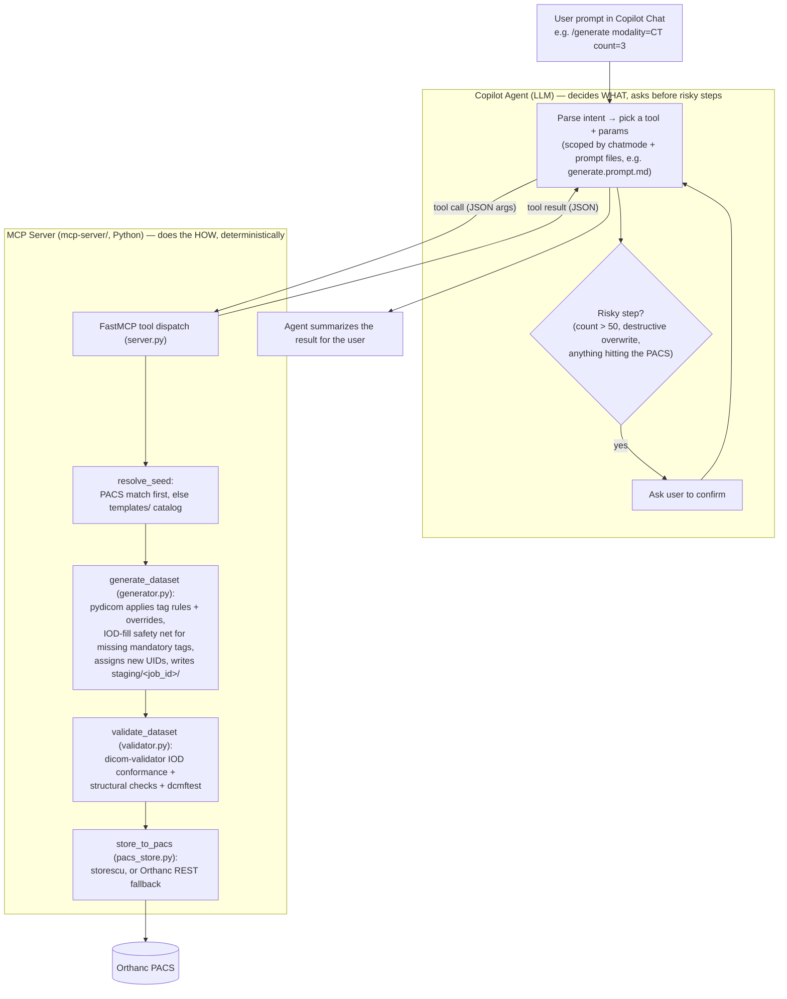

# Pixel-Atlas
Generate realistic, customizable DICOM test dataset for development, testing and training.

## How it works

Two things split the work: the **Copilot agent** (the LLM, in VS Code chat)
decides *what* to do and confirms risky steps with you; the **MCP server**
(`mcp-server/`, plain Python) does the *how*, deterministically — no LLM
involved once a tool is called.



- **Agent (LLM) responsibilities:** understand the request, choose which MCP
  tool(s) to call and with what arguments, resolve natural-language DICOM
  terms to tag keywords (e.g. "Modality LUT" → `ModalityLUTSequence`), and
  gate anything risky — large batches, destructive overwrites, and every
  PACS store — behind an explicit confirmation. It never touches DICOM files
  or the PACS directly.
- **MCP server responsibilities:** everything after a tool is called is
  plain, testable Python — load a seed (template or PACS), apply tag rules
  with `pydicom`, assign UIDs, validate against the DICOM standard, and
  store. Every call is logged to `.pixel-atlas/logs/agent.log` regardless of
  which side (agent or server) is at fault if something goes wrong.
- Chat mode + prompt files (`.github/chatmodes/`, `.github/prompts/`) are
  what keep the agent from wandering — each slash command scopes the model
  down to only the tools that command needs, rather than leaving every tool
  visible for every request.

## Setup guides

- [VS Code, Git, and Claude setup](docs/vscode-git-claude-setup.md)
- [Docker with WSL setup (without Docker Compose)](docs/docker-wsl-setup.md)
- [Orthanc setup (without Docker Compose)](docs/orthanc-setup.md)

Each guide includes step-by-step instructions and a verification section for the relevant setup steps.

## Project layout

Each folder has its own README with details on its contents:

| Folder | Contents |
|---|---|
| [docs/](docs/README.md) | Design docs, execution plan, setup guides |
| [mcp-server/](mcp-server/README.md) | The Pixel Atlas MCP server (Python) |
| [templates/](templates/README.md) | Tag template catalog + fallback seed data |
| [.vscode/](.vscode/README.md) | MCP server registration for VS Code |
| [.github/](.github/README.md) | Copilot chat mode, instructions, and slash-command prompt files |
| [staging/](staging/README.md) | Scratch output for in-progress generation jobs (gitignored) |
| [scripts/](scripts/README.md) | `setup.ps1` — happy-path environment bootstrap |
| `.pixel-atlas/logs/` | Runtime audit log (`agent.log`, gitignored) — see [solution-design.md §13](docs/solution-design.md#13-status--observability) |

## Copilot agent design docs

Design for the GitHub Copilot agent that generates/modifies test DICOM data on request:

- [Use cases](docs/use-cases.md) — actors, commands, and detailed use cases
- [Solution design](docs/solution-design.md) — workflow, template system, validation, token economy
- [Architecture](docs/architecture.md) — components, MCP server spec, deployment, and diagrams
- [3-day execution plan](docs/execution-plan-3day.md) — implementation scope/schedule for the current build
- [Demo script](docs/demo-script.md) — end-to-end walkthrough of every implemented command
- [Sample prompts](docs/sample-prompts.md) — 3-4 example Copilot Chat prompts per use case, for ad hoc manual testing

## Implementation status

Tracking progress against the [3-day execution plan](docs/execution-plan-3day.md).
This log is historical (Day 1-3 as originally scoped) — the template layer it
describes (`ct-chest-axial`, one CT-only template) was later replaced by the
per-IOD templates (`ct-image`/`mr-image`/`us-image`/`mg-image`) described
throughout the rest of this README and in `templates/README.md`.

### Day 1 — read-only MCP server (complete)

- [x] `mcp-server/` scaffolded: `server.py` (FastMCP, stdio), `config.py`,
      `orthanc_client.py`, `templates.py`, `job_registry.py`, `audit_log.py`.
- [x] `templates/catalog.yaml` + `templates/CT/ct-chest-axial/manifest.yaml`
      authored (tag-spec only, no seed `.dcm` yet — that's Day 2).
- [x] Read-only tools implemented and smoke-tested directly against the
      already-running Orthanc container:
      - `list_templates(modality?, body_part?, orientation?)`
      - `get_template_info(template_id)`
      - `list_pacs_studies(modality?, patient_name?, date_range?)` — via Orthanc's `/tools/find`
      - `get_job_status(job_id)` — in-memory registry stub (empty until Day 2 writes to it)
      - `health_check()` — MCP/Orthanc/DCMTK-on-PATH check; **added beyond the
        architecture.md §3 tool table** to back the no-job-id branch of `/status`
        (solution-design.md §13) since no formal tool covered it
- [x] Append-only audit log at `.pixel-atlas/logs/agent.log` (solution-design §13),
      written on every tool call.
- [x] VS Code wiring: `.vscode/mcp.json` (points at `.venv/Scripts/python.exe`),
      `.github/chatmodes/pixel-atlas.chatmode.md`, `.github/copilot-instructions.md`,
      prompt files `.github/prompts/status.prompt.md` and `list-templates.prompt.md`.
- [x] Manual verification of `/status` and `/list-templates` from Copilot Chat itself
      (confirmed working in an interactive VS Code session).

### Day 2 — generation pipeline (script-level complete, chat verification pending)

- [x] DCMTK installed manually (no winget/chocolatey package available) to
      `C:\tools\dcmtk-3.7.0-win64-dynamic\bin`. **Actually load-bearing in this
      codebase: only `storescu` and `dcmftest`** — and even `storescu` is a
      soft dependency, since `pacs_store.py` falls back to Orthanc REST upload
      if it's missing. `dcmodify`'s job is done in-process by `pydicom`
      (never shelled out to); `findscu` is unused because `orthanc_client.py`
      talks to Orthanc's REST API for every PACS query. `dciodvfy` is **not**
      a DCMTK binary at all — it ships in the separate `dicom3tools` project,
      which is not installed; see below. Net effect: DCMTK is not a hard
      prerequisite for Day 2 to work, only for the `storescu` code path to be
      preferred over the REST fallback.
- [x] Synthetic fallback seed generated for `ct-chest-axial`
      (`templates/CT/ct-chest-axial/generate_seed.py` → `seed/IM0001.dcm`,
      noise pixel data, no real patient data); `has_seed_data: true` in both
      the manifest and `catalog.yaml`.
- [x] `mcp-server/uid_strategy.py`: deterministic `generate_uid(job_id, index)`
      per solution-design.md §7.
- [x] `mcp-server/seed_resolver.py` → `resolve_seed(modality, body_part?, orientation?)`:
      PACS-first via `orthanc_client.find_studies`, template-fallback via the
      catalog, `source_type=none` with closest alternatives otherwise.
- [x] `mcp-server/generator.py` → `generate_dataset(template_id, seed_source, instance_count, overrides?, job_id?)`:
      loads the seed (template file or one Orthanc instance via a new
      `orthanc_client.fetch_first_instance_bytes`), applies `fixed`/`sequence`/
      `randomized` tag rules + overrides, writes new UIDs, saves to
      `staging/<job_id>/`. **Deviation:** tag rewriting is done in-process
      with `pydicom` rather than shelling out to `dcmodify` — avoids batch-script
      complexity for 200+ instance runs; see the module docstring.
- [x] `mcp-server/validator.py` → `validate_dataset(path)`: the manifest's 4
      structural checks (Study/SeriesInstanceUID consistency, SOPInstanceUID
      uniqueness, InstanceNumber ordering) run on 100% of instances, plus
      `dcmftest` file-readability on the sampled subset. Sampling policy
      implemented exactly as specified (100% for n≤50, first 5/last 5/random
      20 otherwise). IOD conformance was not run as of Day 2 (`dciodvfy` isn't
      installed) — **closed on Day 3**, see below.
- [x] `mcp-server/pacs_store.py` → `store_to_pacs(path)`: `storescu` batch
      C-STORE, falling back to Orthanc REST upload (`orthanc_client.upload_instance`)
      if `storescu` isn't on PATH.
- [x] All four tools wired into `server.py` (`resolve_seed`, `generate_dataset`,
      `validate_dataset`, `store_to_pacs`), each logged via `audit_log`.
- [x] End-to-end script test (bypassing Copilot): `resolve_seed` →
      `generate_dataset` → `validate_dataset` → `store_to_pacs` run directly
      for count=3 and count=200. Both passed validation and stored fully
      (`method: storescu`); Orthanc's `/statistics` showed 204 instances
      (1 pre-existing + 3 + 200) after both runs.
- [x] `.github/prompts/generate.prompt.md` wired, `pixel-atlas.chatmode.md`
      updated to reflect Day 2 tool availability and the `dciodvfy` caveat.
- [ ] The same `/generate` flow run **through Copilot Chat itself** (only the
      underlying tool functions have been verified directly so far).

### Day 3 — complete (script-level); Copilot Chat run-through still pending

- [x] **Priors generation** (new scope beyond the original 3-day brief):
      `generate_dataset(..., prior_of_study_uid=, days_before=)` looks up the
      reference study's `PatientID`/`PatientName`/`StudyDate` via a new
      `orthanc_client.get_study_details`, reuses that identity, and sets
      `StudyDate` to `days_before` days earlier — while still generating a
      fully independent `StudyInstanceUID`/`SeriesInstanceUID`/`SOPInstanceUID`
      set (never an in-place edit of the reference study). Wired into the
      `generate_dataset` MCP tool and `generate.prompt.md`'s `prior_of=`/
      `days_before=` params. Verified end-to-end: generated + stored a
      baseline study, then a prior 90 days earlier — Orthanc confirms both
      share `PatientID` with the expected `StudyDate` gap and distinct
      `StudyInstanceUID`s.
- [x] **Real IOD-conformance validation**: `dicom-validator` (pip-installable,
      validates against the DICOM standard's own module/IOD JSON definitions —
      same job as `dciodvfy`, without needing `dicom3tools`, which has no
      package-manager install path here either) is wired into
      `validate_dataset`'s `iod_conformance` field. First call per server
      process downloads/caches the standard (~40s, one-time); after that it's
      near-instant. Also fixed 4 real conformance gaps it surfaced in the
      Day 2 synthetic seed (missing `AcquisitionNumber`,
      `PositionReferenceIndicator`, `PatientPosition`,
      `ReferringPhysicianName`) — the seed now validates clean.
- [x] **Bug caught by this work, fixed**: `dicom-validator`'s default result
      handler logs to stdout — which would corrupt the MCP server's stdio
      JSON-RPC channel in production. Fixed by attaching a stderr handler to
      the root logger at the top of `server.py` before any tool runs, and by
      passing an explicit silent handler in `validator.py`.
- [x] **Generic PACS feature lookup** (new scope): "do we have an axial
      study" and "do we have a study with a Modality LUT" are the same
      underlying need — checking whether any tag is present (optionally with
      a value) on data already in the PACS. Added `check_pacs_feature(tag,
      value?, modality?, date_range?)` (`mcp-server/feature_lookup.py`,
      wired into `server.py`) — takes a DICOM keyword (`RescaleSlope`) or
      hex tag (`0028,3000`), narrows candidates via the existing
      modality/date index, then fetches one representative instance's tags
      per candidate (new `orthanc_client.get_instance_tags`/
      `get_first_instance_id`) and checks presence/value. Deliberately no
      natural-language-to-tag mapping inside the tool — the model resolves
      the user's phrase to the correct DICOM keyword itself before calling
      it (see `pixel-atlas.chatmode.md`). Sequence tags work for presence
      checks; matching a value inside a sequence's items is out of scope.
      Verified against the live Orthanc: value-filtered lookup, hex-form
      input, an absent sequence tag (0 matches, no crash), an unknown tag
      (clean error, not an exception), and modality-narrowed scans.
- [x] **`modify_dataset`** (`mcp-server/modify.py`, wired into `server.py`):
      fetches every instance of an existing PACS study, applies overrides,
      and either writes a new independent derived study
      (`regenerate_uids=true`, default) or keeps the original UIDs
      (`regenerate_uids=false`, destructive). The destructive path requires
      `confirm_destructive=true` — the tool call is rejected without it,
      as a second safeguard beyond the chat-layer confirmation. `/modify.prompt.md`
      wired. **Bug found and fixed during testing:** Orthanc's `/instances`
      listing order doesn't match `InstanceNumber` order, which broke the
      structural ordering check on modified output — fixed by sorting
      fetched instances by `InstanceNumber` before reprocessing (same fix
      applied to `validator.py`'s PACS-fetch path, see below).
- [x] **Standalone `/validate.prompt.md`**: `validate_dataset` now accepts
      either `path=` (a job's staging folder) or `study_uid=` (fetches every
      instance from the PACS into a throwaway folder first, then runs the
      same checks — `validator._materialize_study`).
- [x] **Error handling — real bug found and fixed**: pydicom by default only
      *warns* on an invalid VR value (e.g. `PatientAge="not-an-age"`) and
      silently writes it anyway; `generate_dataset`/`modify_dataset` inherited
      that silent-accept behavior for user-supplied overrides. Added
      `generator.strict_value_validation()`, scoped narrowly to override
      application (not dataset loading, which stays tolerant of real-world
      data) — a bad override now raises a `PlanError` with a specific
      message instead of writing garbage silently. `PlanError` now also
      carries `job_id`, so a failed job stays traceable via `get_job_status`
      even when the tool call itself returns an `{"error": ...}` response.
      `store_to_pacs`/`validate_dataset` also now update the originating
      job's registry state (`completed`/`failed`) by inferring `job_id` from
      the staging folder name.
- [x] **`regenerate_uids=false` destructive path tested against a throwaway
      study**: confirmed the `confirm_destructive` gate rejects the call
      without it, and that with it, the call proceeds and reports a `note`
      about the PACS's overwrite policy. **Real finding, not a bug:**
      Orthanc's default `OverwriteInstances=false` means the original
      instance is *not* actually replaced without extra Orthanc-side
      configuration — verified directly (`check_pacs_feature` after the
      "overwrite" still found the old value), which is exactly why that
      `note` field exists rather than claiming success outright.
- [x] **`scripts/setup.ps1`**: rescoped from the original plan's "Docker
      check + Orthanc up + image build" (which assumed a containerized MCP
      server that was never built) to match what's actually here — a native
      `.venv` MCP server talking to containerized Orthanc. Checks
      Docker/Orthanc/Python, sets up `.venv` + dependencies, checks DCMTK as
      a soft dependency, runs `health_check`. **Bug found and fixed**: the
      script had non-ASCII em-dashes that Windows PowerShell 5.1 misparsed
      under its default codepage (no BOM) into stray quote characters,
      breaking the whole script — replaced with plain ASCII. Runs cleanly
      end-to-end now (verified).
- [x] [Demo script](docs/demo-script.md) written and dry-run twice via
      direct tool calls (see its own dry-run log).
- [ ] None of Day 1-3's tool behavior has been run through **Copilot Chat**
      itself yet — every verification across all three days has been a
      direct Python call into the MCP tool functions, not a live VS Code
      Agent Mode session. This is the one item that hasn't moved since Day 1.

### Local dev environment for the MCP server

```powershell
python -m venv .venv
.venv\Scripts\pip install -r mcp-server\requirements.txt
```

Orthanc is expected to already be running per [orthanc-setup.md](docs/orthanc-setup.md)
(`http://localhost:8042`, DICOM port 4242, credentials `orthanc`/`orthanc`).
Override via `ORTHANC_URL` / `ORTHANC_USER` / `ORTHANC_PASSWORD` env vars if different.

Run the server directly for a quick check (it will idle waiting for stdio input — Ctrl+C to exit):

```powershell
.venv\Scripts\python mcp-server\server.py
```

Normally it's launched automatically by VS Code via `.vscode/mcp.json` when the
`Pixel Atlas` chat mode is selected.

### Testing with Copilot Chat

Once the venv is set up and Orthanc is running, you can test the read-only tools via Copilot Chat:

**Prerequisites:**
- VS Code with GitHub Copilot Chat extension installed and signed in
- Copilot **Agent Mode** enabled (org policy controlled — check Copilot settings)
- **MCP Servers** enabled in Copilot settings (usually enabled by default once Agent Mode is on)

**Steps:**

1. **Reload VS Code** to pick up the MCP server registration from `.vscode/mcp.json`:
   - Press `Ctrl+R` or go to View → Command Palette → "Developer: Reload Window"
   - You should see the MCP server start (check the Output panel, Copilot channel, for any errors)

2. **Open Copilot Chat**:
   - Press `Ctrl+Shift+I` or click the Copilot Chat icon in the Activity Bar

3. **Switch to the Pixel Atlas chat mode** (dropdown at the top of the Chat panel):
   - Click the mode selector and choose **Pixel Atlas**
   - This restricts the available tools to `pixel-atlas/*` only

4. **Test the read-only commands**:

   ```
   /list-templates
   ```
   Expected: a table with the four generic IOD templates we've implemented — `ct-image` (CT), `mr-image` (MR), `us-image` (US), `mg-image` (MG) — each with blank `body_part`/`orientation` (generic, IOD-level) and `has_seed_data` (true).

   ```
   /status
   ```
   Expected: a status table showing:
   - `mcp_server`: ok
   - `orthanc_reachable`: true (with Orthanc version and URL)
   - `dcmtk_binaries_on_path`: `dcmodify`/`storescu`/`findscu`/`dcmftest` true, `dciodvfy` false (expected — IOD conformance is covered by `dicom-validator` instead, see Day 3 status above)
   - `template_count`: 4 (one generic IOD template each for CT/MR/US/MG)

   ```
   /status job=does-not-exist
   ```
   Expected: an error message saying no job found with that id (since the job registry is empty until a `/generate` job populates it).

5. **Test generation** (make sure DCMTK's `bin` folder, e.g.
   `C:\tools\dcmtk-3.7.0-win64-dynamic\bin`, is on PATH before launching VS Code
   so `storescu` is available to the MCP server process):

   ```
   /generate modality=CT count=3 orientation=axial body_part=CHEST
   ```
   Expected: since Orthanc has no CHEST/axial CT data yet, the agent reports no
   PACS match and asks to confirm falling back to the `ct-image` template
   seed (CT Image IOD, generic — CHEST/axial come from the requested
   overrides). On confirmation, it generates 3 instances and validates them (reporting
   `passed: true` with `iod_conformance.files_with_errors: 0`), then — **before
   storing anything** — shows a summary and asks you to confirm the store.
   Only after that confirmation does it call `store_to_pacs(..., confirm_store=True)`
   and summarize job_id/study_uid/stored_count. This store confirmation
   happens on every `/generate` call, not just large ones.

   ```
   /generate modality=CT count=200 orientation=axial body_part=CHEST
   ```
   Expected: same as above, plus an explicit >50-instance confirmation prompt
   before generation starts.

   ```
   /generate modality=CT count=2 prior_of=<study_uid from the previous /generate> days_before=90
   ```
   Expected: the agent generates 2 instances that share the referenced study's
   `PatientID` and have a `StudyDate` 90 days earlier, with their own new
   `StudyInstanceUID`. The summary should call out the shared PatientID and
   computed StudyDate explicitly.

6. **Test the generic PACS feature lookup** (natural language, or the
   `/check-feature` slash command — see the troubleshooting note below on
   why the slash-command form is more reliable):

   ```
   Do we have any CT study with a Modality LUT?
   ```
   Expected: the agent recognizes "Modality LUT" as `ModalityLUTSequence`
   (tag `0028,3000`) itself, calls `check_pacs_feature(tag="ModalityLUTSequence", modality="CT")`,
   and reports 0 matches (none of our synthetic seeds include one).

   ```
   Is there a study where RescaleSlope is 1?
   ```
   Expected: the agent calls `check_pacs_feature(tag="RescaleSlope", value="1")`
   and reports the matching studies (should exclude the one pre-existing real
   study that lacks `RescaleSlope`).

**Troubleshooting:**

| Problem | Check |
|---|---|
| Chat mode dropdown doesn't show Pixel Atlas | `.github/chatmodes/pixel-atlas.chatmode.md` exists and is valid YAML; try reloading VS Code |
| "MCP server not found" error in chat | Check Copilot Output panel (View → Output → Copilot) for stderr from the server; verify `.vscode/mcp.json` path is correct |
| `/list-templates` times out or returns empty | Check `mcp-server/server.py` starts without error: `.venv\Scripts\python mcp-server\server.py` (Ctrl+C to exit); verify `templates/catalog.yaml` exists |
| `/status` shows `orthanc_reachable: false` | Verify Orthanc container is running (`docker ps`) and listening on `localhost:8042`; check `ORTHANC_URL`/`ORTHANC_USER`/`ORTHANC_PASSWORD` in `.vscode/mcp.json` match your setup |
| `store_to_pacs` reports `method: orthanc_rest` instead of `storescu` | `storescu` isn't on PATH for the process VS Code launched the MCP server from — add DCMTK's `bin` folder to the system/user PATH (not just the current shell) and reload VS Code |
| Agent says a tool (e.g. `check_pacs_feature`) "is not available in this session", or loops calling an unrelated tool (e.g. `get_job_status` with a made-up job id) instead of the one it needs | Fully **restart** VS Code (not just "Reload Window") and start a **new** chat conversation — a stale session can cache an older tool list. Verify in the chat's tools picker (wrench icon) that the tool is checked/enabled for the `pixel-atlas` server. If it's still missing, check View → Output → the MCP output channel for the actual `tools/list` response. Prefer the slash-command form (e.g. `/check-feature`) over free-form phrasing when this happens — slash commands scope the model to only the tools that command needs, which is what actually prevents the wandering. |
| Agent maps your phrase to the wrong DICOM tag (e.g. treats "Modality LUT" as `RescaleSlope`) | This was a real bug in `pixel-atlas.chatmode.md`'s own wording (two unrelated example tags mentioned in the same sentence, which the model conflated) — fixed, but if you see it recur with a different tag pair, it's the same class of issue: report which phrase/tag pair, so the chatmode instructions can be tightened further. |

### Not yet implemented

Nothing from the original 3-day plan remains unimplemented at the script
level — see [execution-plan-3day.md](docs/execution-plan-3day.md) §4 for
what's explicitly deferred beyond it (additional templates, UC-08 batch
generation, UC-07's full coverage-gap flow, native non-Docker MCP server,
idempotent retry, CI contract tests, Path B). The one thing that has never
been done, across every day, is running this through Copilot Chat
end-to-end without hitting an issue that needed a follow-up fix — see the
troubleshooting table above for what's come up in practice so far.
