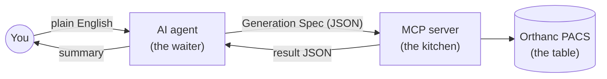
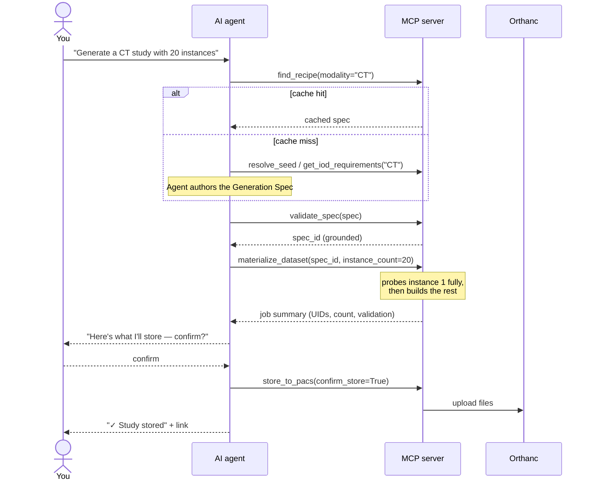

# Pixel Atlas — Beginner's Guide

This is a plain-language walkthrough of the project for someone who has never
seen it before. It answers: what does this tool do, what is "the AI" doing,
what is "the MCP server", why are there so many files in `mcp-server/`, and
how does a request travel from your prompt to a file sitting in the PACS.

If you want the deep, authoritative version of any section, see
`docs/solution-design.md` (the full design) or `docs/architecture.md`
(component/deployment reference). This doc is the on-ramp to those.

---

## 1. The one-sentence pitch

Pixel Atlas lets you ask, in plain English, for **fake (synthetic) medical
imaging files** — e.g. "give me a CT study with 20 slices" — and it builds
real, standards-conformant DICOM files and drops them into a local test PACS
(Orthanc), so QA/dev/test engineers don't have to hand-craft DICOM test data.

Nothing here touches real patient data. Everything is synthetic, generated
on your machine.

**Try it right now** (once [SETUP.md](SETUP.md) is done): open Claude Code
or Copilot Chat in this repo and type

```
Generate 3 axial CT chest instances
```

Everything below explains what happens between you pressing Enter and a
study showing up at http://localhost:8042.

---

## 2. The restaurant analogy

If the tool names feel abstract, here's a mental model that maps cleanly
onto how this actually works:

| Restaurant | Pixel Atlas |
|---|---|
| You, ordering in plain English ("I'll have the steak, medium rare") | You, prompting the agent ("Generate 20 CT slices") |
| The waiter — translates your order into a ticket the kitchen understands, and never cooks anything themselves | The AI agent (Claude Code / Copilot) — turns your request into a Generation Spec (a JSON "order ticket"), never touches a `.dcm` file itself |
| The recipe book behind the pass — exact, unambiguous instructions for every dish on the menu | The **Knowledge Base** (`mcp-server/kb/`) — exact tag/module requirements for every DICOM scan type |
| The kitchen expediter, checking the ticket against the recipe book before anyone starts cooking | `validate_spec` — checks the ticket (spec) against the rulebook (KB) *before* any file is built |
| The kitchen itself — same steps, same result, every single time, no improvisation | `materialize_dataset` — deterministic Python: builds pixels, assigns UIDs, writes files |
| The health inspector, checking the finished plate before it leaves the kitchen | `validate_dataset` — full DICOM conformance check before anything is stored |
| The pass window, where the finished dish reaches your table | `store_to_pacs` — uploads the finished files into Orthanc |
| A regular you order every week — the kitchen already knows it by heart | A **recipe cache** hit — a previously-validated spec is reused instead of authored from scratch |

The one rule that keeps this restaurant running well: **the waiter writes
the ticket, the kitchen builds the dish — the waiter never touches the
stove.** That division (decide *what* vs. do the *how*) is the whole reason
this project is split into an AI half and a Python half. Section 3 unpacks
why that split matters beyond the analogy.

---

## 3. The two halves: "the AI" and "the MCP server"

Think of this project as two cooperating halves, split for a specific reason:
**cost and correctness**.

| | The AI (you're talking to it right now) | The MCP server (`mcp-server/`) |
|---|---|---|
| What it is | Claude Code, running as your chat agent | A local Python program |
| What it's good at | Understanding your intent, **authoring the actual DICOM tags** grounded in what the server tells it a scan type requires, holding a conversation, asking for confirmation | Grounding that authoring against the DICOM standard, then deterministic, repeatable DICOM engineering: synthesizing pixel data, assigning UIDs, talking to Orthanc |
| What it does NOT do | It never reads/writes `.dcm` files itself, never invents a tag value the server's Knowledge Base can't back up | It never decides *which* tags to set or *what* values make sense — that's the AI's call, checked, not made, by the server |

**Why split it this way?** DICOM is a huge, rigid standard (thousands of
tags, strict per-modality rules) — a single wrong VR (value representation)
can make a file unreadable by real PACS/viewer software. Rather than have
the AI guess blindly, the server exposes a **Knowledge Base**: "here's
exactly what a CT image requires." The AI reads that, authors tag values
grounded in it, and the server's job is to mechanically check that authoring
(`validate_spec`) and then do the heavy, repeatable lifting no LLM should be
doing token-by-token — pixel synthesis, UID assignment, file I/O
(`materialize_dataset`). A **recipe cache** means this authoring step is
usually a one-time cost per kind of request: check `find_recipe` first, and
if this exact kind of scan has been built before, reuse that already-checked
spec instead of authoring again.

This is exactly what **`CLAUDE.md`** (the project's root instruction file)
enforces: "Check `find_recipe` before authoring... you author the spec; the
server only grounds and builds," and "Never loop" if something errors.



The AI never sees a `.dcm` byte and the server never invents a tag value —
only short JSON crosses that line in either direction.

### What is "MCP" then?

**MCP (Model Context Protocol)** is just the plumbing that lets an AI agent
(Claude Code) call functions ("tools") exposed by an external program (the
`mcp-server/` Python process) — like a very structured, typed RPC mechanism.
The AI sees a list of tool names + descriptions + parameters (e.g.
`validate_spec(spec)`) and can decide to invoke one. It never sees the
Python source — just the tool's name, docs, and whatever JSON result comes
back. This is registered for Claude Code in the root `.mcp.json` file, which
says: "start `.venv/Scripts/python.exe mcp-server/server.py` and treat it as
the `pixel-atlas` MCP server."

So: **you type a request → the AI decides which MCP tool(s) to call → the
MCP server (plain Python, no AI inside it) does the DICOM work → results
flow back to the AI → the AI summarizes them for you.**

---

## 4. Why so many files in `mcp-server/`?

A commercial kitchen doesn't have one person grilling, plating, washing
dishes, *and* answering the phone — each station owns one job, so the whole
place doesn't stall when one thing changes. `mcp-server/` is the same idea:
several genuinely distinct concerns, each owned by exactly one file. A rough
mental model, grouped by role:

```
Entry point         → server.py               (registers all MCP tools)
"What does DICOM     → iod_lookup.py           (the standard's rulebook,
 require?" (rulebook)                            loaded from mcp-server/kb/)
Building a spec      → spec_validator.py       (checks the agent's spec against the rulebook)
                      → spec_extractor.py       (reverse: existing study → spec)
                      → spec_store.py           (holds validated specs in memory)
Turning a spec into   → materializer.py         (the big one: builds .dcm files)
 real files           → seed_builder.py         (pixel data + skeleton dataset)
                      → dicom_apply.py          (safely writes tag values)
                      → uid_strategy.py         (generates DICOM UIDs deterministically)
Editing/cloning       → modify.py               (edit an existing PACS study)
 existing studies     → priors.py               (clone a study, shifted in time)
                      → study_clone.py          (shared fetch+remap logic for both)
Talking to the PACS   → orthanc_client.py       (thin REST wrapper around Orthanc)
                      → pacs_store.py           (uploads finished files to Orthanc)
                      → seed_resolver.py         (finds a similar existing PACS study)
                      → feature_lookup.py        (checks if PACS has tag/value X)
Bookkeeping           → job_registry.py         (tracks in-progress jobs/status)
                      → recipe_store.py          (caches previously-validated specs)
                      → audit_log.py             (writes agent.log / jobs.log)
                      → token_util.py            (rough cost/size estimate)
Quality gate          → validator.py             (validates generated .dcm files)
Config                → config.py                (paths, env vars, Orthanc creds)
```

If this were one giant file, it would be very hard to reason about (which
part builds pixels? which part talks to Orthanc? which part enforces DICOM
rules?). Splitting it lets each file be tested and understood independently,
and lets several tools (`materialize_dataset`, `modify_dataset`,
`generate_prior_study`) **reuse** the same low-level pieces (e.g.
`dicom_apply.py`, `orthanc_client.py`) instead of duplicating logic.

### The "Knowledge Base" (`mcp-server/kb/2026c/`)

This is checked-in, static JSON data derived from the real DICOM standard
(via `pydicom`/`dicom_validator`), pinned to standard edition "2026c". It's
the authoritative answer to "what tags does a CT image require? what SOP
Class is 'Enhanced CT'? what VR does `KVP` have?" `iod_lookup.py` loads this
once and nearly every other module consults it.

This replaced an earlier design that used hand-authored per-scan-type YAML
templates — the equivalent of a restaurant that could only cook dishes
someone had pre-written a recipe card for, and had to stop and write a new
card by hand every time a customer asked for something new. The KB approach
means the kitchen can cook *anything the DICOM standard defines*, on the
first ask — no "sorry, no recipe for that yet." (Superseded planning docs
about that migration are kept in `docs/archive/` for history only.)

---

## 5. The MCP tools (what the AI can actually call)

These are the "buttons" the AI can press. Each is implemented in `server.py`,
which delegates to the module that actually owns that logic.

| Tool | Plain-English purpose |
|---|---|
| `find_recipe` / `list_recipes` | **Check first.** Look up previously-validated scan-type "recipes" (a cache) — a hit means the agent doesn't have to author anything. |
| `resolve_seed` | Finds a similar existing PACS study to reuse as a base, instead of authoring from scratch. |
| `get_iod_requirements` / `describe_attributes` | The Knowledge Base lookup the agent uses to ground itself before writing tag values — "what does a CT image actually require?" |
| `extract_spec` | Turns an existing PACS study (or local `.dcm`) into an editable spec — the reuse path when a similar study already exists. |
| `validate_spec` | Checks the agent's authored (or reused) spec against the Knowledge Base before anything gets built. Catches bad tags/values early, cheaply. |
| `materialize_dataset` | Builds the actual `.dcm` files from a validated spec — pixel synthesis, UID assignment, per-instance expansion, all deterministic Python. |
| `store_to_pacs` | Uploads a folder of generated `.dcm` files into the Orthanc PACS. Requires explicit confirmation. |
| `modify_dataset` | Change tag values on an existing PACS study (either as a new derived copy, or destructively in place). |
| `generate_prior_study` | Clone a whole study for the same patient, dated N days earlier — useful for "prior exam" test scenarios. |
| `validate_dataset` | Runs DICOM conformance checks against a staged folder or a stored study. |
| `list_pacs_studies` / `list_series_instances` | Look up what's already in the PACS. |
| `check_pacs_feature` | "Does the PACS already have a study where tag X = value Y?" |
| `get_job_status` | Check progress/state of a generation job by ID. |
| `health_check` | Sanity check: is Orthanc reachable, are DCMTK tools installed, what KB edition is loaded. |

---

## 6. Slash commands (`.claude/commands/*.md`)

These are shortcuts you can type directly (e.g. `/generate`) that give the
AI a pre-written recipe for a common task, including which tools to call and
in what order, and what to ask you before doing something irreversible.

| Command | What happens when you run it |
|---|---|
| `/generate` | Ask for modality/count/etc → check `find_recipe` → author (or reuse) a spec → `validate_spec` → `materialize_dataset` → show you the summary → ask to confirm → `store_to_pacs`. |
| `/modify` | Find the study → check your requested changes are valid for that IOD → ask "new copy or destructive overwrite?" → `modify_dataset` → validate → confirm → store. |
| `/validate` | Run `validate_dataset` on a folder or a stored study and show the full report. |
| `/status` | Either check one job's status, or run `health_check` for the whole environment. |
| `/check-feature` | Turn your plain-language ask ("has anyone stored an MR with contrast") into the exact DICOM tag, then check the PACS for it. |
| `/list-recipes` | Show what scan types have already been generated and cached before. |

(There's also a `.github/` folder with equivalent Copilot Chat prompt files
for people using VS Code Copilot instead of Claude Code — same six flows.)

There are currently **no custom subagents** (`.claude/agents/`) defined for
this project — you're always talking to the one Pixel Atlas agent, guided by
the rules in `CLAUDE.md` plus whichever slash command you invoke.

---

## 7. Putting it together: one request, start to finish

Example: **"Generate a CT study with 20 instances."** Following it end to
end is the fastest way to make everything above click.



Narrated, step by step:

1. You ask (or type `/generate`). The agent follows `CLAUDE.md`'s golden
   rules — check the recipe cache before authoring anything.
2. Agent calls `find_recipe(modality="CT")`.
   - **If it's a hit** (someone's generated a plain CT study before): the
     agent takes the cached spec, skips straight to step 4.
   - **If it's a miss** (first time): agent calls `resolve_seed("CT")`, then
     `get_iod_requirements(modality="CT")` to see what a CT image actually
     requires (modules, mandatory tags), and authors a Generation Spec
     itself — `attributes` (tag values), `perInstance` rules (e.g.
     `SliceLocation` stepping per instance), a `pixel` directive (rows,
     columns, how to synthesize pixel data).
3. Agent calls `validate_spec(spec)` — `spec_validator.py` checks every tag
   against the KB (`iod_lookup.py`): does it exist, is the VR right, is it
   even valid for a CT image? On success it's stored (`spec_store.py`) and
   handed back a `spec_id`.
4. Agent calls `materialize_dataset(spec_id, instance_count=20)`.
   `materializer.py` takes over: generates pixel data (`seed_builder.py`),
   writes all 20 instances' tags (`dicom_apply.py`), assigns UIDs
   (`uid_strategy.py`), and writes `.dcm` files to a staging folder
   (`staging/job-<id>/`).
5. One instance is validated first as a quick probe (`validator.py`); if
   something's missing, there's a small bounded auto-repair loop (the agent
   fixes the reported tags and retries `validate_spec`/`materialize_dataset`)
   before it commits to all 20.
6. If this was authored fresh from the Knowledge Base (not extracted from an
   existing PACS study), `materializer.py` auto-saves it as a recipe — so
   the *next* plain CT request in step 2 is a hit.
7. The tool returns a compact result (job id, study UID, count, output path,
   validation status, rough token cost) — the agent shows you this summary,
   never the raw DICOM tags.
8. You confirm storage. Agent calls `store_to_pacs(...)`.
9. `pacs_store.py` uploads the files into your local Orthanc PACS (via
   DCMTK's `storescu` if installed, otherwise a plain REST upload).
10. Every step along the way is written to `.pixel-atlas/logs/agent.log` and
    `jobs.log` for later debugging (`audit_log.py`) — you never see these
    directly, they're just breadcrumbs.

From here, that study can be listed (`list_pacs_studies`), edited
(`/modify` → `modify_dataset`), or used as the basis for a "prior study"
(`generate_prior_study`) — all following the same pattern: **agent decides
intent → one or two deterministic MCP tool calls → confirm before anything
irreversible.**

---

## 8. Myths vs. reality

Quick gut-check for anything that still feels fuzzy:

| Myth | Reality |
|---|---|
| "The AI writes the DICOM file." | It never touches a `.dcm` byte. It writes a small JSON spec; `materializer.py` (plain Python) writes the file. |
| "The AI knows DICOM by heart." | It's grounded on the Knowledge Base every time (`get_iod_requirements`) — nothing is memorized or guessed. |
| "Bigger requests cost more AI tokens." | No — one spec covers the whole study regardless of instance count. 3 instances and 1,000 cost the same tokens; only server compute time scales. See `solution-design.md §13`. |
| "Editing a study overwrites it." | Not by default. `modify_dataset` creates a new derived study unless you explicitly confirm a destructive in-place overwrite. |
| "It can generate any kind of DICOM object." | Only standard image IODs (CT/MR/US/CR/DX/XA/...) plus PR and KO. SR, RT, SEG, and encapsulated docs are explicitly refused, never faked. |
| "Nothing is checked before it hits the PACS." | Every study passes `validate_spec` *and* `validate_dataset` (full DICOM conformance) before `store_to_pacs` is even allowed to run. |

---

## 9. Where to look next

- **`docs/solution-design.md`** — the authoritative deep-dive (Knowledge
  Base, Generation Spec format, UID strategy, validation, storage, token
  economy). Read this once the above clicks.
- **`docs/architecture.md`** — components/deployment view, MCP tool
  reference table.
- **`docs/SETUP.md`** / **`docs/QUICKSTART.md`** — how to get the
  environment running and example prompts to try.
- **`docs/sample-prompts.md`** / **`docs/demo-prompts.md`** — more prompts
  to try once you're comfortable, from plain regression checks to
  PR/KO markup demos.
- **`CLAUDE.md`** — the actual operating contract the agent follows; worth
  reading once you're comfortable, to see exactly which shortcuts and
  guardrails are hard-coded into how the agent behaves.
