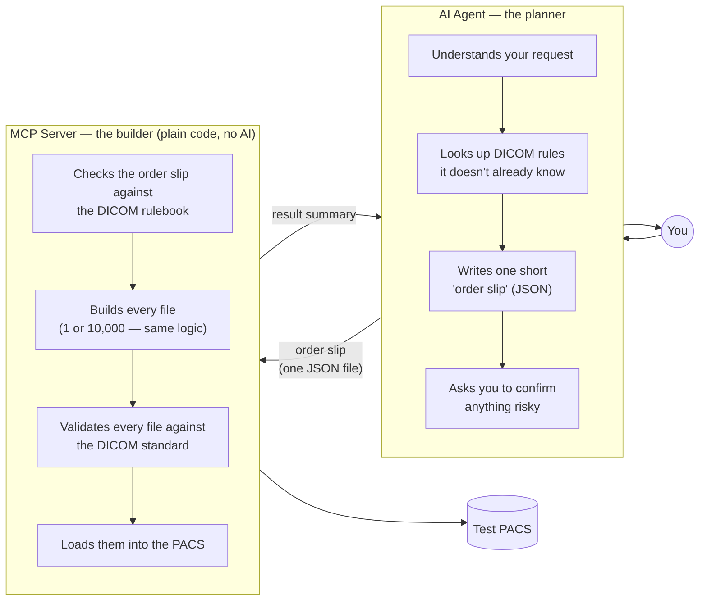
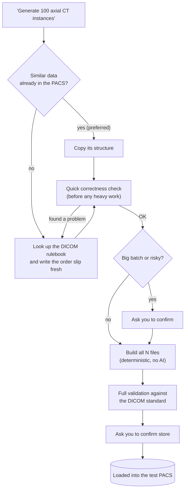

# Pixel Atlas — Plain-English Overview

> No jargon. For engineering detail see [solution-design.md](solution-design.md)
> and [architecture.md](architecture.md).

## 1. What it does

Pixel Atlas creates **fake-but-realistic medical scan files** (DICOM) for
testing software — no real patient data involved. You ask in plain English
("give me 100 CT chest scans"), and it produces valid test files and loads
them into a test system (the "PACS").

## 2. Who does what

The two halves of this tool have very different jobs, and it matters for cost
and safety that they stay separate:

**The AI never touches a DICOM file.** It writes one short JSON description of
what's needed; everything after that — building files, checking them against
the DICOM standard, loading them into the PACS — is deterministic Python code
that runs the same way every time, with no AI involved. That split is what
keeps cost flat and output predictable (see §4).

## 3. How one request flows, step by step

Every request gets checked twice before anything reaches the PACS: once
cheaply (the order slip, before building anything), and once fully (the
finished files, before storing them). Nothing is stored without your explicit
confirmation.

## 4. Token usage — the number management actually asks about

"Tokens" are what AI usage is billed/measured by. The one fact that matters:

**The AI writes one order slip per study — never one instruction per file.**
Measured directly from this tool, generating a CT study at three different
sizes:

| Instances requested | Order slip size (tokens) | Result summary (tokens) |
|---|---|---|
| 3 | 258 | 96 |
| 100 | 259 | 98 |
| 1,000 | 259 | 98 |

**Requesting 1,000 files costs the same AI tokens as requesting 3.** The
file-building, validation, and PACS upload are plain Python — zero additional
AI cost no matter how many files come out the other end. The only thing that
scales with instance count is server compute time (building/validating more
files), not AI usage.

The only case with a *one-time* extra AI cost is a scan type the tool hasn't
built before (it has to look up the DICOM rulebook first) — and even that
result gets cached, so the second request for the same kind of scan costs
nothing extra either.

| Situation | AI cost |
|---|---|
| A scan type already used before (cache hit) | ~0 — no planning, straight to building |
| A new scan type, first time | One small rulebook lookup (a few hundred tokens, one-time) |
| Same request again | Back to ~0 — cached |
| Asking for more instances of the same request | **No change** — same one order slip either way |

## 5. What's automated vs. what needs your say-so

| Always automatic | Always asks first |
|---|---|
| Checking the DICOM rulebook | Generating more than 50 instances |
| Building and validating files | Storing anything to the PACS |
| Reusing a previously-seen recipe | Overwriting an existing study in place |
| Logging every action (see §6) | Anything ambiguous (e.g. how many series?) |

## 6. Safety & audit — what management cares about

- **No real patient data, ever.** This is a test tool pointed at a test PACS.
  Before it could ever touch real patient data, a privacy-scrubbing step would
  need to be added first — not built today, by design.
- **Nothing is silently overwritten.** New studies are always created fresh;
  editing makes a copy unless you explicitly confirm an in-place overwrite.
- **Every file is checked against the official DICOM standard before it's
  stored** — not just "does it look right," but validated against the same
  rulebook real DICOM software checks against.
- **Every action is logged locally** (which tool ran, with what inputs, what
  happened) — for free, since it's written to disk, not sent through the AI.
- **The AI never sees the image files** — only short text descriptions
  (JSON). Pixel data is generated by plain code, not by the AI.

## 7. Why not hand-built templates (the old approach)?

The tool used to rely on **pre-made fill-in-the-blank forms** — one per scan
type, hand-built by an expert in advance. Two problems: if nobody had built a
form for a scan type yet, the tool was stuck; and every new form was a fresh,
manual expert job.

Now there's **one rulebook** (the official DICOM standard, indexed for
lookup) instead of separate hand-made forms — so the tool can build **any**
standard scan type, not just the ones someone happened to prepare in advance,
and a repeat request reuses its own prior work automatically.

## 8. One-sentence summary

An AI agent reads your request and writes one short instruction file; plain,
deterministic code turns that into as many real test DICOM files as needed,
checks them against the DICOM standard, and loads them into the test
PACS — so cost stays flat regardless of batch size, and every file is
validated before it's stored.
