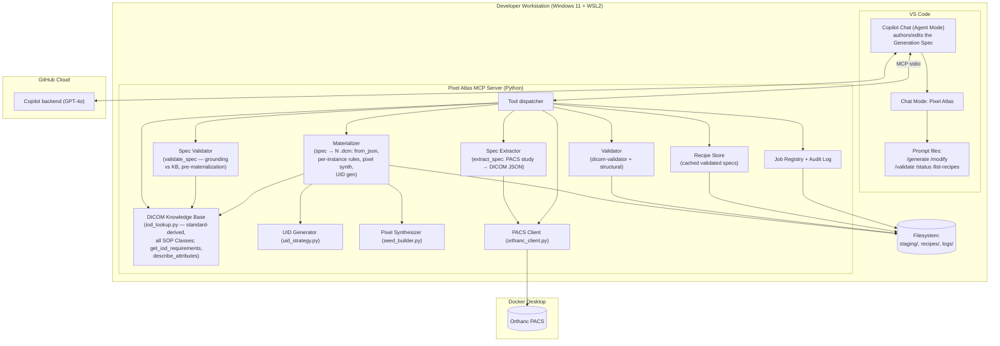
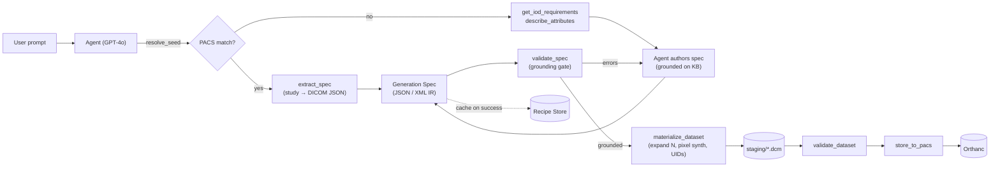
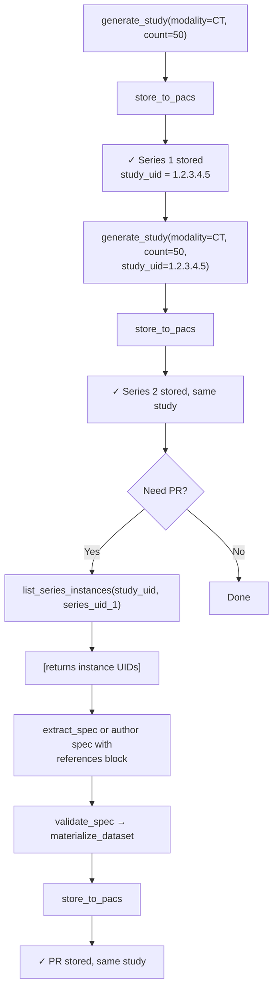

# Pixel Atlas — Architecture

> The current, implemented architecture. Companion to
> [solution-design.md](solution-design.md) (the **how**),
> [ai-driven-simple-overview.md](ai-driven-simple-overview.md) (plain English),
> and [ai-driven-comprehensive-plan.md](ai-driven-comprehensive-plan.md) (full
> build reference).

## 1. Architectural overview

Local-first, MCP-mediated: the agent decides *what*, the MCP server does the *how*
deterministically. The knowledge and generation core is:

- **Knowledge comes from a standard-derived DICOM Knowledge Base (KB)**, not
  per-template YAML. One KB covers every SOP Class and is reused across all
  requests and modalities.
- **The agent produces a DICOM Generation Spec** (JSON, canonically the DICOM
  JSON Model; XML optional) grounded on the KB. This structured IR — not template
  cloning — is what drives generation.
- **A deterministic Materializer library converts the spec into `.dcm` files.**
  The LLM authors one spec; the Materializer expands N instances, synthesizes
  pixel data, and assigns UIDs — the same token discipline (one bounded planning artifact per study).
- **Everything DICOM-sensitive stays local**; only NL prompts and the (synthetic,
  non-binary) spec cross to the Copilot/GPT-4o cloud.

The trust boundary, deployment paths (A local / B hosted), and non-functional
posture are standard local-first (developer machine + local PACS network vs. the Copilot cloud).

## 2. Component architecture

Component roles:

| Component | Status | Role |
|---|---|---|
| Copilot Chat | **Reframed** | Now authors/edits a structured Generation Spec grounded on KB tool responses — not just picking a template and overrides. |
| DICOM Knowledge Base | **New (subsumes Template Engine's `iod_spec.yaml`)** | Standard-derived, all-SOP-Class knowledge. Backs `get_iod_requirements` + `describe_attributes`. Reused by Spec Validator and Materializer. |
| Spec Validator | **New** | Deterministic grounding of a spec vs the KB before materialization, **plus curated cross-tag consistency rules** (pixel-module group, Modality↔SOPClass, geometry triplet; decision #1) and pixel-module-tag rejection (decision #2). |
| Spec Store | **New** | Holds validated specs server-side keyed by `spec_id` (decision #6) so the spec isn't re-sent between `validate_spec` → `materialize_dataset`; repairs apply a diff. |
| Materializer | **New (replaces the template clone-and-rewrite core)** | Compiles a spec → `.dcm` (from_json, per-instance/per-frame rules, UID gen). **Probe-first** (decision #5); handles single-frame/multi-frame/PR/KO (decision #4); preserves source pixels on the PACS path (decision #2). |
| Spec Extractor | **New** | PACS study → DICOM JSON Model spec, for the PACS-first and modify paths. **No PHI scrubbing for now** (decision #8). |
| Pixel Synthesizer | **Generalized** | Modality-agnostic Image Pixel module synthesis from the spec's `pixel` directive, IOD path only (was per-template seed `.dcm`). |
| Recipe Store | **New (replaces Template Catalog)** | Auto-grown cache of validated specs keyed by modality+bodypart+orientation+SOPClass+module-flags (decision #7); `list_recipes`/`get_recipe`. |
| Audit Log | **Extended** | Per job records full spec + provenance + KB edition (decision #11) — server-side only, zero token cost. |
| UID Generator, Validator, PACS Client, Job Registry, Orthanc | **Unchanged** | Post-generation and I/O are format-agnostic. |

## 3. Revised MCP tool contract

The MCP tool contract:
Unchanged tools (`validate_dataset`, `store_to_pacs`, `list_pacs_studies`,
`check_pacs_feature`, `get_job_status`, `health_check`) keep their current
signatures.

| Tool | Input | Output | Notes |
|---|---|---|---|
| `get_iod_requirements` | `{sop_class_uid? \| modality?}` | modules (M/C/U) + Type 1/1C/2/2C/3 tags (keyword, VR, VM, condition) | **Expanded** to the full KB — any SOP Class, not just templated ones. Primary grounding tool. Backed by `iod_lookup.py`; no `dicom-validator` call at request time. |
| `describe_attributes` | `{keywords[] \| tags[]}` | `[{tag, keyword, vr, vm, retired?}]` | **New.** Fast batch VR/keyword lookup while the AI authors a spec. |
| `validate_spec` | `{spec}` | `{grounded, spec_id, errors[]:{tag,keyword,reason}, warnings[]}` | **New.** Deterministic pre-materialization grounding vs KB (tag exists, VR, IOD validity, Type-1 presence, protected-tag placement) **plus the curated cross-tag consistency rules** — pixel-module group, Modality↔SOPClass, geometry triplet — and **rejects pixel-module tags in `attributes`** (decisions #1, #2). On success **stores the spec server-side and returns a `spec_id`** (decision #6) so it need not be re-sent. Feeds the repair loop. |
| `extract_spec` | `{study_uid \| path}` | `{spec}` (DICOM JSON Model envelope) | **New.** Fetches an existing study and emits a Generation Spec. **No PHI scrubbing for now (decision #8)** — source identity and the Image Pixel module are preserved as-is (reference PACS assumed to hold test data). Basis for PACS-first generate and for modify. |
| `materialize_dataset` | `{spec_id, instance_count?, target_pacs?, job_id?}` | `{job_id, study_uid, series_uid, output_path, count}` | **New (replaces `generate_dataset`).** Takes a **`spec_id`** (decision #6), not the full spec. **Probe-first (decision #5):** materializes and fully validates one instance before expanding to N. IOD path synthesizes the pixel module; **PACS path preserves source pixels untouched (decision #2)**. Handles multi-frame (count = frames) and PR/KO (reference-based, no pixels) per solution-design §10 (decision #4). Rejects an ungrounded `spec_id`. Reuses UID/staging/job-registry/safety-net machinery. |
| `resolve_seed` | `{modality, body_part?, orientation?, sop_class_uid?}` | `{source_type: pacs\|iod, pacs_candidates[]}` | **Kept, simplified.** On a PACS hit → agent calls `extract_spec`; otherwise `source_type=iod` (KB-authored spec) — the old `template`/`none` outcomes collapse into `iod` (no coverage gap). **Matching stays lightweight** (indexed `ModalitiesInStudy` query + `StudyDescription` substring for body_part/orientation; **no per-instance tag scanning**) so it doesn't slow down as the PACS grows — see [solution-design.md §4.1](solution-design.md#41-seed-matching-criteria-kept-lightweight). |
| `modify_dataset` | `{source:{study_uid\|path}, overrides, regenerate_uids}` | `{job_id, study_uid, output_path, count}` | **Reframed** as a convenience wrapper over `extract_spec` → apply overrides → `materialize_dataset`. Same non-destructive default + `confirm_destructive` gate. |
| `list_recipes` / `get_recipe` | `{modality?, body_part?, orientation?}` / `{recipe_id}` | recipe summaries / a cached spec | **Replaces `list_templates`/`get_template_info`.** Browse the auto-grown recipe cache. |
| `generate_study` | `{modality, count=1, body_part?, orientation?, enhanced?, overrides?, cine_rate?, study_uid?}` | `{job_id, study_uid, count, frames?, output_path, validation, approx_tokens}` | **One-shot generation (preferred path).** Builds a conformant study from defaults + auto-fill. **New:** `study_uid` pins the new series to an existing study (for multi-series workflows) — reuses that study's identity (PatientID/PatientName/StudyDate) automatically, avoiding double-entry. |
| `list_series_instances` | `{study_uid, series_uid?}` | `{instances: [{series_uid, sop_class_uid, sop_instance_uid, instance_number}]}` | **New.** Enumerates stored instances for a PACS study (optionally one series). Used to get concrete instance UIDs for PR/KO `references` blocks — never read `.dcm` files directly for this. Errors if the study/series isn't stored yet. |

## 4. The IR pipeline (data flow)

The IR (the Generation Spec) is the contract between the AI (author) and the
Materializer (consumer). Everything left of `materialize_dataset` is
knowledge/planning (LLM + KB, cheap, O(1) in instance count); everything right is
deterministic bulk work (no LLM, scales with N).

### 4.1 Multi-series workflow

**Key:** `study_uid` parameter on `generate_study` pins the new series to an existing
study; identity (PatientID/Name/StudyDate) is reused automatically. `list_series_instances`
provides the instance UIDs for PR/KO cross-references.

## 5. Deployment architecture

Deployment:
VS Code + local (containerized or native) MCP server + Dockerized Orthanc; stdio
transport for Path A, remote HTTP/SSE for Path B. The redesign adds **no new
runtime services** — the KB, Spec Validator, Materializer, Spec Extractor, and
Recipe Store are all in-process modules of the existing MCP server. The only new
on-disk artifact is `recipes/` (replacing `templates/`), plus the one-time
KB build output consumed by `iod_lookup.py`.

## 6. Prerequisites & setup

No new
prerequisites: the KB is built from `dicom-validator` (already a dependency) and
the pydicom data dictionary (already present). XML serialization, if enabled, uses
a small pure-Python native-model converter — no extra native binaries.

## 7. Token & cost economy (architectural hooks)

Maps to [solution-design.md §13](solution-design.md#13-repair-loop--token-economy):

| Hook | Where |
|---|---|
| One O(1) spec per study; N-loop + pixel synthesis in a single `materialize_dataset` call | Materializer |
| Deterministic `validate_spec` catches grounding errors before any file I/O; bounded repair loop | Spec Validator |
| Recipe cache short-circuits authoring for repeat requests | Recipe Store |
| KB responses are compact, structured, cached per session; not re-inlined | KB |
| Spec (synthetic tag values) and never DICOM binaries/pixels cross to the cloud | Boundary |
| Validation/report capping + sampling | Validator (unchanged) |

## 8. Extensibility — Path B (hosted)

Path B (hosted) —
and *better suited* to it: the standard-derived KB and the Recipe Store are
naturally shared/centralized assets (one KB per standard edition; recipes shared
across teams). The tool contracts in §3 are exposed over remote HTTP/SSE
unchanged; the DICOM domain logic (KB, Spec Validator, Materializer) does not
change with transport.

## 9. Risks & mitigations

| Risk | Mitigation |
|---|---|
| AI emits an ungrounded/hallucinated tag | `validate_spec` rejects it before materialization; `validate_dataset` is the second gate before store |
| `dicom-validator` internal KB shape changes on upgrade | Pin the version; isolate all access behind `iod_lookup.py` (single wrapper) |
| Repair loop burns tokens on a hard request | Bounded retries then fail-loud; recipe cache prevents re-paying for known requests |
| XML round-trip loses envelope fidelity | Keep JSON canonical; gate XML behind a round-trip test before promoting it |
| Recipe drift across KB editions | Version recipes by KB edition; invalidate on edition bump |
| Loss of the hand-review step templates got | Curated recipes can still be committed/PR-reviewed; conformance is enforced by validation regardless |
| Pixel realism (AI drives tags, not anatomy) | Out of scope — synthetic pixel data is not clinically realistic |
