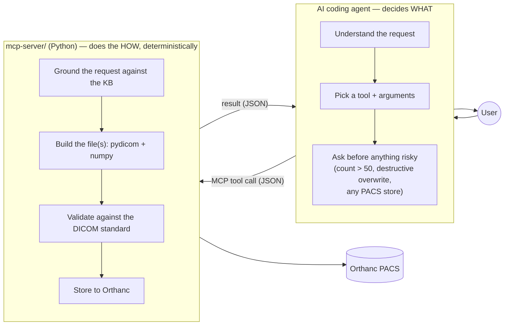
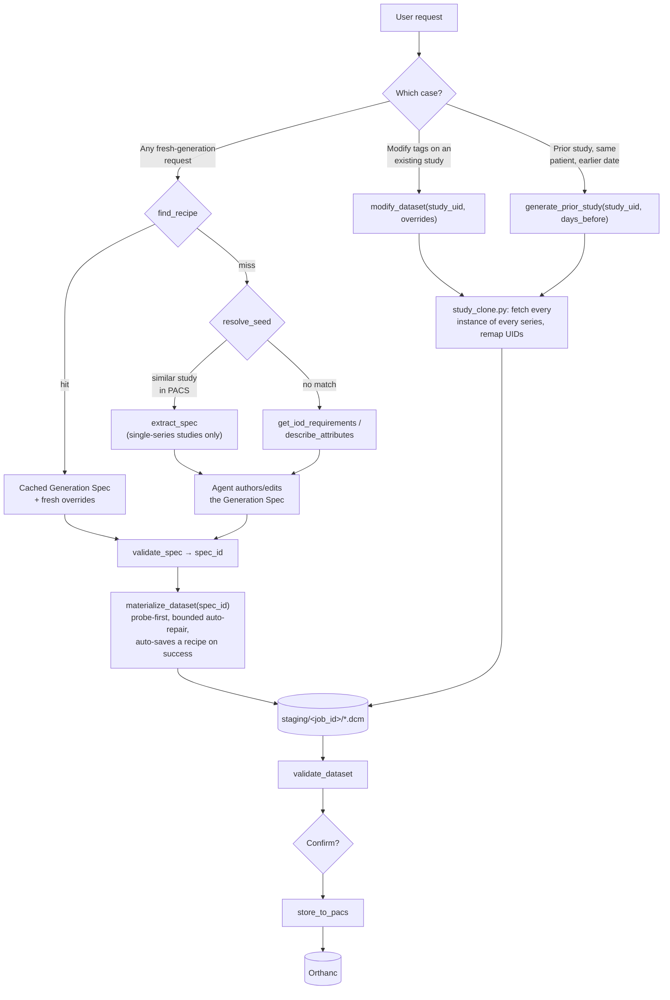
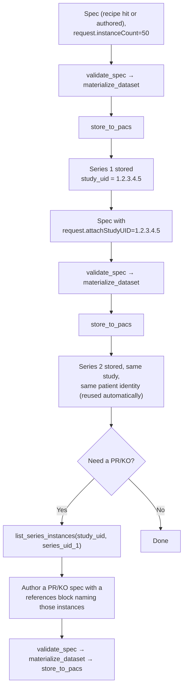

# Pixel Atlas — Architecture

> Components, data flow, and the MCP tool reference for the system as it
> exists today. Companion to [solution-design.md](solution-design.md) (the
> **how** — Generation Spec format, Knowledge Base, token economy).

## 1. Overview

Pixel Atlas is **local-first and MCP-mediated**: an AI coding agent (Claude
Code, or GitHub Copilot Chat) authors the DICOM tags, grounded on a
standard-derived Knowledge Base; a local Python MCP server (`mcp-server/`)
only grounds/validates that authoring and does the deterministic mechanical
work — pixel synthesis, UID assignment, per-instance expansion, PACS I/O. No
DICOM file is ever read by the agent directly, and a recipe cache means the
authoring step itself is usually skipped on repeat requests.

Three ideas make that possible:

- **A DICOM Knowledge Base (KB)**, derived once from the DICOM standard and
  **committed in-repo as plain JSON** (`mcp-server/kb/2026c/`). It covers
  every SOP Class the standard defines, not a curated subset, so there's no
  "no template for this modality yet" dead end. It loads from disk once per
  process — no network call, no first-run parse delay.
- **A Generation Spec** — a small JSON envelope (the DICOM JSON Model plus a
  thin generation layer) that describes *what* to build: attributes, an
  optional pixel directive, per-instance rules. It is O(1) in instance count —
  never lists per-instance data.
- **A deterministic Materializer** that turns a Generation Spec into `.dcm`
  files: expands to N instances, synthesizes pixel data, assigns UIDs. The
  agent authors or edits one spec; the Materializer does the bulk work.

Only natural-language prompts and the (synthetic, textual) Generation Spec
ever cross to the agent's cloud backend. DICOM binaries and pixel data never
leave the local machine.

## 2. The two-actor split

The agent never touches a `.dcm` file or the PACS directly — only tool calls
and their JSON results. Chat mode + prompt files (`.claude/commands/`,
`.github/chatmodes/`, `.github/prompts/`) scope each slash command down to
the tools it actually needs, instead of exposing every tool for every request.

## 3. Two generation pipelines

There isn't one single pipeline — there are two, and picking the right one
matters:

**Why two flows, not one.** Fresh generation, editing via a spec, and PR/KO
all go through the same Generation Spec + Materializer pipeline (grounded
against the KB, probe-validated before expanding to N) — a recipe hit just
short-circuits the authoring step. `modify_dataset` and
`generate_prior_study` deliberately **bypass the spec pipeline entirely** —
they call `study_clone.py` directly, because their job is *faithful
replication*: every series and every instance of the source study must
survive unchanged except for the requested edits, which a from-scratch spec
can't guarantee as cleanly as a direct clone-and-remap. `extract_spec` (used
by the spec-authoring flow) is intentionally narrower: it only supports
single-series source studies — for a multi-series study, `modify_dataset`/
`generate_prior_study` are the tools that preserve structure correctly.

## 4. Component map

| Concern | File(s) | Role |
|---|---|---|
| Entry point | `server.py` | Registers every MCP tool on a `FastMCP` instance (stdio transport). |
| Knowledge Base | `iod_lookup.py` | Loads the committed KB JSON (`kb/2026c/`); answers module/tag requirements, modality↔SOP-Class resolution, and builds functional-group skeletons generically from `group_macros` (works for any modality, no per-modality Python). Shared with `validator.py`. |
| Spec validation | `spec_validator.py` | `validate_spec` — grounds a spec against the KB (tag existence, VR, IOD validity, pixel-module/UID placement) plus a few cross-tag consistency rules. Stores the spec and returns a `spec_id` on success. |
| Spec storage | `spec_store.py` | In-memory store of validated specs keyed by `spec_id`; owns `SpecError`. |
| Pixel + base dataset | `seed_builder.py` | Synthesizes pixel data (noise/gradient/phantom) and builds the minimal base dataset for the no-PACS-seed path. |
| Materializer | `materializer.py` | `materialize_dataset(spec_id)` — builds `.dcm` files: single-frame (N files, probe-first), classic multi-frame (cine), enhanced multi-frame (functional groups), or PR/KO (reference-based, no pixels). |
| Extraction | `spec_extractor.py` | `extract_spec` — turns a **single-series** PACS study (or local `.dcm`) into a Generation Spec. |
| Full-fidelity clone | `study_clone.py` | Fetches every instance of every series of a study and remaps UIDs — the shared core of `modify_dataset` and `generate_prior_study`. |
| Modify | `modify.py` | `modify_dataset` — applies overrides/per-instance rules via `study_clone`; non-destructive by default. |
| Priors | `priors.py` | `generate_prior_study` — clones a study via `study_clone`, shifts `StudyDate` back N days. |
| Seed resolution | `seed_resolver.py` | `resolve_seed` — PACS-first (lightweight `ModalitiesInStudy` + `StudyDescription`-substring match), else KB fallback. |
| Recipes | `recipe_store.py` | File-based cache of validated, KB-authored specs, keyed by modality + body part + orientation + SOP Class + flags. |
| Validation | `validator.py` | `validate_dataset` — IOD conformance (`dicom-validator`), cross-instance structural checks, `dcmftest`. |
| PACS I/O | `orthanc_client.py`, `pacs_store.py` | Orthanc REST wrapper; `store_to_pacs` (storescu, REST fallback). |
| Feature lookup | `feature_lookup.py` | `check_pacs_feature` — "does the PACS have any study with tag X (= value)?" |
| UIDs | `uid_strategy.py` | Deterministic UID generation per `(job_id, index)` — idempotent retries. |
| Bookkeeping | `job_registry.py`, `audit_log.py`, `token_util.py` | In-memory job status; on-disk audit log (`.pixel-atlas/logs/`); rough token-cost estimate. |
| Config | `config.py` | All environment-driven paths/credentials — the only file that reads `os.environ`. |

See [mcp-server/README.md](../mcp-server/README.md) for the full per-file
breakdown.

## 5. MCP tool reference

| Tool | Purpose |
|---|---|
| `find_recipe(modality, body_part?, orientation?, enhanced?, contrast?, localizer?)` / `list_recipes(modality?)` | **Check first.** Look up / browse the auto-grown cache of previously-validated KB-authored specs — a hit skips authoring entirely. |
| `resolve_seed(modality, body_part?, orientation?, enhanced?)` | PACS-first seed resolution. Returns `source_type` `pacs` (call `extract_spec`), `iod` (author from the KB), or `unsupported`. |
| `extract_spec(study_uid?, path?)` | Turns a **single-series** PACS study or local `.dcm` into a Generation Spec to edit. Refuses multi-series sources (use `modify_dataset`/`generate_prior_study` instead). |
| `get_iod_requirements(sop_class_uid?, modality?, enhanced?, full?)` | KB lookup: modules + Type-1/1C/2/2C/3 tags for a SOP Class — how the agent grounds itself before authoring `attributes`. Compact by default. |
| `describe_attributes(names)` | Batch VR/keyword lookup for a list of DICOM keywords or tags. |
| `validate_spec(spec)` | Grounds an agent-authored/extracted/recipe spec against the KB. On success stores it and returns a `spec_id`; on failure returns specific, actionable errors. |
| `materialize_dataset(spec_id, instance_count?, job_id?)` | Builds `.dcm` files from a validated spec. Probe-first: fully validates one instance before expanding to N. Auto-saves a recipe on success for KB-authored specs. |
| `modify_dataset(study_uid, overrides?, per_instance?, regenerate_uids=True, confirm_destructive?)` | Edits every instance of every series of an existing study. Default writes a new derived study; `regenerate_uids=False` is a destructive in-place overwrite and requires `confirm_destructive=True`. |
| `generate_prior_study(study_uid, days_before, overrides?)` | Clones a study's full structure (every series/instance) for the same patient, dated `days_before` days earlier. Never edits the original. |
| `validate_dataset(path?, study_uid?)` | IOD conformance + structural checks on a staged folder or a stored study. |
| `store_to_pacs(path, confirm_store=False)` | Uploads a staged folder to Orthanc. Requires `confirm_store=True`. |
| `list_pacs_studies(modality?, patient_name?, date_range?)` | List studies in the PACS. |
| `list_series_instances(study_uid, series_uid?)` | Enumerate stored instances of a study/series — used to get concrete instance UIDs for a PR/KO `references` block. |
| `check_pacs_feature(tag, value?, modality?, date_range?)` | "Does any stored study have this tag (= value)?" |
| `get_job_status(job_id)` | Look up a job's state/progress. |
| `health_check()` | MCP server / Orthanc reachability / DCMTK binaries / KB edition. |

## 6. Multi-series studies

Setting `spec["request"]["attachStudyUID"]` lets a second (or third) series
be attached to a study a prior call already stored, instead of minting a new
study every time:

The study must already be stored before a second series can attach to it —
`attachStudyUID` is looked up in the PACS, not just reused as a UID string.
Default interpretation is always "N instances = one series"; the agent asks
before generating anything if the request implies multiple series (different
body parts/orientations/modalities, an explicit "N series", or a multi-frame
ask mixed with a separate single-frame one).

## 7. Supported IOD family

- **All standard image IODs, single-frame and multi-frame** — CT, MR, US, MG,
  CR, DX, XA, RF, NM, PT, OCT and their Enhanced/multi-frame variants.
- **Presentation State (PR)** and **Key Object Selection (KO)** — reference
  existing instances rather than carrying pixels; the referenced instances
  must already be stored.
- **Explicitly refused, never substituted:** Structured Reports (SR), RT
  objects, Segmentation (SEG), encapsulated documents, waveforms, and other
  non-image/highly-structured IODs.

## 8. Deployment

VS Code (or another MCP client) spawns `mcp-server/server.py` as a local
subprocess over stdio; Orthanc runs in a Docker container. No other runtime
services — the KB, spec validator, Materializer, and recipe store are all
in-process modules of the one MCP server. On-disk artifacts: `recipes/`
(auto-grown recipe cache), `staging/` (scratch output per job), the committed
KB (`mcp-server/kb/2026c/`), and `.pixel-atlas/logs/` (audit log). See
[SETUP.md](SETUP.md) for the concrete install steps.

## 9. Token economy (why cost doesn't scale with instance count)

- One Generation Spec per study — never one instruction per instance. The
  Materializer's N-loop and pixel synthesis run entirely server-side.
- A recipe hit skips the authoring turn entirely; a miss costs one bounded
  authoring turn, paid once per request signature, then cached.
- `validate_spec` is a cheap, deterministic pre-check; the probe-first
  materialization validates one instance fully before committing to the rest
  of a large batch.
- The recipe cache skips authoring entirely for a repeat request.
- Pixel data and DICOM binaries never enter the chat context — only the
  small JSON spec/result does.

See [solution-design.md §13](solution-design.md#13-token-economy) for the
mechanics and measured numbers.

## 10. Risks & mitigations

| Risk | Mitigation |
|---|---|
| AI-authored spec references a hallucinated/wrong tag | `validate_spec` rejects it before any file is written; `validate_dataset` is the second gate before store |
| A large batch fails conformance late | Probe-first: one instance is fully validated before the other N−1 are generated |
| `dicom-validator`'s internal data shape changes on upgrade | KB is pinned to one committed edition (`2026c`); all access goes through `iod_lookup.py` |
| Multi-series structure lost during modify/prior | `modify_dataset`/`generate_prior_study` clone every series via `study_clone.py` rather than reconstructing from one representative instance |
| Pixel realism | Out of scope by design — synthesized noise/gradient/phantom, not clinically realistic imagery |
