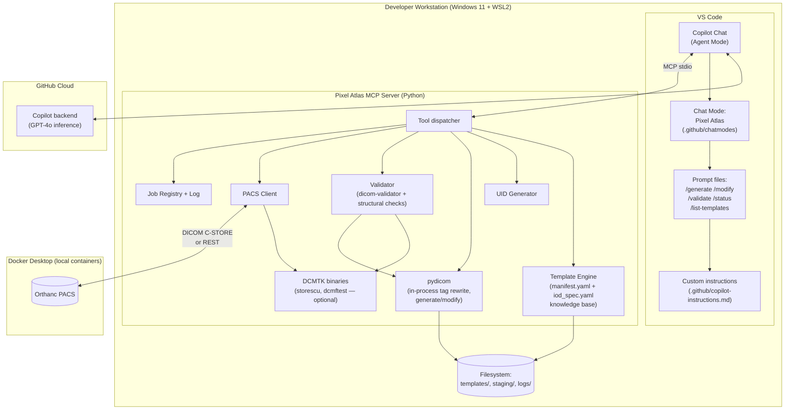
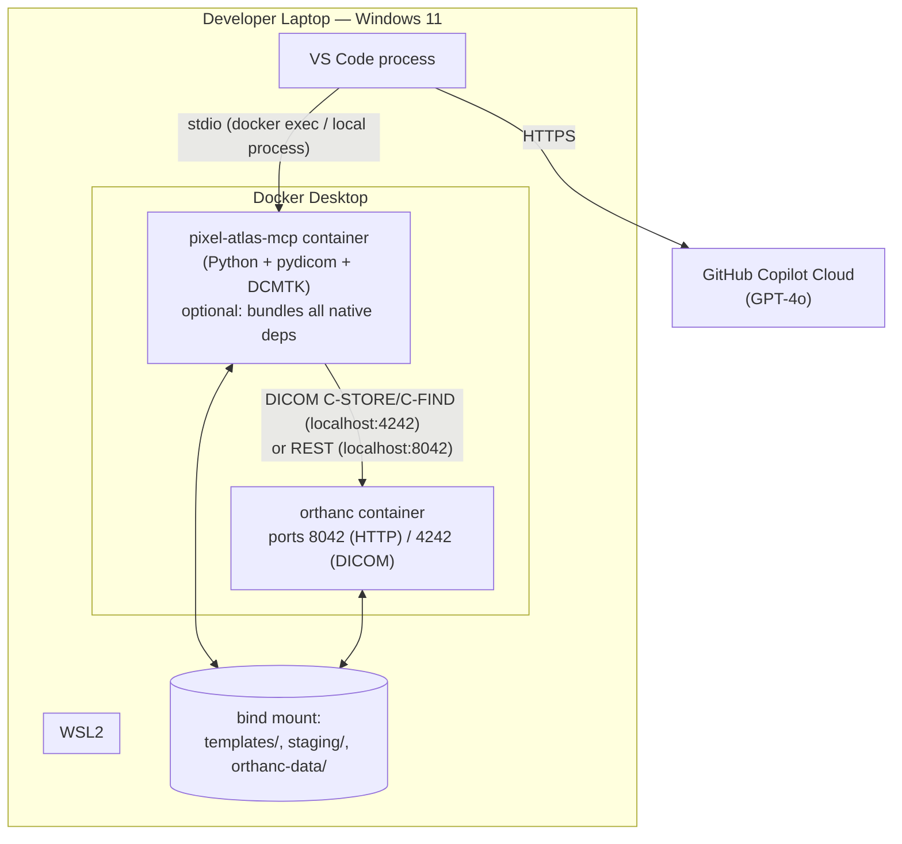

# Pixel Atlas Copilot Agent — Architecture

Covers components, the DICOM MCP server contract, and deployment. See
[use-cases.md](use-cases.md) for scope and [solution-design.md](solution-design.md)
for the detailed workflow this architecture executes.

## 1. Architectural Overview

- **Local-first, MCP-mediated tool use.** The "agent" is GitHub Copilot Chat in VS
  Code Agent Mode (model: GPT-4o), acting as a thin orchestrator. All DICOM-specific
  work — template access, tag rewriting, UID generation, validation, PACS I/O — is
  implemented as deterministic Python code behind a custom **Model Context Protocol
  (MCP) server**, not as LLM-generated logic.
- **PACS-first sourcing.** Before any generation, the server checks the PACS for
  similar existing data (`resolve_seed`) and only proposes the bundled template seed
  data as a user-confirmed fallback — see [solution-design.md §3](solution-design.md#3-seed-resolution-pacs-first-template-fallback).
- **Two deployment paths, one server core.** v1 targets VS Code + a locally-run MCP
  server (Path A, [§5](#5-deployment-architecture-path-a--local-v1)). The same MCP server core is
  designed to be reusable behind a hosted GitHub Copilot Extension/Skillset later
  (Path B, [§9](#9-extensibility--path-b-hosted-copilot-extension))
  without rewriting the DICOM logic.
- **Everything DICOM-sensitive stays local to the PACS network** in Path A; only
  natural-language prompts and structured plans (never binary DICOM data) cross to
  the Copilot/GPT-4o cloud backend.

## 2. Component Architecture



| Component | Role |
|---|---|
| Copilot Chat (Agent Mode) | Parses user intent, plans tags, decides which MCP tools to call, confirms risky/large actions, summarizes results. Model: GPT-4o. |
| Chat mode (`pixel-atlas.chatmode.md`) | Restricts the toolset available to the agent to the Pixel Atlas MCP tools + minimal file read tools — improves both safety and token economy. |
| Prompt files (`.github/prompts/*.prompt.md`) | Implement `/generate`, `/modify`, `/validate`, `/status`, `/list-templates` as reusable, versioned slash commands. |
| Custom instructions (`.github/copilot-instructions.md`) | Repo-wide, always-included context: what Pixel Atlas is, PACS-first/template-fallback rule, non-destructive-by-default rule, no-PHI rule, confirmation thresholds. Kept short (§ token economy). |
| Pixel Atlas MCP Server | Local Python process (or container) exposing the tool contract in [§3](#3-dicom-mcp-server--bare-minimum-spec) over stdio. |
| pydicom (in-process) | All tag rewriting for `generate_dataset`/`modify_dataset` happens as plain `pydicom` `setattr` calls inside the server process — no `dcmodify` subprocess (see `mcp-server/generator.py`'s module docstring). |
| DCMTK binaries | Only `storescu` (PACS C-STORE, via `pacs_store.py`) and `dcmftest` (basic per-file readability check, via `validator.py`) are ever shelled out to — both optional/soft dependencies. `dcmodify`/`dciodvfy`/`findscu` are not used anywhere; IOD conformance is `dicom-validator` (a Python import), and PACS queries go through Orthanc's REST API. |
| Template Engine | Reads `catalog.yaml`/`manifest.yaml` (generation fill-rules) and `iod_spec.yaml` (the committed IOD knowledge base — mandatory/conditional/optional modules and tags, backing the `get_iod_requirements` tool via `iod_lookup.py`), and clones/interpolates seed instances via `seed_builder.py` — either PACS-fetched (preferred) or bundled fallback seed data. |
| PACS Client | Talks to the configured PACS via DICOM C-STORE or Orthanc's REST API — used both for the `resolve_seed` similarity search (checked first, before any template is used) and for fetch/store during generation. |
| Job Registry + Log | In-memory job state (v1) + append-only local log file for audit. |
| Orthanc PACS | Reference test PACS, run via Docker per [orthanc-setup.md](orthanc-setup.md). |

## 3. DICOM MCP Server — Bare-Minimum Spec

**Goal:** the smallest tool surface that supports generate/modify/validate/status
end-to-end. No auth, no multi-tenancy, no persistent job store, no template-authoring
UI in v1 — all explicitly deferred.

- **Language/runtime:** Python 3.11+, official `mcp` Python SDK, `pydicom` for
  in-process tag manipulation, `dicom-validator` (PyPI) for IOD conformance
  checking. Only `storescu` and `dcmftest` (both optional/soft dependencies) are
  invoked as DCMTK subprocesses — `dcmodify`/`dciodvfy`/`findscu` are not used.
- **Transport:** stdio (local process spawned by VS Code per `.vscode/mcp.json`).
  Path B ([§9](#9-extensibility--path-b-hosted-copilot-extension))
  swaps this for a remote HTTP/SSE MCP transport without changing tool logic.

| Tool | Input | Output | Notes |
|---|---|---|---|
| `resolve_seed` | `{modality, body_part?, orientation?, sop_class_uid?}` | `{source_type: pacs\|template\|none, pacs_candidates[], template_candidates[]}` | **Called before any generation.** Queries the PACS first (via `list_pacs_studies` internally); only reports a template candidate if no PACS match exists. Implements the PACS-first/template-fallback rule (solution-design §3). |
| `list_templates` | `{modality?, body_part?, orientation?}` | `[{template_id, modality, body_part, orientation, sop_class_uid, has_seed_data}]` | Reads `catalog.yaml`; paginated, default limit 20. This is a **tag-spec** catalog browse, not a data source lookup. |
| `get_template_info` | `{template_id}` | tag rules + `protected_tags` (no pixel data) | `protected_tags` are the only tags a caller can't override (sequence-derived + UID tags); any other tag valid for the IOD is fair game. Consulted on every `/generate`, independent of `resolve_seed`'s outcome. |
| `get_iod_requirements` | `{template_id?, sop_class_uid?}` | committed `iod_spec.yaml` contents: modules (mandatory/conditional/optional) + Type 1/1C/2/2C/3 tags for M/C modules | Read-only IOD knowledge-base lookup, backed by `iod_lookup.py` (no `dicom-validator` call at request time — see solution-design §6.1). Used to check a tag's legitimacy/type before proposing an override, including internally by `modify_dataset`'s validation against a PACS study's actual SOP Class. |
| `generate_dataset` | `{seed_source: {type: pacs\|template, ref}, instance_count, overrides, target_pacs?}` | `{job_id, study_uid, series_uid, output_path, count, seed_source}` | Runs the full fetch/load→clone→rewrite→UID pipeline (solution-design §8) in one call, including an IOD-fill safety net for any mandatory tag still missing. Rejects a `template` seed source unless the chat layer has recorded user confirmation. |
| `modify_dataset` | `{source: {study_uid \| local_path}, overrides, regenerate_uids}` | `{job_id, study_uid, output_path, count}` | Fetches an explicitly-named source (not a similarity search), validates overrides via the same shared policy as `generate_dataset` (`override_policy.py`: reject protected tags and anything not valid for the study's actual IOD, per `get_iod_requirements`), then reuses the generation pipeline. |
| `validate_dataset` | `{path \| study_uid}` | `{passed, checked_instances, sampling_ratio, errors[], warnings[]}` | `dicom-validator` IOD conformance + structural checks, sampled per solution-design §10. |
| `store_to_pacs` | `{path \| study_uid, pacs_alias}` | `{stored_count, failed_count, failed_sop_uids[]}` | `storescu` batch, or Orthanc REST fallback. |
| `list_pacs_studies` | `{modality?, patient_name?, date_range?}` | `[{study_uid, modality, date, description}]` | Orthanc REST `/studies`. Used directly for `/modify` discovery, and internally by `resolve_seed` for similarity search. |
| `check_pacs_feature` | `{tag, value?, modality?}` | `{present, example_study_uids[]}` | Checks whether the PACS already has data with a given tag/value, independent of the template catalog — see `.github/chatmodes/pixel-atlas.chatmode.md` for tag-resolution guidance. |
| `get_job_status` | `{job_id}` | `{state, progress_pct, message}` | In-memory registry lookup. |
| `health_check` | `{}` | `{mcp_server, orthanc_reachable, template_count, dcmtk_binaries_on_path}` | Startup/smoke-test tool — confirms the server, PACS, and template catalog are all reachable. |

**Explicit non-goals for v1:** no user auth (single local user), no queueing across
server restarts, no template upload/authoring endpoint (templates are added via a
normal file/PR workflow, solution-design §6.5), no multi-PACS routing logic beyond a
named-alias config file, no pixel-level PACS similarity matching (metadata matching
only, solution-design §3).

## 4. Copilot-Side Artifacts

Repo layout for the VS Code-native integration (Path A):

```
.vscode/
  mcp.json                        # registers the Pixel Atlas MCP server
.github/
  copilot-instructions.md         # repo-wide agent context (kept short)
  chatmodes/
    pixel-atlas.chatmode.md       # scopes tools + preferred model (GPT-4o)
  prompts/
    generate.prompt.md
    modify.prompt.md
    validate.prompt.md
    status.prompt.md
    list-templates.prompt.md
templates/                        # tag template catalog + fallback seed data, see solution-design §6
mcp-server/                       # Pixel Atlas MCP server source (Python)
```

`.vscode/mcp.json` (conceptual):

```jsonc
{
  "servers": {
    "pixel-atlas": {
      "command": "python",
      "args": ["${workspaceFolder}/mcp-server/server.py"],
      "env": { "PIXEL_ATLAS_TEMPLATES": "${workspaceFolder}/templates" }
    }
  }
}
```

`pixel-atlas.chatmode.md` front matter (conceptual):

```yaml
description: Pixel Atlas — generate/modify/validate synthetic DICOM test data
tools: ["pixel-atlas/*"]     # only this MCP server's tools + read-only workspace files
model: GPT-4o
```

## 5. Deployment Architecture (Path A — local, v1)



Two ways to run the MCP server itself, both supported:

1. **Containerized (recommended default)** — a single `pixel-atlas-mcp` Docker
   image bundles Python, `pydicom`, and the DCMTK binaries, so nothing needs native
   installation beyond Docker Desktop itself. VS Code launches it via
   `docker run -i --rm pixel-atlas-mcp` as the MCP server command.
2. **Native process** — Python 3.11+ and DCMTK installed directly on the host (or
   inside the existing WSL2 Ubuntu distro), for environments where an extra Docker
   container isn't desired. Slower to bootstrap, documented as the fallback path.

## 6. Prerequisites & Setup

| Prerequisite | Purpose | Install |
|---|---|---|
| VS Code | Host IDE | Manual download (see [vscode-git-claude-setup.md](vscode-git-claude-setup.md)) |
| GitHub Copilot + Copilot Chat extensions, Agent Mode + MCP enabled | Runs the agent | Sign-in + org policy toggle (admin-controlled; cannot be auto-installed) |
| Docker Desktop + WSL2 | Runs Orthanc and (optionally) the containerized MCP server | See [docker-wsl-setup.md](docker-wsl-setup.md); Docker Desktop install itself needs interactive consent and cannot be silently automated |
| Python 3.11+ (native path only) | Runs the MCP server outside Docker | `winget install Python.Python.3.11` |
| DCMTK (native path only, optional) | `storescu`/`dcmftest` — soft dependencies; `health_check` reports which binaries are on PATH | `winget install DCMTK.DCMTK` if available, else manual install from the DCMTK project; unnecessary if using the containerized MCP server |

**"Auto install" reality check:** Docker Desktop and the Copilot org policy toggle
both require interactive/admin consent and cannot be silently scripted end-to-end.
What *can* be automated is everything after that:

- `scripts/setup.ps1` — a PowerShell bootstrap script that checks for
  Docker/Python/DCMTK, uses `winget` to install what's missing and automatable,
  pulls/builds the `pixel-atlas-mcp` image, and starts the Orthanc container (the
  single-container command from [orthanc-setup.md](orthanc-setup.md)).
- `.devcontainer/devcontainer.json` (optional, most turnkey for the native path) —
  a Dev Container image with Python, `pydicom`, and DCMTK pre-installed, so opening
  the repo in a container gives a ready environment with one VS Code prompt.

### Setup steps for a new user

1. Install VS Code, Docker Desktop (with WSL2 integration), and sign in to GitHub
   Copilot — one-time, manual (see table above).
2. Clone the repo, open it in VS Code.
3. Run `./scripts/setup.ps1` — verifies/installs remaining prerequisites, starts
   Orthanc, pulls the `pixel-atlas-mcp` image.
4. In VS Code Copilot settings, confirm "Agent Mode" and "MCP Servers" are enabled
   (org policy permitting).
5. Reload the VS Code window — it auto-starts the `pixel-atlas` MCP server per
   `.vscode/mcp.json`.
6. Open Copilot Chat, select the **Pixel Atlas** chat mode.
7. Run `/status` as a smoke test — expect the MCP server, DCMTK, and Orthanc to all
   report reachable.

## 7. End-User Usage

Once set up, a user works entirely from Copilot Chat in the `Pixel Atlas` chat mode:

- `Generate 200 axial CT instances` or `/generate modality=CT count=200 orientation=axial`
  → agent first checks the PACS for similar existing data; if found, it confirms the
  plan and clones it, otherwise it asks before falling back to the built-in CT
  template — then generates, validates, stores, and returns the StudyInstanceUID
  plus an Orthanc web viewer link (`http://localhost:8042/...`).
- `/list-templates modality=MR` → quick check of which tag templates exist (and
  whether fallback seed data is bundled) before asking for a generation.
- `/modify study=1.2.3.4.5 Modality=MR` → derives a new study from an existing PACS
  entry.
- `/validate study=1.2.3.4.5` → conformance report for any study, generated or not.
- `/status` → environment health check; `/status job=<id>` → progress of a specific
  generation.

## 8. Non-Functional Architecture Concerns

- **Token/cost economy** — architectural hooks that enable the practices in
  [solution-design.md §14](solution-design.md#14-token--cost-economy): the chat
  mode's restricted toolset, the pre-indexed `catalog.yaml`, and pushing all bulk
  looping into the MCP server rather than the chat loop.
- **Scalability** — v1 is single-user/single-machine; the in-memory job registry and
  local staging directory are the natural limits. Path B ([§9](#9-extensibility--path-b-hosted-copilot-extension))
  is the scale-out path if concurrent/shared usage is needed.
- **Security boundary** — the trust boundary is the developer's machine + local
  PACS network vs. the GitHub Copilot cloud. Only natural-language text and
  structured plans (modality, counts, tag names/values) cross that boundary; DICOM
  binaries never do (solution-design §16).
- **Versioning** — the MCP server and the template catalog version independently;
  a template manifest schema version field (future) allows the server to reject or
  migrate stale manifests instead of silently misreading them.
- **Observability** — local append-only log (solution-design §13) is sufficient for
  v1's single-user scope; centralized logging is a Path B concern.

## 9. Extensibility — Path B (Hosted Copilot Extension)

Also referred to as a GitHub Copilot Extension / Skillset, hosted outside VS Code.

Documented now, **not implemented in v1**, so the core MCP server is built in a way
that doesn't need to be rewritten if/when this path is chosen (e.g. to support
[UC-09, headless/CI generation](use-cases.md#uc-09-future--headlessci-triggered-generation),
or non-VS-Code users).

| Aspect | Path A (v1, this document) | Path B (future) |
|---|---|---|
| Entry point | VS Code Copilot Chat, Agent Mode | GitHub Copilot Extension (Skillset) backed by a GitHub App, usable from GitHub.com or any Copilot surface |
| MCP transport | Local stdio | Remote HTTP/SSE MCP endpoint, authenticated |
| Hosting | Developer's own machine | A hosted service (e.g. container app / Azure/AWS) running the same MCP server core |
| Auth | Implicit (single local user, local PACS) | GitHub App OAuth + per-org PACS routing/config |
| Template catalog | Local filesystem in the repo | Centralized store (e.g. blob storage) shared across teams |
| PACS access | Local/dev-network Orthanc | Routed per-org/per-environment PACS targets, with stricter network policy |
| What's reused unchanged | — | Tool contracts ([§3](#3-dicom-mcp-server--bare-minimum-spec)), template manifest schema, DCMTK wrapper, validation logic |

The migration is additive: the same `list_templates` / `generate_dataset` /
`validate_dataset` / `store_to_pacs` tool contracts are exposed over a different
transport and hosting model; the DICOM domain logic does not change.

## 10. Risks & Mitigations

| Risk | Mitigation |
|---|---|
| A bad template manifest generates non-conformant data at scale | `validate_dataset` runs before every `store_to_pacs`; golden template regression tests in CI (solution-design §17) |
| Large generations burn excessive tokens via chat back-and-forth | Bulk work isolated in single MCP calls; single batch confirmation; capped/sampled reports (solution-design §14) |
| Accidental overwrite of a real/shared PACS study | Non-destructive-by-default (`regenerate_uids=true`); explicit confirmation required for in-place edits |
| DCMTK/Docker prerequisite drift across developer machines | Containerized MCP server bundles exact DCMTK/Python versions; `setup.ps1` pins versions |
| Template catalog accidentally includes real PHI | Contribution workflow (solution-design §6.5) requires anonymization + admin review before merge |
| Agent uses template fallback without the user noticing | `generate_dataset` mechanically rejects a template `seed_source` unless the chat layer recorded explicit user confirmation (solution-design §5, §12) |
