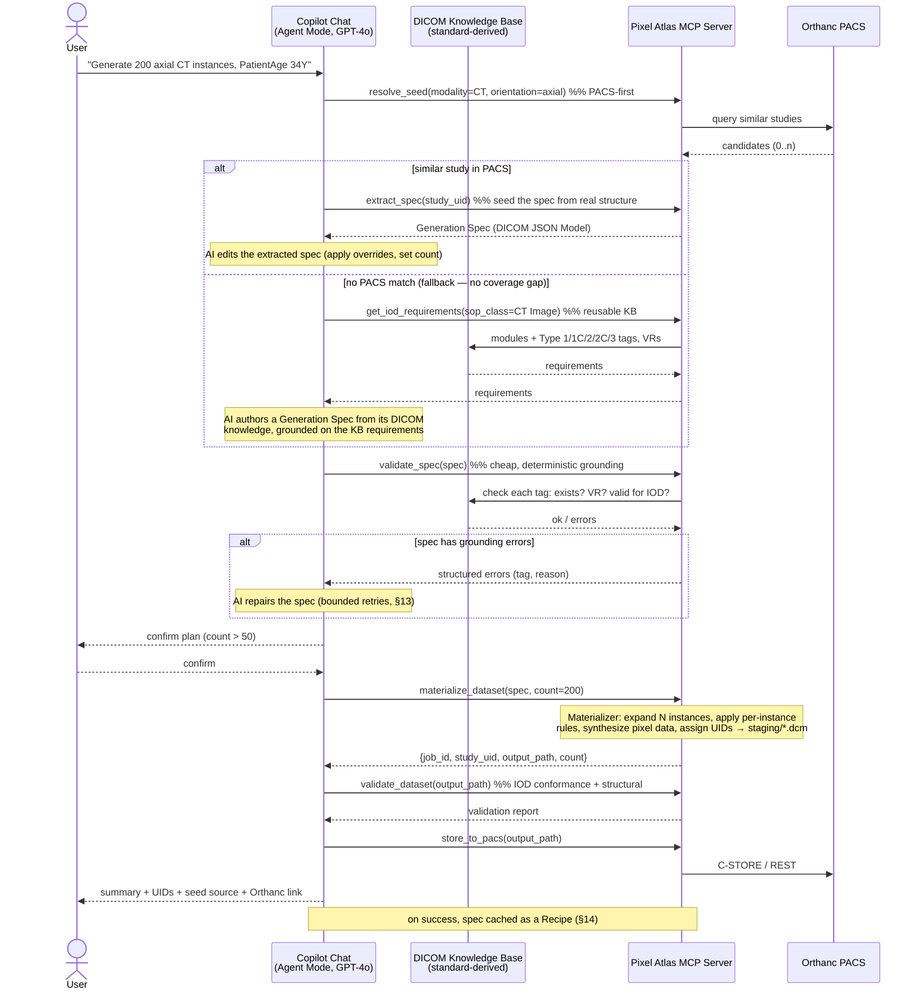

# Pixel Atlas — Solution Design

> The current, implemented design (the **how**). Companion to
> [architecture.md](architecture.md) (components/tools),
> [ai-driven-simple-overview.md](ai-driven-simple-overview.md) (plain English), and
> [ai-driven-comprehensive-plan.md](ai-driven-comprehensive-plan.md) (full build
> reference incl. the decisions ledger).

## 1. What changes and why

Today, DICOM IOD knowledge is **hand-authored per template**: each
`templates/<MODALITY>/<id>/` folder carries an `iod_spec.yaml` (what the
standard requires) plus a `manifest.yaml` (how to fill it) and a seed `.dcm`.
Generation is therefore limited to modalities/study types someone has already
authored a template for, and every new coverage area was a manual authoring +
review effort.

This redesign moves the DICOM knowledge **out of per-template files and into two
reusable layers**:

1. A **DICOM Knowledge Base (KB)** derived once from the DICOM standard,
   covering *every* IOD/SOP Class — the single, reusable source of "what tags
   does this IOD require, what's their VR/Type/VM." No per-modality authoring.
2. The **agent's own DICOM knowledge**, grounded against that KB, to plan tag
   *values* for **any valid natural-language request** — not just pre-authored
   ones.

The agent's output is a structured **DICOM Generation Spec** — a JSON document
(canonically the [DICOM JSON Model, PS3.18 Annex F](#5-the-dicom-generation-spec-the-ir),
with an optional XML serialization). A deterministic **Materializer library**
converts that spec into conformant `.dcm` files. The LLM produces *one* spec per
study; the library expands it to N instances, synthesizes pixel data, and
generates UIDs — preserving the token discipline of the current design.

**One line:** *templates (hand-authored knowledge) → standard-derived Knowledge
Base + AI-authored JSON/XML spec → deterministic Materializer → `.dcm`.*

## 2. Design principles (revised)

1. **Knowledge is derived from the standard, once, and reused.** IOD/module/tag
   requirements come from the KB (built from `dicom-validator`'s standard data +
   the pydicom data dictionary), not from per-template YAML. The same KB serves
   every modality and every request.
2. **The AI plans; deterministic code materializes and validates.** The LLM
   authors a compact spec (shared attributes + per-instance rules + a pixel
   *directive*). It never emits per-instance datasets, pixel bytes, or loops over
   1..N. The Materializer expands, synthesizes pixels, and assigns UIDs in one
   tool call — same [token economy](#13-repair-loop--token-economy) guarantee as
   the template design.
3. **Grounding, not trust.** Every attribute the AI emits is checked
   mechanically against the KB (tag exists, VR correct, valid for this IOD)
   *before* materialization. Ungrounded/hallucinated tags are rejected with a
   specific error, never silently written.
4. **PACS-first still holds.** The preferred seed is real structure already in
   the PACS: extract an existing study into a spec, let the AI adjust it, then
   materialize. Building a spec purely from the standard KB is the fallback —
   but, unlike the template fallback, it has **no coverage gap** (see
   [§11](#11-no-more-coverage-gaps)).
5. **Non-destructive by default.** Generation always writes a new study; modify
   produces a derived study unless the user explicitly confirms an in-place
   overwrite. Unchanged from today.
6. **Validate before store; fail loud on ambiguity.** Nothing reaches the PACS
   without passing conformance validation. If a value is genuinely ambiguous or
   the request is not a valid DICOM concept, the agent stops and asks.
7. **Successful specs become reusable recipes.** A grounded, validated spec is
   cached (see [§14](#14-recipe-cache-emergent-reuse)) so a repeat request skips
   planning entirely. The "template catalog" becomes an *emergent, auto-grown*
   cache instead of a hand-curated prerequisite.

## 3. Glossary (new/changed terms)

| Term | Meaning |
|---|---|
| **DICOM Knowledge Base (KB)** | The reusable, standard-derived knowledge of every IOD: modules (M/C/U), and per tag its keyword, VR, VM, and Type (1/1C/2/2C/3). Built offline from `dicom-validator` standard data + pydicom dictionary; queried at runtime via MCP tools. Replaces per-template `iod_spec.yaml`. |
| **DICOM Generation Spec (the IR)** | The JSON (or XML) document the AI produces: a small envelope carrying study/series-level **attributes** (in DICOM JSON Model form), **per-instance rules**, a **pixel directive**, an **identity policy**, and **provenance**. The single artifact the Materializer ingests. |
| **DICOM JSON Model** | The DICOM-standard JSON encoding of a dataset (PS3.18 Annex F), e.g. `{"00100010": {"vr":"PN","Value":[{"Alphabetic":"DOE^JOHN"}]}}`. Loadable directly by `pydicom.Dataset.from_json`. The canonical body of the Generation Spec. |
| **Native DICOM Model (XML)** | The standard XML encoding of the same dataset (PS3.19). Supported as an alternate serialization; JSON is canonical (see [§5.4](#54-xml-serialization)). |
| **Materializer** | The deterministic library that compiles a Generation Spec into N conformant `.dcm` files (attribute application, per-instance expansion, pixel synthesis, UID generation). The "library that converts the json/xml into a DICOM file." |
| **Grounding** | Mechanically checking every AI-emitted attribute against the KB before materialization. |
| **Recipe** | A grounded, validated Generation Spec cached for reuse (with the request signature it satisfies). The successor to a "template." |

## 4. High-level workflow



The five steps of the original brief are preserved; only step 2–3 change: instead
of "download a template study and rewrite it," the agent **authors (or extracts)
a grounded spec**, which the Materializer converts.

### 4.1 Seed matching criteria (kept lightweight)

`resolve_seed`'s PACS query stays **cheap and index-friendly**, unchanged from
the current design — it must not get slower as the PACS grows:

- **Modality** is the only real server-side query key (via Orthanc's indexed
  `ModalitiesInStudy`); it must match exactly and is never substituted.
- **Body part** and **orientation**, when the user gives them, are matched as
  **case-insensitive substrings of `StudyDescription`** on the returned
  candidates — *not* by querying `BodyPartExamined`/`ImageOrientationPatient` and
  *not* by fetching each candidate's tags.
- Optional `patient_name`/`date_range` narrow the query server-side where given.

**Explicitly not done during seed resolution:** per-instance tag inspection
(fetching each candidate study's tags to match `BodyPartExamined`,
`ImageOrientationPatient`-derived orientation, or arbitrary feature tags). That
richer matching is O(candidates) in network fetches and gets expensive on a large
PACS, so it is **out of scope for seed matching**. The per-instance
`check_pacs_feature` tool still exists for the deliberate, narrowed "does the PACS
have any study with tag X" question — but it is a separate, opt-in call, never on
the `resolve_seed` hot path. If description-substring matching proves too coarse
in practice, richer matching is a future enhancement to weigh against its cost,
not a v1 default.

## 5. The DICOM Generation Spec (the IR)

The single artifact the AI produces and the Materializer ingests. It is a thin
**generation envelope** around a **DICOM JSON Model** attribute body, so the
attribute payload is standard and directly `from_json`-loadable, while the
envelope carries the generation semantics (how many instances, per-instance
variation, pixel synthesis, identity policy) that a static dataset can't express.

### 5.1 Structure

```jsonc
{
  "pixelAtlasSpec": "1.0",
  "request": {
    "prompt": "Generate 200 axial CT instances, PatientAge 34Y",
    "modality": "CT",
    "instanceCount": 200,
    "seedSource": { "type": "iod", "sopClassUID": "1.2.840.10008.5.1.4.1.1.2" }
    //            or { "type": "pacs", "studyUID": "1.2.3.4.5" }
  },

  // Study/series-level attributes shared by every instance — DICOM JSON Model.
  // Authored by the AI, grounded against the KB before materialization.
  "attributes": {
    "00080060": { "vr": "CS", "Value": ["CT"] },                       // Modality
    "00080016": { "vr": "UI", "Value": ["1.2.840.10008.5.1.4.1.1.2"] },// SOPClassUID
    "00180060": { "vr": "DS", "Value": ["120"] },                      // KVP
    "00185100": { "vr": "CS", "Value": ["HFS"] },                      // PatientPosition
    "00200037": { "vr": "DS", "Value": ["1","0","0","0","1","0"] },    // ImageOrientationPatient (axial)
    "00280030": { "vr": "DS", "Value": ["0.7","0.7"] }                 // PixelSpacing
    // ... every Type 1/2 non-pixel tag the KB lists for this IOD
  },

  // Per-instance rules — evaluated by the Materializer for i = 0..N-1.
  // Keeps the spec O(1) in size regardless of instance count (token economy).
  "perInstance": {
    "SOPInstanceUID":       { "rule": "uid" },
    "InstanceNumber":       { "rule": "index + 1" },
    "SliceLocation":        { "rule": "linspace", "start": -120.0, "step": 1.5 },
    "ImagePositionPatient": { "rule": "derive_from_slice" }
  },

  // Pixel data is NEVER emitted as bytes by the AI — only described.
  // The Materializer OWNS and synthesizes the whole Image Pixel module from this
  // directive on the IOD path (§5.3). IGNORED on the PACS-seed path (source
  // pixels are cloned untouched). The AI must NOT put pixel-module tags in
  // `attributes` — validate_spec rejects them.
  "pixel": {
    "rows": 512, "columns": 512, "samplesPerPixel": 1,
    "photometricInterpretation": "MONOCHROME2",
    "bitsAllocated": 16, "generator": "noise"        // noise | gradient | phantom
  },

  // Identity policy. Synthetic pools on the IOD path; on the PACS-seed path,
  // source identity is currently kept as-is (privacy scrubbing deferred — §15).
  "identity": { "mode": "synthetic", "pool": "default", "patientCount": 1 },

  // Overrides parsed from the user request, applied last (validated vs VR/KB).
  "overrides": { "PatientAge": "034Y" },

  // What the AI grounded this on — auditable.
  "provenance": {
    "grounded": true,
    "knowledgeRefs": ["PS3.3 C.7.1.1 Patient", "PS3.3 C.8.2.1 CT Image"],
    "authoredBy": "gpt-4o", "specSource": "iod"     // iod | pacs-extract | recipe
  }
}
```

### 5.2 Why an envelope, not raw DICOM JSON Model

Raw DICOM JSON Model describes exactly one static dataset. A generation request
is inherently *parametric* — N instances varying by `InstanceNumber`/
`SliceLocation`, deterministic UIDs, synthesized pixels. The envelope keeps the
attribute body 100% standard (and `from_json`-loadable) while adding the minimum
generation metadata needed, and keeps the AI's output **O(1) in instance count**
— the same discipline of pushing the N-loop into the MCP server, not the chat loop.

### 5.3 What the AI authors vs. what the Materializer owns

| Concern | Owner | Rationale |
|---|---|---|
| Which tags, their VR, values, IOD structure | **AI**, grounded on KB | This is the DICOM-knowledge work being moved off templates |
| Per-instance numeric progressions | AI declares the *rule*; Materializer *evaluates* | O(1) spec, deterministic expansion |
| **The entire Image Pixel module** (`Rows`, `Columns`, `BitsAllocated`/`BitsStored`/`HighBit`, `PixelRepresentation`, `SamplesPerPixel`, `PhotometricInterpretation`, `PlanarConfiguration`, `PixelData`) | **Materializer** (from `pixel` directive) | Single owner avoids AI-vs-synthesis conflicts (decision #2). `validate_spec` **rejects** any of these tags in `attributes`. Never in the LLM context — token economy + no binary in chat. |
| **Pixel module on the PACS-seed path** | **Left untouched** — cloned from the source instance as-is | When the seed is a real PACS study, the source's pixel data and pixel-module tags are preserved verbatim; the `pixel` directive is ignored on this path (decision #2). |
| UID generation | **Materializer** (`uid_strategy.py`, deterministic per `job_id`+index) | Idempotent retries; unchanged from today |
| VR/type/IOD conformance enforcement | **Materializer + validator** | Grounding, not trust |

### 5.4 XML serialization

The same model can be serialized as the standard **Native DICOM Model (PS3.19
XML)** for tooling that prefers XML. JSON is canonical because (a) it is directly
loadable by `pydicom.Dataset.from_json`, and (b) it is materially lighter on
tokens. XML support is a thin converter over the same in-memory dataset (emit via
a native-model writer; ingest via a native-model reader) — see
[architecture.md](architecture.md) for where it lives. The `pixel`,
`perInstance`, and envelope fields carry over as XML attributes/elements on the
document root.

### 5.5 Pixel data: who writes it, how it's added

Two sources, **neither of which routes pixel bytes through the LLM** (the core
token-economy guarantee):

- **PACS-seed path** → pixels (and the whole Image Pixel module) are **cloned from
  the source instance untouched** (decision #2). No synthesis, no AI, no tokens.
- **IOD path (no PACS study)** → the **Materializer synthesizes** pixels. The AI
  authors only the small `pixel` *directive* (rows, columns, bits, samples,
  photometric, `generator` ∈ {noise, gradient, phantom}) — a few dozen tokens. The
  Materializer (generalized `seed_builder.py`) generates the byte array in-process
  with NumPy and writes `PixelData` + the pixel-module tags.

**Token cost:** effectively zero for pixel data. A 512×512×16-bit array is ~512 KB
(~700k tokens if inlined) and is *never* inlined — only the ~30-token directive is.
So the IOD path is no more pixel-expensive than the current design.

**Modality-aware defaults & viewer-safety:** the AI sets the `pixel` directive from
its DICOM knowledge (e.g. US → RGB/`YBR`, MG → high-bit `MONOCHROME2`, CT →
16-bit `MONOCHROME2`). For CT/MR the Materializer also sets `RescaleSlope`/
`Intercept` and `WindowCenter`/`Width` consistent with the synthesized value range
so viewers render something sane. This is **structural/viewer-safety only** —
synthetic noise is not clinically realistic (§17), which is acceptable per the
out-of-scope pixel-realism decision and is what the "test output first" loop
surfaces.

**Transfer syntax:** materialized files use **Explicit VR Little Endian,
uncompressed** (`1.2.840.10008.1.2.1`) in `file_meta`; compressed transfer syntaxes
are out of scope for v1.

## 6. The DICOM Knowledge Base (the reusable knowledge)

The KB is the heart of "use AI for knowledge instead of relying on templates."

- **Source:** built offline from `dicom-validator`'s standard-derived
  IOD→module→tag tables (already loaded today by
  [validator.py](../mcp-server/validator.py) for conformance checking) plus the
  pydicom data dictionary (keyword ↔ tag ↔ VR ↔ VM). Optionally enriched with a
  small curated notes file for conditions the standard expresses as free text.
- **Coverage:** *every* SOP Class the standard defines — not a curated subset.
  This is what removes the per-modality authoring bottleneck.
- **Shape:** for a given SOP Class, returns modules (M/C/U) and, for M/C modules,
  each tag's keyword, VR, VM, Type, and any machine-readable condition.
- **Runtime access:** pure lookups, no network, no per-request `dicom-validator`
  parse (the standard data is cached once per process, as today). Exposed via the
  MCP tools in [§7](#7-mcp-tool-surface-changes).
- **Reuse:** one KB instance answers questions for all requests, all modalities,
  across the whole session. It is also what `validate_spec` and the Materializer's
  fill-in-the-blanks safety net consult — a single knowledge source, not three.

This subsumes the current per-template `iod_spec.yaml` files: instead of N
committed YAML files (one per template), there is **one** standard-derived KB.

## 7. MCP tool surface changes

Full contract in [architecture.md §3](architecture.md#3-revised-mcp-tool-contract).
The conceptual changes:

| Tool | Change | Purpose |
|---|---|---|
| `get_iod_requirements` | **Expanded** | Now backed by the full KB across *all* SOP Classes (not just templated ones). Primary knowledge tool the AI grounds on. |
| `describe_attributes` | **New** | Batch lookup of VR/VM/Type/keyword for a set of tags — the AI's fast grounding check while authoring. |
| `validate_spec` | **New** | Deterministic grounding of a Generation Spec against the KB *before* materialization: unknown tag, wrong VR, missing Type-1, tag-not-valid-for-IOD → structured errors for the repair loop. |
| `materialize_dataset` | **New (replaces `generate_dataset`)** | Compiles a Generation Spec into N `.dcm` files. The "library that converts json/xml → DICOM." Reuses today's UID/staging/job-registry/validation-safety-net machinery. |
| `extract_spec` | **New** | Turns an existing PACS study (or local path) into a Generation Spec (DICOM JSON Model), so the AI can edit real structure. Unifies generate and modify. |
| `resolve_seed` | **Kept** | Still PACS-first; on a hit, the agent calls `extract_spec` instead of cloning a template seed. |
| `modify_dataset` | **Reframed** | Becomes `extract_spec` → AI edits → `materialize_dataset`; the standalone tool is retained as a convenience wrapper. |
| `validate_dataset`, `store_to_pacs`, `list_pacs_studies`, `check_pacs_feature`, `get_job_status`, `health_check` | **Unchanged** | Post-generation and PACS I/O are format-agnostic. |
| `list_templates`, `get_template_info` | **Deprecated → `list_recipes`, `get_recipe`** | Repositioned over the emergent recipe cache ([§14](#14-recipe-cache-emergent-reuse)) instead of a hand-curated catalog. |

## 8. Spec authoring by the AI

For the **fallback (no PACS seed)** path — the interesting new case:

1. The agent maps the request to a SOP Class (modality → default SOP Class via a
   small KB table). **Default is the classic single-frame SOP Class** for the
   modality; the Enhanced/multi-frame SOP Class is chosen only when the user
   explicitly asks for "enhanced" / "multi-frame". Genuinely ambiguous modalities
   are confirmed with the user.
2. `get_iod_requirements(sop_class)` returns the M/C modules and their Type
   1/1C/2/2C/3 tags — grounding context, fetched once, not inlined per turn.
3. The AI drafts the `attributes` body: every Type 1 tag gets a
   knowledge-plausible synthetic value; every Type 2 tag is present (empty if no
   sensible value); Type 3 only where the request implies them. Identity tags
   defer to the `identity` policy (synthetic pools), never freeform PHI.
4. The AI declares `perInstance` rules and a `pixel` directive rather than
   enumerating instances or pixels.
5. The AI attaches `provenance.knowledgeRefs` so the grounding is auditable.

**Sequences (SQ) — AI authors them directly (decision #3).** Rather than scoping
nested sequences (code sequences, contrast, referenced-image, per-frame functional
groups) out of v1, the AI authors them in DICOM JSON Model form and the safety net
catches mistakes: `validate_spec`'s structural/VR checks, then the probe-first
`validate_dataset` (§10), then a bounded repair. This is more ambitious and more
token-heavy for deeply-nested IODs, and is the most likely place to burn repair
iterations — flagged as a risk to watch in early testing (§17), not a hard limit.

For the **PACS-seed** path, steps 1–3 are replaced by `extract_spec`, and the AI
only edits the extracted spec (apply overrides, set count). Source identity and
pixel data are preserved as-is — the reference PACS is assumed to hold synthetic
test data, so PHI scrubbing is deferred (§15, decision #8). This also makes the
prior-study flow trivially correct: a baseline and its prior share the source's
(preserved) identity, so they stay linked without a separate identity map.

## 9. Spec validation & grounding (`validate_spec`)

A cheap, deterministic gate run **before** the expensive materialization:

- **Tag existence** — every key in `attributes`/`overrides` is a real DICOM tag
  (KB / pydicom dictionary).
- **VR correctness** — each value matches the tag's VR (`DA`, `TM`, `PN`, `IS`,
  `DS`, `AS`, `UI`, …), reusing today's strict value validation
  ([generator.py's `strict_value_validation`](../mcp-server/generator.py)).
- **IOD validity** — every tag is defined for this SOP Class's IOD per the KB;
  a tag not valid for the IOD is rejected, naming it.
- **Required-tag presence** — every unconditional Type 1 tag has a non-empty
  value; every Type 2 tag is present (possibly empty). Missing → error.
- **Protected tags** — UID tags and per-instance-computed tags can't be pinned in
  `attributes` (they belong in `perInstance`), same policy as
  [override_policy.py](../mcp-server/override_policy.py).
- **Pixel-module tags rejected in `attributes`** — the whole Image Pixel module is
  Materializer-owned (§5.3, decision #2); any of those tags appearing in
  `attributes` is an error naming it.
- **Cross-tag consistency rules (decision #1)** — grounding checks *structure*;
  the KB alone won't catch a self-inconsistent-but-conformant dataset. So
  `validate_spec` adds an explicit, curated set of cross-tag checks for the handful
  that break viewers/parsers:
  - **Pixel-module group** — `SamplesPerPixel` ↔ `PhotometricInterpretation` ↔
    `PlanarConfiguration`, and `BitsAllocated` ≥ `BitsStored` > `HighBit`,
    `PixelRepresentation` ∈ {0,1}. (Enforced via the `pixel` directive, which is
    the single owner — so this is validated on the directive, not free-form tags.)
  - **Modality ↔ SOPClassUID** — the `Modality` value must be consistent with the
    IOD implied by `SOPClassUID` (KB mapping).
  - **Geometry triplet** — if any of `ImageOrientationPatient` /
    `ImagePositionPatient` / `PixelSpacing` is present, the set required together
    for a valid frame of reference must be present and well-formed.

  These are a deliberately small, maintained list — not full clinical validation
  (§17). Everything else remains "conformant-but-possibly-implausible," which is
  acceptable for synthetic test data.

Errors are returned as a compact, structured list (`{tag, keyword, reason}`) that
the agent can act on directly in the repair loop ([§13](#13-repair-loop--token-economy)).
This replaces the template's `manifest.yaml` allow-list/protected-tags derivation
with a KB-driven check that works for *any* IOD.

## 10. Materialization (`materialize_dataset`) — the library

Runs entirely in-process as one tool call, referencing a validated spec by its
`spec_id` (§13, decision #6 — the full spec is not re-sent):

```
1. Load the spec by spec_id (stored server-side by validate_spec).
   Resolve SOP Class + KB requirements.
2. Build the base dataset:
     - if seedSource.type == "pacs": load the fetched source instance(s) as the
       base — pixel data and the whole Image Pixel module are kept UNTOUCHED
       (decision #2); the `pixel` directive is ignored on this path.
     - if seedSource.type == "iod": build a minimal base (file_meta + fresh
       UIDs) from sopClassUID (reuse seed_builder.build_minimal_seed), and
       synthesize the Image Pixel module from the `pixel` directive (reuse
       seed_builder's modality-agnostic pixel synthesis, sized by rows/cols/bits).
3. Apply the spec's `attributes` via pydicom from_json onto the base.
4. PROBE-FIRST (decision #5): materialize exactly ONE instance, then run the FULL
   validate_dataset on it (IOD conformance + structural + pixel). If it fails,
   stop and return the errors for a bounded post-materialize repair (§13) —
   before generating the other N-1 files. ~1% of the cost catches most failures.
5. Create job_id; new_study_uid, new_series_uid = uid_strategy.generate_uid(job_id).
6. for i in range(instanceCount):        # (or per-frame for multi-frame IODs, below)
     new_sop_uid = generate_uid(job_id, i)
     clone base in-memory
     evaluate perInstance rules with i (InstanceNumber, SliceLocation, ...)
     apply overrides (validated in §9)
     fill-in-the-blanks safety net: any unconditional Type 1/2 tag still
       missing per the KB → set empty (Type 2) or raise naming it (Type 1)
     write UIDs + dataset → staging/<job_id>/IM{i:04d}.dcm
7. Return {job_id, study_uid, output_path, count}.
```

**Multi-frame IODs (decision #4).** For multi-frame SOP Classes the "count" means
*frames within one instance*, not N separate instances: the `perInstance` rules
become **per-frame** and populate the Per-Frame Functional Groups Sequence, and
one multi-frame `.dcm` is written. The probe in step 4 validates that single
multi-frame instance. Whether a SOP Class is single- or multi-frame is a KB fact.

**Presentation State (PR) / Key Object (KO) IODs (decision #4).** These are not
image IODs — they *reference* existing instances rather than carrying pixels. The
Materializer skips pixel synthesis entirely and instead requires a
`references` block in the spec (the target study/series/SOP instances the PR/KO
applies to), which must already exist in the PACS. Requesting a PR/KO with no
resolvable referenced instances fails loud.

This reuses the current generation execution detail:
in-process pydicom rewriting, deterministic UIDs, staging layout, job registry,
and the Type-1/2 safety net are unchanged. The substitutions are: **(a)** the seed
is a spec (extracted or IOD-built), **(b)** on the IOD path pixel data is
synthesized from the `pixel` directive (on the PACS path it is cloned untouched),
and **(c)** a probe instance is validated before the full expansion.

## 11. Supported IOD family & coverage

### 11.1 In scope (decision #4)

Within the supported family, the template design's dead-end (UC-07 / *no PACS
match and no template → no generation*) disappears — the "no PACS match" branch
always falls back to **building the spec from the KB**. The supported family is:

- **All standard image IODs, single-frame *and* multi-frame** — CT, MR, US, MG,
  CR, DX, XA, RF, NM, PT, OCT, and their Enhanced/multi-frame variants (handled
  per §10's multi-frame branch).
- **Presentation State (PR)** and **Key Object Selection (KO)** — handled per
  §10's reference-based branch (they reference existing instances).

So "no coverage gaps" means: **any request within this family** is generatable,
via PACS extract (preferred) or KB-authored spec (fallback).

### 11.2 Explicitly refused (decision #4)

The agent **says no** (never silently substitutes) for IODs outside the family —
notably **Structured Reports (SR)**, **RT objects** (RTSTRUCT/RTPLAN/RTDOSE/…),
**Segmentation (SEG)**, **Encapsulated documents** (PDF/CDA/STL), **Waveforms**,
and other non-image/highly-structured IODs. These have complex, deeply-nested
structures and reference/relationship semantics that AI-from-JSON authoring can't
reliably produce; they are candidates for a later phase, not v1.

### 11.3 Resolution outcomes

- **In-family + PACS match** → `extract_spec` → AI edits → materialize (preferred).
- **In-family + no PACS match** → AI authors spec from KB → materialize.
- **Out-of-family** → refuse, name the unsupported IOD, point at the roadmap.
- **Genuinely invalid/ambiguous request** → stop and ask, as today.

## 12. Generate / Modify / Prior — unified through the spec

All three become the same pipeline with a different spec *source*:

| Command | Spec source | Then |
|---|---|---|
| `/generate` (PACS seed) | `extract_spec(pacs study)` → AI edits | validate_spec → materialize |
| `/generate` (fallback) | AI authors from KB | validate_spec → materialize |
| `/modify` | `extract_spec(named study)` → AI applies overrides | validate_spec → materialize (regenerate_uids default true) |
| `/generate prior_of=` | `extract_spec(reference study)` → AI keeps identity, shifts StudyDate | validate_spec → materialize |

The prior-study identity reuse and the destructive-overwrite gate carry over
unchanged — they're properties of materialization, not of where the spec came
from.

## 13. Repair loop & token economy

The one new cost is the possibility of an AI **repair iteration**. Kept cheap by
design:

| Technique | Effect |
|---|---|
| **Spec-handle (`spec_id`) pattern (decision #6)** — the AI emits the spec **once**; `validate_spec` stores it server-side and returns a `spec_id`; `materialize_dataset(spec_id)` and repairs reference it. Repairs send a **small diff** (changed fields only), not the whole spec. | Roughly **halves** the new-path token premium — the largest single saving. The spec never gets re-emitted as a tool argument. |
| AI emits **one spec per study** (shared attributes + `perInstance` rules), never N instances or pixel bytes | Spec is O(1) in instance count — same discipline as today's single `generate_dataset` call |
| `validate_spec` is **deterministic and pre-materialization** | Most errors (grounding + the §9 cross-tag rules) caught in one cheap pass, before any file I/O |
| **Probe-first materialization (decision #5)** — validate 1 instance fully before expanding to N | A post-materialization conformance failure costs ~1 instance, not N; the repair diff is applied to the stored spec and only the probe re-runs |
| Grounding/repair errors are **compact and specific** (`{tag, reason}`) | A repair turn edits a few fields, not the whole spec |
| Repair loop (spec-grounding **and** probe) is **bounded** (e.g. ≤ 2 retries each), then fail-loud | No unbounded LLM back-and-forth |
| **Recipe cache** short-circuits planning for repeat requests ([§14](#14-recipe-cache-emergent-reuse)) | Common requests cost ~0 planning tokens |
| KB lookups return **compact structured data, cached per session**; the KB standard data is loaded once per process and kept warm (decision #10) | Grounding context fetched once, not re-inlined; no repeated `dicom-validator` warm-up |
| Pixel data + DICOM binaries **never enter the chat context**; the extended audit trail (decision #11) is written **server-side only**, never to chat | Zero token cost for richer auditing |

Net: the common (recipe-hit or PACS-extract) path is *cheaper* than today; the
worst case (novel modality, one repair) adds a single bounded LLM turn to author
the spec — paid once, then cached. With the `spec_id` handle, the earlier ~7–8k
first-time estimate drops to roughly **~4–5k**.

## 14. Recipe cache (emergent reuse)

"Should be able to reuse" is satisfied two ways:

1. **The KB is inherently reusable** — one standard-derived knowledge source for
   all requests (§6).
2. **A recipe cache** turns each successful, validated spec into a reusable
   artifact keyed by its request signature. The key (decision #7) is the coarse
   structural tuple **modality + body part + orientation + SOP Class + a small set
   of module-affecting flags** (e.g. `contrast`, `localizer`) — because those
   flags add/remove whole modules (Contrast/Bolus, …) and so must not collide with
   the plain variant. Plain user *overrides* are **not** part of the key; they're
   re-applied fresh at materialization. On a matching later request, the agent
   loads the recipe and skips authoring+grounding entirely — straight to confirm →
   materialize. (Future scope, decision #7b: richer/semantic keying beyond a fixed
   flag list.)

The recipe store *is* the successor to the template catalog, but it is
**auto-grown from real successful generations** rather than hand-authored ahead
of need. `list_recipes`/`get_recipe` browse it. Recipes are plain JSON specs, so
they remain human-reviewable and PR-diffable (a curated recipe can still be
committed deliberately, e.g. a canonical chest-CT protocol) — the difference is
that authoring one is no longer a *prerequisite* for coverage.

## 15. Security, privacy & conformance

- **PHI scrubbing is deferred for now (decision #8).** This tool targets a
  local/dev **test** environment whose reference PACS is assumed to hold synthetic
  or already-anonymized data. On the PACS-extract path, source identity and pixel
  data are therefore **reused as-is** (which is also what keeps priors linked, §8).
  The IOD path still uses synthetic identity pools because there is no source data
  to carry. **If this is ever productionized against a PACS with real PHI, an
  `extract_spec` scrubbing layer must be added first** — tracked as an open item
  (§17). Until then, do not point it at a PACS containing real patient data.
- **Grounding prevents malformed data at scale** — `validate_spec` (incl. the §9
  cross-tag rules) + the probe-first `validate_dataset` both run before store; a
  hallucinated or self-inconsistent tag set can't reach the PACS.
- **Audit trail (decision #11)** — because data structure is now AI-generated
  rather than human-reviewed, the local audit log records, per job, the full
  spec (`spec_id` + content), its `provenance`, and the KB edition — so any output
  is reproducible and traceable. This is written server-side only (zero token cost).
- **Boundary unchanged** — only NL prompts and the Generation Spec cross to the
  Copilot/GPT-4o cloud; DICOM binaries and pixel data never do.
- **Conformance** — every materialized study passes `validate_dataset`
  (`dicom-validator` IOD conformance + structural checks) before store, exactly
  before every store.

## 16. Relationship to the current design & migration

This document defines the target. The concrete before/after, per-file and
per-tool impact, and a phased migration that keeps the current template path
working during transition are in
[design-change-ai-driven.md](design-change-ai-driven.md).

## 17. Open questions

- **KB shape stability** — `dicom-validator`'s internal standard-data structures
  are not a documented public API; pin the version and wrap access behind
  `iod_lookup.py` so a schema change is contained.
- **Type 1C/2C conditions** are free text in the standard, not machine-checkable;
  the AI interprets them per request, and `validate_dataset` remains the backstop.
- **Recipe cache invalidation** — when does a cached recipe become stale (KB
  refresh, standard-edition bump)? Version recipes by KB edition.
- **XML round-trip fidelity** — confirm the native-model converter round-trips
  the envelope fields losslessly before promoting XML beyond "supported alt."
- **Clinical plausibility** — grounding + the §9 cross-tag rules guarantee
  *conformance and viewer-safety*, not that every AI-chosen value is clinically
  sensible; no independent check. Acceptable for synthetic test data.
- **AI-authored sequences (decision #3)** — deeply-nested SQ (per-frame functional
  groups on multi-frame IODs; PR/KO reference sequences) are the highest-risk
  authoring target for repair-loop churn and token cost. Watch early testing; if a
  particular IOD proves consistently hard, fall back to a Materializer-injected
  curated sequence for it.
- **PHI scrubbing on productionization (decision #8)** — the deferred
  `extract_spec` scrubbing layer must be designed and signed off before any use
  against a PACS holding real PHI.
- **KB warm-up/caching (decision #10)** — confirm the standard data loads once and
  stays warm across `get_iod_requirements`/`validate_spec` calls in a session
  (the ~40s first-load cost — confirmed once in the KB feasibility spike).

## 18. Multi-series studies & cross-series references

**Problem.** A user may ask for one study containing several series — same
modality (e.g. "1 study, 4 instances, but 2 different series") or different
modalities (e.g. "2 CT series with a PR pointing at series 1's first image").
Today's tools mint a fresh `StudyInstanceUID` on every `generate_study`/
`materialize_dataset` call (`materializer.py` — `new_study_uid =
uid_strategy.new_uid(job_id, "study")` in each of `_materialize_single_frame`,
`_materialize_classic_mf`, `_materialize_enhanced_mf`), so there is no way to
attach a second series to a study already built in a prior call. PR/KO already
support cross-series references via `spec["references"]["series"]`
(`materializer.py:126`, `:316-322`), but only against instances **already
stored in the PACS** — and there is no tool to enumerate a stored series'
instance UIDs without reading raw `.dcm` files, which the golden rules forbid.

Two small additions close this gap (implemented). No new mega-tool, no change
to the one-series-per-call materialization model — the model stays right, it
was just missing a way to *chain* calls onto one study.

**18.1 `generate_study(..., study_uid: str | None = None)`**

When `study_uid` is given:
- The materializer skips minting a new `StudyInstanceUID` and reuses the
  passed one.
- The passed `study_uid` must already exist in the PACS (mirrors the existing
  PR/KO invariant: "requires a `references` block ... which must already
  exist in the PACS", §10) — otherwise: *"store the first series before
  attaching a second series to study_uid"*.
- Identity (PatientID/PatientName/StudyDate/StudyDescription/
  AccessionNumber) is derived from that existing study via Orthanc, not a
  fresh synthetic pool — a sibling of `_resolve_prior_identity`
  (`materializer.py:101`), but same-study (no date shift) instead of
  prior-study, so the two series are unambiguously the same patient/study.

**18.2 New tool `list_series_instances(study_uid, series_uid=None)`**

A thin Orthanc REST lookup (parallel to `orthanc_client.find_studies`)
returning `[{seriesUID, sopClassUID, sopInstanceUID, instanceNumber}]` for a
*stored* study/series. This is the missing enumeration primitive: an agent
authoring a PR/KO's `references` block needs concrete SOP Instance UIDs from
an already-stored sibling series, and today has no way to get them except
reading `.dcm` files directly (forbidden).

**18.3 Resulting flow — "2 CT series + PR pointing at series 1, image 1"**

1. `generate_study(modality=CT, count=N1)` → confirm → `store_to_pacs` →
   capture `study_uid`, `series_uid_1`.
2. `generate_study(modality=CT, count=N2, study_uid=study_uid)` → confirm →
   `store_to_pacs` → `series_uid_2`, same study, same patient identity.
3. `list_series_instances(study_uid, series_uid_1)` → pick the target
   instance(s).
4. Author a PR spec: `{"references": {"studyUID": study_uid, "series":
   [{"seriesUID": series_uid_1, "instances": [that instance]}]}}` →
   `validate_spec` → `materialize_dataset` → confirm → `store_to_pacs`.

Three artifacts, three confirm-before-store gates — the same discipline as
today, chained rather than replaced.

**18.4 Disambiguation is an agent-behavior rule, not a code change.** Default
interpretation stays "N instances = one series." The agent must ask before
generating anything when the request is ambiguous about series cardinality:
different body parts/orientations/modalities mentioned, an explicit "N
series," or a multi-frame modality mixed with a separate single-frame ask.
Multi-frame (enhanced/classic) SOP classes are inherently one-instance-per-
series (one `.dcm` file, N frames) — "4 images" in a multi-frame request
usually means 4 frames in one instance, not 4 series, and that reading should
be confirmed with the user rather than assumed, since series cardinality is
irreversible once stored.
