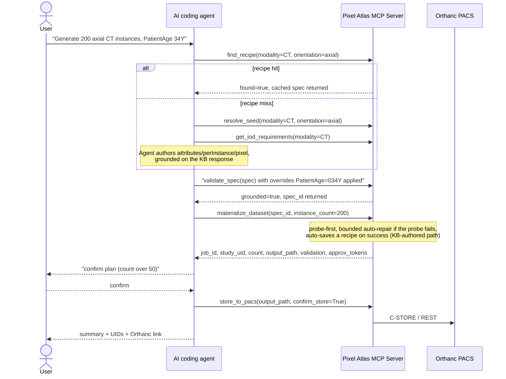

# Pixel Atlas — Solution Design

> The **how**: the Generation Spec format, the Knowledge Base, validation and
> materialization, and the token economy that keeps generation cheap
> regardless of instance count. Companion to
> [architecture.md](architecture.md) (components, tool reference, diagrams).

## 1. What this system does

Pixel Atlas turns a plain-English request ("generate 200 axial CT
instances") into conformant synthetic DICOM files loaded into a local test
PACS (Orthanc). DICOM knowledge — which tags an IOD requires, their VR/Type,
how modules nest — comes from a **DICOM Knowledge Base (KB)** derived once
from the DICOM standard and covering every SOP Class the standard defines.
There is no per-modality template to author before a new scan type can be
generated.

## 2. Design principles

1. **Knowledge is derived from the standard, once, and reused.** IOD/module/tag
   requirements come from the KB (`mcp-server/kb/2026c/`, built from
   `dicom-validator`'s standard data + the pydicom data dictionary), not from
   per-modality code or config. The same KB serves every modality and every
   request.
2. **The AI plans; deterministic code materializes and validates.** For a
   brand-new study, the server (or, in the advanced flow, the agent) authors a
   compact spec — shared attributes + per-instance rules + a pixel directive.
   Nothing ever enumerates 1..N instances or emits pixel bytes in the spec;
   the Materializer expands, synthesizes pixels, and assigns UIDs in one tool
   call.
3. **Grounding, not trust.** Every attribute in a spec is checked mechanically
   against the KB — tag exists, VR correct, valid for this IOD — before
   materialization. Ungrounded/hallucinated tags are rejected with a specific
   reason, never silently written.
4. **PACS-first, KB fallback, no coverage gap.** The preferred seed for a new
   study is real structure already in the PACS: extract an existing
   single-series study into a spec, edit it, then materialize. If nothing
   similar exists, the KB fallback still generates it — there is no "not
   supported yet" branch inside the supported IOD family (§10).
5. **Non-destructive by default.** Generation always writes a new study;
   modify produces a derived study unless the user explicitly confirms an
   in-place overwrite.
6. **Validate before store; fail loud on ambiguity.** Nothing reaches the PACS
   without passing conformance validation. If a request is genuinely
   ambiguous (series cardinality) or not a valid DICOM concept, the agent
   stops and asks rather than guessing.
7. **Successful specs become reusable recipes.** A grounded, KB-authored spec
   is cached (§12) so a repeat request skips planning entirely.

## 3. Glossary

| Term | Meaning |
|---|---|
| **DICOM Knowledge Base (KB)** | The committed, standard-derived knowledge of every IOD: modules (M/C/U), and per tag its keyword, VR, VM, and Type. `mcp-server/kb/2026c/` — three JSON files, pinned to one DICOM standard edition, loaded from disk once per process. |
| **Generation Spec** | The JSON document that describes what to build: study/series-level `attributes` (DICOM JSON Model), `perInstance` rules, a `pixel` directive, an `identity` policy, and `provenance`. The Materializer's only input. |
| **DICOM JSON Model** | The DICOM-standard JSON encoding of a dataset (PS3.18 Annex F), e.g. `{"00100010": {"vr":"PN","Value":[{"Alphabetic":"DOE^JOHN"}]}}` — directly loadable by `pydicom.Dataset.from_json`. The canonical body of `attributes`. |
| **Materializer** | The deterministic code (`materializer.py`) that compiles a Generation Spec into N conformant `.dcm` files. |
| **Grounding** | Mechanically checking every spec attribute against the KB before materialization (`validate_spec`). |
| **Recipe** | A grounded, KB-authored Generation Spec cached for reuse, keyed by its request signature. |
| **Probe** | The first materialized instance, fully validated before the remaining N−1 are generated — catches most conformance failures at ~1% of the cost of a full batch. |

## 4. One spec-authoring flow, with a recipe fast path

**Recipe hit (the common repeat case).** `find_recipe(modality, body_part,
orientation, ...)` returns a previously-validated spec for this exact
request signature — the agent applies any new overrides to it and skips
straight to `validate_spec` → `materialize_dataset`. No authoring, no KB
round-trip.

**Recipe miss (first time for this signature, editing, or PR/KO).** The
agent resolves a seed (`resolve_seed`), either extracts a spec from an
existing **single-series** PACS study (`extract_spec`) or authors one from KB
requirements (`get_iod_requirements`/`describe_attributes`), edits it, then
`validate_spec` → `materialize_dataset`. A successful KB-authored
materialization is auto-cached as a recipe (§12), so the next matching
request is a hit.



**Editing or cloning an existing study does not go through the spec
pipeline at all.** `modify_dataset` and `generate_prior_study` call
`study_clone.py` directly: fetch every instance of every series, remap UIDs
(or keep them, for a destructive overwrite), apply overrides, write the
result. This is a deliberate divergence from the spec pipeline — faithful
multi-series replication is simpler and more reliable as a direct clone than
as a spec reconstructed from one representative instance. `extract_spec`
(used by the *manual authoring* flow, not by modify/prior) is intentionally
restricted to single-series sources for the same reason: a spec is built from
one representative instance, which would silently mangle a genuinely
multi-series source.

### 4.1 Seed matching stays lightweight

`resolve_seed`'s PACS query is deliberately cheap and index-friendly, so it
doesn't slow down as the PACS grows:

- **Modality** is the only real server-side query key (Orthanc's indexed
  `ModalitiesInStudy`) — matched exactly, never substituted.
- **Body part** and **orientation**, when given, are matched as
  case-insensitive substrings of `StudyDescription` on the returned
  candidates — not by fetching each candidate's own tags.

Richer matching (per-instance tag inspection) is explicitly out of scope for
`resolve_seed` — that's what the separate, opt-in `check_pacs_feature` tool
is for.

## 5. The Generation Spec

```jsonc
{
  "pixelAtlasSpec": "1.0",
  "request": {
    "prompt": "Generate 200 axial CT instances, PatientAge 34Y",
    "modality": "CT",
    "instanceCount": 200,
    "seedSource": { "type": "iod", "sopClassUID": "1.2.840.10008.5.1.4.1.1.2" }
    //            or { "type": "pacs", "studyUID": "1.2.3.4.5" }
  },

  // Study/series-level attributes shared by every instance — a flat
  // {Keyword: value} map (NOT the DICOM JSON Model's tag-hex/VR-wrapped
  // form — validate_spec resolves each keyword against the KB itself).
  "attributes": {
    "KVP": "120",
    "ImageOrientationPatient": ["1", "0", "0", "0", "1", "0"]
    // SOPClassUID/StudyInstanceUID/SeriesInstanceUID/SOPInstanceUID are
    // resolved by request.seedSource + the Materializer — validate_spec
    // rejects those protected keywords (and pixel-module keywords) here.
  },

  // Per-instance rules — evaluated by the Materializer for i = 0..N-1.
  // Keeps the spec O(1) in size regardless of instance count.
  "perInstance": {
    "InstanceNumber": { "rule": "index+1" },
    "SliceLocation":  { "rule": "linspace", "start": -120.0, "step": 1.5 },
    "ImagePositionPatient": { "rule": "derive_from_slice" }
  },

  // Never emitted as bytes — only described. The Materializer owns and
  // synthesizes the whole Image Pixel module from this directive (IOD path);
  // on the PACS-seed path it's ignored (source pixels are cloned untouched).
  "pixel": {
    "rows": 512, "columns": 512, "samplesPerPixel": 1,
    "photometricInterpretation": "MONOCHROME2",
    "bitsAllocated": 16, "generator": "noise"        // noise | gradient | phantom
  },

  "identity": { "mode": "synthetic" },

  // Overrides parsed from the user request, applied last, validated vs VR/KB.
  "overrides": { "PatientAge": "034Y" },

  "provenance": { "grounded": true, "specSource": "iod" }  // iod | pacs-extract | recipe
}
```

### 5.1 Why an envelope, and a flat attribute map

A generation request is inherently parametric — N instances varying by
`InstanceNumber`/`SliceLocation`, deterministic UIDs, synthesized pixels — so
a single static dataset (DICOM JSON Model or otherwise) can't express it
directly. The envelope adds only the generation metadata a static dataset
can't express (`request`, `perInstance`, `pixel`, `identity`) and keeps the
spec **O(1) in instance count**. `attributes` itself is a flat
`{Keyword: value}` map rather than the DICOM JSON Model's tag-hex/VR-wrapped
form — lighter for the agent to author and for `validate_spec` to check
(`kb.describe(keyword)` resolves VR/tag from the keyword itself).

### 5.2 What the agent authors vs. what the Materializer owns

| Concern | Owner |
|---|---|
| Which tags, their VR, values, IOD structure | **The agent**, grounded on the KB (`get_iod_requirements`/`describe_attributes`) — or reused as-is from a recipe/PACS-extracted spec |
| Per-instance numeric progressions | Agent declares the *rule*; Materializer evaluates it |
| **The entire Image Pixel module** (`Rows`, `Columns`, `BitsAllocated`, `PixelData`, ...) | **Materializer** (from the `pixel` directive). `validate_spec` rejects any of these tags in `attributes`. |
| Pixel module on the PACS-seed path | Left untouched — cloned from the source instance as-is |
| UID generation | Materializer (`uid_strategy.py`), deterministic per `(job_id, index)` — idempotent retries |

### 5.3 Pixel data

Two sources, neither of which routes pixel bytes through the LLM:

- **PACS-seed path** → pixels (and the whole Image Pixel module) are cloned
  from the source instance untouched.
- **IOD path (no PACS seed)** → the Materializer synthesizes pixels from the
  small `pixel` directive (rows, columns, bits, samples, photometric,
  `generator` ∈ {noise, gradient, phantom}) using NumPy, in-process. A
  512×512×16-bit array is ~512 KB — never inlined into chat context, only the
  ~30-token directive is.

Materialized files use Explicit VR Little Endian, uncompressed
(`1.2.840.10008.1.2.1`); compressed transfer syntaxes are out of scope.

## 6. The DICOM Knowledge Base

- **Source:** built once from `dicom-validator`'s standard-derived
  IOD→module→tag tables plus the pydicom data dictionary, then committed
  in-repo as plain JSON (`mcp-server/kb/2026c/dict_info.json`,
  `iod_info.json`, `module_info.json`) — pinned to one DICOM standard
  edition, identical across every environment, no network fetch.
  [validator.py](../mcp-server/validator.py) shares the same loader for
  conformance checking.
- **Coverage:** every SOP Class the standard defines, not a curated subset.
- **Shape:** for a SOP Class, modules (M/C/U) and, for M/C modules, each
  tag's keyword/VR/VM/Type — including `group_macros` for multi-frame
  functional groups, which the Materializer walks generically (works for any
  modality with zero per-modality Python).
- **Reuse:** one KB instance, loaded once, answers `get_iod_requirements`,
  `describe_attributes`, `validate_spec`'s grounding checks, and the
  Materializer's fill-in-the-blanks safety net.

## 7. Spec authoring

**Recipe path (the common repeat case):** `find_recipe` returns a
previously-validated spec for this exact request signature (§12) — apply any
new overrides and go straight to `validate_spec` → `materialize_dataset`.

**Authoring path (first time for this signature, editing, or PR/KO):**

1. Map the request to a SOP Class — the classic single-frame SOP Class by
   default; the Enhanced/multi-frame variant only when the user explicitly
   asks for it.
2. `get_iod_requirements(sop_class)` — the M/C modules and their Type
   1/1C/2/2C/3 tags.
3. Author `attributes`: a knowledge-plausible value for every Type-1 tag,
   presence (possibly empty) for every Type-2 tag, Type-3 only where the
   request implies them.
4. Declare `perInstance` rules and a `pixel` directive rather than
   enumerating instances or pixel bytes.
5. Sequences (nested SQ — code sequences, per-frame functional groups, PR/KO
   reference sequences) are authored directly in DICOM JSON Model form; the
   safety net is `validate_spec`'s structural checks, then the probe, then a
   bounded repair. This is the most likely place to spend repair iterations
   for a deeply-nested IOD.

For the PACS-seed path, steps 1–3 are replaced by `extract_spec` (single-series
sources only) — the agent edits the extracted spec (overrides, count). Source
identity and pixel data are preserved as-is (no PHI scrubbing — see §11).

## 8. Spec validation & grounding (`validate_spec`)

A cheap, deterministic gate run before the expensive materialization step:

- **Tag existence** — every key in `attributes`/`overrides` is a real DICOM
  tag.
- **VR correctness** — each value matches the tag's VR.
- **IOD validity** — a tag not valid for this SOP Class's IOD is flagged (a
  warning, not a hard error, since the KB's per-IOD tag list is not
  exhaustive).
- **Pixel-module and UID tags rejected in `attributes`** — those are
  Materializer-owned; putting them in `attributes` is an error naming the tag.
- **Cross-tag consistency (a small, curated set, not full clinical
  validation):**
  - the `pixel` directive's own internal consistency (`SamplesPerPixel` ↔
    `PhotometricInterpretation`, `BitsAllocated` ≥ `BitsStored` > 0);
  - `Modality` agrees with the IOD implied by `SOPClassUID`;
  - geometry completeness — if any of `ImageOrientationPatient`/
    `ImagePositionPatient`/`PixelSpacing` is set, a warning nudges toward
    setting the others too.

On success the spec is stored server-side and a `spec_id` is returned — so
the full spec is never re-sent to `materialize_dataset` or a repair call,
which is the largest single token saving over resending the whole spec each
turn.

## 9. Materialization (`materialize_dataset`)

Runs entirely in-process, referencing a validated spec by its `spec_id`.
Four branches, chosen from the KB's classification of the SOP Class:

1. **Single-frame** (`_materialize_single_frame`) — builds a base dataset
   (cloned from a PACS seed, or freshly built + pixel-synthesized for the IOD
   path), then loops `i = 0..N-1`: fresh pixel content per instance, applies
   `perInstance` rules, fills any still-missing Type-2 tag, assigns UIDs,
   writes `IM{i:04d}.dcm`. **Probes** instance 0 fully before continuing to
   the rest.
2. **Classic multi-frame** (`_materialize_classic_mf`, e.g. US Multi-frame,
   XA cine) — one file, `count` = frames, `NumberOfFrames` + Cine Module
   timing (set via `attributes`/`overrides`, e.g. `CineRate`/`FrameTime`).
3. **Enhanced multi-frame** (`_materialize_enhanced_mf`, e.g. Enhanced
   CT/MR) — one file; Shared and Per-Frame Functional Groups Sequences are
   built from the KB's `group_macros`, generically, for any modality.
4. **PR/KO** (`_materialize_reference`) — no pixels; requires a `references`
   block naming study/series/instances that must already exist in the PACS.

Every branch reuses `uid_strategy` (deterministic, idempotent UIDs),
`job_registry` (progress/state), and `validator.validate_dataset` for the
probe. On success, a KB-authored (`seedSource.type == "iod"`) spec is
auto-saved as a recipe (§12) — best-effort, never blocks a good result.

## 10. Supported IOD family & coverage

**In scope:** all standard image IODs, single-frame and multi-frame — CT, MR,
US, MG, CR, DX, XA, RF, NM, PT, OCT and their Enhanced/multi-frame variants —
plus Presentation State (PR) and Key Object Selection (KO).

**Explicitly refused, never substituted:** Structured Reports (SR), RT
objects (RTSTRUCT/RTPLAN/RTDOSE/...), Segmentation (SEG), encapsulated
documents (PDF/CDA/STL), waveforms, and other non-image/highly-structured
IODs — these have deeply-nested, relationship-heavy structures that JSON-spec
authoring can't reliably produce.

## 11. Security, privacy & conformance

- **No PHI scrubbing.** This is a local/dev test tool whose reference PACS is
  assumed to hold synthetic or already-anonymized data. `extract_spec` reuses
  source identity and pixel data as-is (which is also what keeps a prior
  linked to its reference study without a separate identity map). **Do not
  point this at a PACS holding real patient data** without adding a scrubbing
  layer first.
- **Grounding prevents malformed data at scale** — `validate_spec` and the
  probe-first `validate_dataset` both run before store.
- **Audit trail** — every tool call and every generated job (full spec,
  provenance, KB edition) is logged locally to `.pixel-atlas/logs/`, at zero
  token cost.
- **Boundary** — only NL prompts and the Generation Spec (synthetic tag
  values, no binaries) ever cross to the agent's cloud backend.
- **Conformance** — every materialized study passes `validate_dataset`
  (`dicom-validator` IOD conformance + structural checks) before store.

## 12. Recipe cache

A grounded, **KB-authored** spec (`seedSource.type == "iod"`) is cached
automatically after a successful `materialize_dataset` call, keyed by the
coarse structural signature: modality + body part + orientation + SOP Class +
a small set of module-affecting flags (`contrast`, `localizer`). Plain user
*overrides* are not part of the key — they're re-applied fresh on reuse. On a
matching later request, `find_recipe` returns the cached spec and the agent
skips straight to `validate_spec` → `materialize_dataset`, no authoring.
Recipes are plain JSON files under `recipes/`, so they stay human-reviewable
and diffable. PACS-extracted specs are not cached (each is specific to the
source study they came from).

## 13. Token economy

The one new cost versus a hand-tuned template is the possibility of a repair
turn. Kept cheap by design:

| Technique | Effect |
|---|---|
| The `spec_id` handle — a spec is emitted once; `validate_spec` stores it and returns a `spec_id`; `materialize_dataset` references it | The spec is never re-sent as a tool argument |
| One spec per study (never one instruction per instance) | O(1) in instance count |
| `validate_spec` is deterministic and pre-materialization | Most errors caught in one cheap pass, before any file I/O |
| Probe-first materialization | A late conformance failure costs ~1 instance, not N |
| Materialization's probe-guided auto-repair is bounded (≤3 rounds) then fails loud | No unbounded back-and-forth |
| Recipe cache | A repeat request costs ~0 planning tokens |
| Pixel data and DICOM binaries never enter chat context | Zero token cost regardless of instance count or image size |

Measured (generating a CT study at three sizes, tool-boundary tokens, **on a
recipe hit** — no authoring turn):

| Instances requested | Request tokens | Result tokens |
|---|---|---|
| 3 | ~258 | ~96 |
| 100 | ~259 | ~98 |
| 1,000 | ~259 | ~98 |

Requesting more instances costs the same tokens — only server compute time
scales with count. A recipe *miss* additionally costs one bounded
authoring turn (`get_iod_requirements` + the agent's own spec-authoring
tokens), paid once per request signature, then cached.

## 14. Multi-series studies & cross-series references

A study can be built up across multiple spec-authoring/materialize cycles
instead of one call per study:

- **`spec["request"]["attachStudyUID"] = <existing study>`** skips minting a
  new `StudyInstanceUID` and reuses the given one; identity (PatientID/
  PatientName/StudyDate/StudyDescription/AccessionNumber) is derived from
  that existing study via Orthanc, not a fresh synthetic pool (`materializer.py`'s
  `_resolve_same_study_identity`). The study must already be stored —
  otherwise materialization fails with a "study not found in the PACS" error.
- **`list_series_instances(study_uid, series_uid=None)`** enumerates a
  stored study/series' instances — the way an agent gets concrete SOP
  Instance UIDs to put in a PR/KO's `references` block, without ever reading
  a `.dcm` file directly.

Flow for "2 CT series + a PR pointing at series 1's first image":

1. Author/reuse a CT spec, `request.instanceCount = N1` → `validate_spec` →
   `materialize_dataset` → confirm → `store_to_pacs` → capture `study_uid`,
   `series_uid_1`.
2. Author/reuse a second CT spec with `request.attachStudyUID = study_uid`,
   `request.instanceCount = N2` → `validate_spec` → `materialize_dataset` →
   confirm → `store_to_pacs` → `series_uid_2`, same study, same patient
   identity.
3. `list_series_instances(study_uid, series_uid_1)` → pick the target
   instance(s).
4. Author a PR spec: `{"references": {"studyUID": study_uid, "series":
   [{"seriesUID": series_uid_1, "instances": [that instance]}]}}` →
   `validate_spec` → `materialize_dataset` → confirm → `store_to_pacs`.

**Series cardinality is an agent-behavior rule, not a code constraint.**
Default interpretation stays "N instances = one series." The agent must ask
before generating anything when the request is ambiguous: different body
parts/orientations/modalities mentioned, an explicit "N series," or a
multi-frame modality mixed with a separate single-frame ask — multi-frame SOP
classes are inherently one-instance-per-series, so "4 images" there usually
means 4 frames, not 4 series.

## 15. Known limitations

- **`extract_spec` only supports single-series source studies** — a
  multi-series source is refused loud (use `modify_dataset` or
  `generate_prior_study`, which replicate every series faithfully via
  `study_clone.py`).
- **No PHI scrubbing** — see §11; this must be added before any use against a
  PACS holding real patient data.
- **Job/spec state is in-memory** — `job_registry` and `spec_store` are lost
  on server restart; in-flight jobs and unmaterialized `spec_id`s don't
  survive a restart.
- **Type-1C/2C conditions** are free text in the standard, not fully
  machine-checkable; the agent interprets the common cases (the KB's
  `_cond_holds` resolves ones already decidable from known tags, e.g.
  SOPClassUID-based), and `validate_dataset` remains the backstop for the
  rest.
- **Clinical plausibility** — grounding and the cross-tag rules guarantee
  conformance and viewer-safety, not that every value is clinically sensible.
  Acceptable for synthetic test data.
