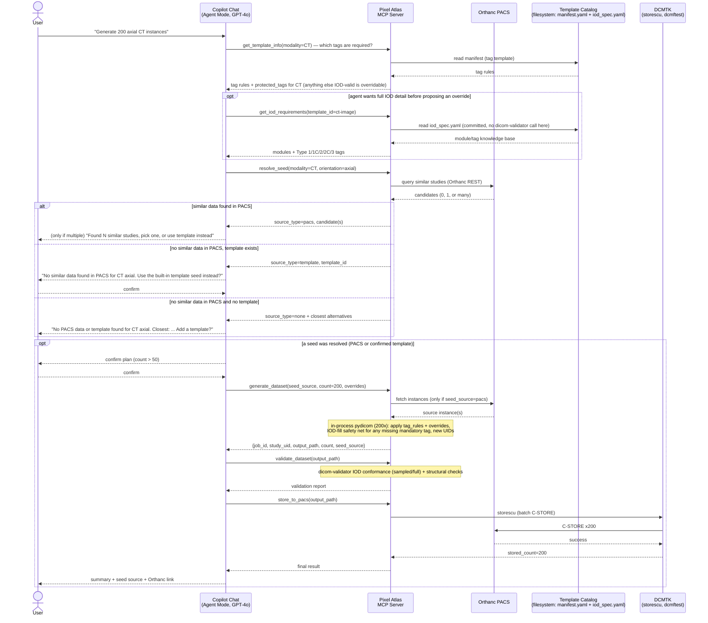

# Pixel Atlas Copilot Agent — Solution Design

Covers the use cases in [use-cases.md](use-cases.md). For component/deployment
architecture see [architecture.md](architecture.md).

## 1. Design Principles

1. **Tag templates describe requirements, not data.** A "template" is a
   specification of *which DICOM tags are required for a given modality/study type*
   (fixed, sequential, randomized, overridable) — not a full binary study to clone
   blindly. It is consulted on every request to plan and validate tag values,
   regardless of where the actual seed instance data comes from.
2. **PACS-first seed sourcing.** Before generating anything, the agent checks
   whether the PACS already contains similar data it can use as a cloning seed.
   Bundled template seed data is a **fallback**, used only when nothing similar
   exists in the PACS, and only after the user explicitly confirms. See
   [§3](#3-seed-resolution-pacs-first-template-fallback).
3. **Deterministic code does the bulk work.** Looping over N instances, rewriting
   tags in-process with pydicom, generating UIDs, and calling `storescu` happens as
   plain Python inside **one** MCP tool call. GPT-4o is never asked to reason about instance 1..200
   individually — this is both a correctness and a [token economy](#14-token--cost-economy)
   requirement.
4. **Non-destructive by default.** Generation always produces a new study, whether
   its seed came from the PACS or a template. Modifying an existing PACS study
   produces a new derived study unless the user explicitly confirms an in-place
   overwrite (see [UC-03](use-cases.md#uc-03--modify-or-clone-an-existing-pacs-study)).
5. **Validate before store.** Nothing reaches the PACS without passing conformance
   validation first.
6. **Fail loud on ambiguity.** If no similar PACS data and no template match exists,
   or an override tag/value is invalid, the agent stops and asks — it never
   silently substitutes.

## 2. High-Level Workflow

The five steps from the original brief, expanded into the actual execution pipeline
— note that the PACS is consulted for existing similar data **before** the template
catalog is ever used as a data source:

1. **User request** — natural language or a slash command in Copilot Chat (VS Code, Agent Mode, GPT-4o).
2. **Intent parsing & tag planning** — GPT-4o turns the request into a structured `GenerationPlan` (see [§5](#5-intent-parsing--tag-planning)), consulting the relevant tag template via MCP tools to learn which tags apply to this modality/study type (grounding context, not inlined into every prompt).
3. **Seed resolution (PACS-first, template-fallback)** — `resolve_seed` first searches the PACS for existing similar data; only if nothing similar is found does the agent ask the user to fall back to bundled template seed data. See [§3](#3-seed-resolution-pacs-first-template-fallback). No-match-anywhere branch → [§12](#12-no-match-handling).
4. **Generate/modify** — `generate_dataset` or `modify_dataset` clones the *resolved seed* (a PACS study or, on confirmed fallback, a template seed), rewrites tags in-process with pydicom per the tag template (plus an IOD-fill safety net for any mandatory tag still missing — see [§6.1](#61-layout)), and generates new UIDs, all inside one MCP call.
5. **Validate** — `validate_dataset` runs `dicom-validator`'s IOD conformance check + structural checks before anything is stored.
6. **Store to PACS** — `store_to_pacs` runs `storescu` (or Orthanc REST) against the configured PACS.
7. **Report** — the agent returns a compact summary (UIDs, counts, validation result, seed source used, PACS link) — never the raw per-instance data.



## 3. Seed Resolution (PACS-First, Template-Fallback)

`resolve_seed(modality, body_part?, orientation?, sop_class_uid?)` is the single
decision point that implements the PACS-first principle. It runs before any data is
generated or fetched in bulk.

**Matching criteria**, applied in order:

1. `modality` must match exactly — never substituted.
2. If the user specified `body_part` and/or `orientation`, candidates must match
   those too. If the user did not specify them, any body part/orientation for that
   modality counts as a candidate (ranked by how recently the study was stored).
3. Matching is done against PACS metadata already available via `C-FIND`/Orthanc
   REST (Modality, BodyPartExamined, StudyDescription, SeriesDescription,
   ImageOrientationPatient-derived label) — no pixel-level similarity is attempted
   in v1.

**Resolution outcomes:**

| Outcome | Agent behavior |
|---|---|
| Exactly one strong PACS match | Use it automatically as the seed. No extra confirmation beyond the standard large-batch threshold ([§4](#4-agent-command-reference)) — reusing real, already-trusted PACS data is the preferred path, not a risky one. |
| Multiple PACS matches | Present up to 5 candidates (StudyInstanceUID, description, date) and ask the user to pick one, or to use the template fallback instead. |
| No PACS match, a tag template exists for the modality | Explicitly tell the user no similar data was found in the PACS, and ask for confirmation before using the bundled template seed data. Generation does **not** proceed until the user confirms. |
| No PACS match, no tag template either | True coverage gap — report closest alternatives and the template-contribution path ([§12](#12-no-match-handling)). No generation happens. |

This resolution result (`source_type: pacs \| template \| none`, plus candidates) is
passed into `generate_dataset`/`modify_dataset` as the `seed_source` parameter once
the user has confirmed (where confirmation is required).

## 4. Agent Command Reference

Implemented as VS Code Copilot **prompt files** (`.github/prompts/*.prompt.md`),
invoked as slash commands inside the `Pixel Atlas` chat mode (see
[architecture.md §4](architecture.md#4-copilot-side-artifacts)). Natural language
without a slash command is also supported — the agent maps it to the same commands.

| Command | Syntax | Params | Underlying MCP tools | Example |
|---|---|---|---|---|
| `/generate` | `/generate modality=<CT\|MR\|US\|CR\|...> count=<n> [orientation=] [body_part=] [tag=value ...]` | modality, count, optional orientation/body_part/tag overrides | `get_template_info`, `resolve_seed`, `generate_dataset`, `validate_dataset`, `store_to_pacs` | `/generate modality=CT count=200 orientation=axial` |
| `/modify` | `/modify study=<StudyInstanceUID> [tag=value ...] [regenerate_uids=true\|false]` | source study, overrides, mutation mode (default `regenerate_uids=true`) | `list_pacs_studies`, `modify_dataset`, `validate_dataset`, `store_to_pacs` | `/modify study=1.2.3.4.5 Modality=MR` |
| `/validate` | `/validate study=<uid>` or `/validate path=<folder>` | target | `validate_dataset` | `/validate study=1.2.3.4.5` |
| `/status` | `/status [job=<job_id>]` | optional job id | `get_job_status`, environment health check | `/status job=job-7f3a` |
| `/list-templates` | `/list-templates [modality=] [body_part=]` | optional filters | `list_templates` | `/list-templates modality=MR` |

Every command that would create or overwrite more than a small threshold of data
(default: >50 instances, or any in-place PACS overwrite) requires one explicit user
confirmation before execution. Falling back to template seed data (§3) always
requires confirmation regardless of count.

## 5. Intent Parsing & Tag Planning

GPT-4o converts the user's request into a structured plan before any tool call that
mutates state. This keeps planning auditable and lets the MCP server validate the
plan mechanically instead of trusting free-form LLM output.

```jsonc
// GenerationPlan (conceptual schema, passed as generate_dataset's overrides + params)
{
  "modality": "CT",
  "orientation": "axial",
  "body_part": "CHEST",        // optional, narrows PACS/template match
  "instance_count": 200,
  "seed_source": {               // filled in by resolve_seed (§3), after any needed confirmation
    "type": "pacs",              // "pacs" | "template"
    "study_uid": "1.2.3.4.5"     // or template_id if type=template
  },
  "overrides": {                 // tag -> value, validated against the tag's VR and the template's protected_tags/IOD
    "PatientName": "DOE^JOHN",
    "PatientAge": "034Y"
  },
  "target_pacs": "orthanc-local",
  "regenerate_uids": true
}
```

Validation rules applied by the MCP server (not trusted to the LLM alone):

- `modality` must resolve to at least one tag template, or the plan is rejected with
  the no-match flow ([§12](#12-no-match-handling)).
- `seed_source` must be populated by a prior `resolve_seed` call — `generate_dataset`
  rejects a plan that names a template seed without a corresponding user
  confirmation flag having been set by the chat layer.
- Every key in `overrides` is checked against the template's `protected_tags`
  (§6.3) — tags the generator computes itself per-instance (sequence-derived)
  or always regenerates (Study/Series/SOPInstanceUID) — and against the
  target IOD's known tag list (`iod_spec.yaml`); a protected or unrecognized
  tag is rejected with an explicit error naming it. Any other IOD-valid tag
  may be overridden.
- Every override value is checked against its tag's VR (e.g. `DA`, `TM`, `PN`, `IS`,
  `AS`) before being applied in-process with pydicom.
- `instance_count` must be a positive integer; the chat surface warns and asks for
  confirmation above 50.

## 6. Template System

### 6.1 Layout

A "template" is **three distinct things**, not a full binary study:

1. `iod_spec.yaml` — a static, committed, human-reviewable knowledge base of
   what the DICOM standard itself requires for this IOD: every module
   (mandatory/conditional/user-optional) and, for mandatory/conditional
   modules, every tag with its Type (1/1C/2/2C/3), VR, and any
   machine-checkable condition. Generated once via
   `scripts/generate_iod_spec.py` (which reads `dicom-validator`'s own
   standard-derived data), then reviewed and committed like any other source
   file. **The MCP server's runtime code never imports `dicom-validator` to
   read this** — `iod_lookup.py` just loads the committed YAML, the same way
   `templates.py` loads `manifest.yaml`. `dicom-validator` itself is used in
   exactly two places: this one-time authoring script, and
   `validate_dataset`'s existing after-the-fact conformance check (§10) — never
   in the `/generate`/`/modify` runtime path.
2. `manifest.yaml` — generation-convenience fill defaults on top of that IOD:
   `fixed`/`sequence`/`randomized` tag rules. There's no separate
   allow-list field — `override_policy.py` derives `protected_tags` (the
   tags that can't be overridden) from `tag_rules.sequence` plus the fixed
   UID set; everything else valid for the IOD is overridable (§5).
3. `seed/IM0001.dcm` — pixel data and enough structure to be a loadable file.
   **Not** the source of tag-conformance truth (that's `iod_spec.yaml` +
   `manifest.yaml`) — replaceable with any other pixel-bearing file at any
   time. Only read when [seed resolution](#3-seed-resolution-pacs-first-template-fallback)
   finds nothing usable in the PACS and the user confirms the fallback.

Templates are organized primarily by **DICOM IOD**, not by use case: each
`<MODALITY>/<template_id>/` folder is the generic Image IOD for that modality
(e.g. CT Image IOD, MR Image IOD), covering the modules/tags the standard
itself requires. Use-case-specific templates (a chest-CT protocol, a
screening-mammography protocol, ...) are added later as sibling folders under
the same modality, layering their own `fixed`/`sequence`/`randomized` rules
(and, optionally, their own seed data) on top of the same IOD — they can
point at and reuse the IOD's existing `iod_spec.yaml` rather than
regenerating it:

```
templates/
  catalog.yaml                 # index of all tag templates, read by list_templates
  CT/
    ct-image/                  # CT Image IOD — generic, any body part/orientation
      iod_spec.yaml            # knowledge base: modules/tags this IOD requires/allows
      manifest.yaml            # fill defaults: fixed/sequence/randomized tag rules
      seed/
        IM0001.dcm             # pixel-data-only fallback, replaceable any time
  MR/
    mr-image/                  # MR Image IOD
      iod_spec.yaml
      manifest.yaml
      seed/
        IM0001.dcm
  US/
    us-image/                  # Ultrasound Image IOD
      iod_spec.yaml
      manifest.yaml
      seed/
        IM0001.dcm
  MG/
    mg-image/                  # Digital Mammography X-Ray Image IOD (For Presentation)
      iod_spec.yaml
      manifest.yaml
      seed/
        IM0001.dcm
```

`manifest.yaml` is consulted on **every** `/generate` request for that modality, to
know which tags to plan and validate. `iod_spec.yaml` is consulted by
`get_iod_requirements` (any time the agent needs to check a tag's
legitimacy/type against an IOD — including `/modify` validating a requested
edit against an existing PACS study's *actual* SOP Class) and by
`generate_dataset`'s fill-in-the-blanks safety net (§8). The `seed/` folder is
only ever read when `resolve_seed` (§3) determines the PACS has nothing
similar and the user has confirmed the fallback — most generations in a
mature environment should clone a PACS study and never touch `seed/` at all.

### 6.2 `iod_spec.yaml` schema

```yaml
sop_class_uid: 1.2.840.10008.5.1.4.1.1.2
iod_title: CT Image IOD
modules:
  - module: Patient
    ref: C.7.1.1
    usage: M                # M = mandatory, C = conditional, U = user-optional
    tags:
      - tag: "(0010,0010)"
        keyword: PatientName
        type: "2"            # 1/1C/2/2C/3 per PS3.3
        vr: PN
        vm: "1"
  - module: CT Image
    ref: C.8.2.1
    usage: M
    tags:
      - tag: "(0018,0060)"
        keyword: KVP
        type: "2"
        vr: DS
        vm: "1"
  - module: Contrast/Bolus
    ref: C.7.6.4
    usage: C
    condition: "Required if contrast media was used in this image"
    tags: [...]
  - module: Clinical Trial Subject   # "U" modules: listed for completeness,
    ref: C.7.1.3                    # tags omitted (never applicable to synthetic test data)
    usage: U
```
Full tag-level detail (including Type 3/optional tags) is included for every
`M`/`C` module; purely user-optional (`U`) modules are listed by name/ref only.
Regenerate with `python scripts/generate_iod_spec.py <sop_class_uid> <output_path>`
only when deliberately refreshing against a new DICOM standard edition —
review the diff by hand before committing.

### 6.3 `manifest.yaml` schema

```yaml
template_id: ct-image
iod_name: CT Image IOD             # documentary only — human/LLM-facing label
modality: CT
body_part: ""                      # "" at the IOD level = generic, any body part
orientation: ""                    # "" at the IOD level = generic, any orientation
sop_class_uid: 1.2.840.10008.5.1.4.1.1.2   # CT Image Storage
has_seed_data: true                        # false = tag spec only, no fallback binary bundled
seed_params:                               # optional — overrides for seed_builder.build_minimal_seed's
  include_frame_of_reference: true         # defaults (rows/cols/samples_per_pixel/photometric/bits_allocated/
                                            # include_frame_of_reference); omit entirely to accept all defaults
tag_rules:
  fixed:                    # applied to the seed unless overridden — this is where
                             # this IOD's mandatory non-pixel tags get their default values
    Manufacturer: "Pixel Atlas Synthetic"
    BodyPartExamined: CHEST
    KVP: "120"
    ImageOrientationPatient: ["1", "0", "0", "0", "1", "0"]
    PixelSpacing: ["0.7", "0.7"]
    # ... (every other Type 1/2 non-pixel tag this IOD needs — see the
    # committed manifest for the full list; a nested sequence tag's value is
    # a list of plain dicts, e.g. AnatomicRegionSequence's code item, which
    # generator.py converts to a real pydicom Sequence)
  sequence:                 # formula applied per generated instance i = 0..N-1
    InstanceNumber: "i + 1"
    SliceLocation: "start=-120.0, step=1.5"
    ImagePositionPatient: "derive_from(SliceLocation)"
  randomized:                # drawn from a bounded pool, never freeform PHI-shaped text
    PatientName: synthetic_name_pool
    PatientID: generate_synthetic_id
# No overridable_tags allow-list: any tag valid for this IOD may be
# overridden except this template's protected_tags — computed at runtime as
# {StudyInstanceUID, SeriesInstanceUID, SOPInstanceUID, MediaStorageSOPInstanceUID}
# plus this template's own tag_rules.sequence keys (here: InstanceNumber,
# SliceLocation, ImagePositionPatient) — see §5 and mcp-server/override_policy.py.
```

A tag template can exist with `has_seed_data: false` — useful for documenting a
modality's required tags before anyone has sourced an anonymized fallback sample for
it. In that case, if `resolve_seed` also finds no PACS match, the outcome is still
"no usable seed" (§3's last row), but `list_templates`/`get_template_info`/
`get_iod_requirements` can still tell the user which tags *would* be needed
once a seed exists.

### 6.4 `catalog.yaml`

A flat index the MCP server loads on startup (and can hot-reload) so `list_templates`
never has to walk the filesystem or ask the LLM "what templates exist":

```yaml
templates:
  - template_id: ct-image
    iod_name: CT Image IOD
    modality: CT
    body_part: ""
    orientation: ""
    path: CT/ct-image
    has_seed_data: true
  - template_id: mr-image
    iod_name: MR Image IOD
    modality: MR
    body_part: ""
    orientation: ""
    path: MR/mr-image
    has_seed_data: true
  - template_id: us-image
    iod_name: Ultrasound Image IOD
    modality: US
    body_part: ""
    orientation: ""
    path: US/us-image
    has_seed_data: true
  - template_id: mg-image
    iod_name: Digital Mammography X-Ray Image IOD (For Presentation)
    modality: MG
    body_part: ""
    orientation: ""
    path: MG/mg-image
    has_seed_data: true
```

### 6.5 Adding a new tag template

Two kinds of templates can be added:

- **A new IOD template** (a modality not yet covered, e.g. CR, XA): run
  `python scripts/generate_iod_spec.py <sop_class_uid> templates/<MODALITY>/<modality>-image/iod_spec.yaml`,
  review the output by hand, then write `manifest.yaml` (fill defaults for
  every Type 1/2 tag the spec lists, plus an optional `seed_params` block if
  this modality's pixel shape needs to differ from
  `seed_builder.build_minimal_seed`'s defaults — e.g. bit depth or a Frame of
  Reference module). Run `python scripts/generate_seed.py <template_id>` —
  one shared script for every modality, no per-modality script to write —
  then `generate_dataset` + `validate_dataset` end-to-end to confirm
  `iod_conformance.files_with_errors: 0`.
- **A use-case template extending an existing IOD** (e.g. a chest-CT or
  screening-mammography protocol): add a sibling folder under the same modality
  (e.g. `templates/CT/ct-chest-axial/`), reusing the IOD's existing
  `iod_spec.yaml` (same `sop_class_uid`, no need to regenerate), with its own
  `manifest.yaml` layering additional `fixed`/`sequence`/`randomized` rules
  (body part, orientation, protocol defaults), and its own seed data if
  needed.

Either way:

1. Generate or reuse `iod_spec.yaml` — this is what you read to know which
   tags `manifest.yaml` needs fill rules for.
2. Write `manifest.yaml` describing the fixed/sequence/randomized tag rules
   — this alone makes the modality plannable even before any seed data
   exists. No separate allow-list to author: any `tag_rules.sequence` keys
   are automatically protected from overrides (§5), everything else valid
   for the IOD is overridable by default.
3. If possible, obtain 1–3 representative instances for the modality/use case to
   use as fallback seed data, and confirm they contain **no real patient data** (run
   through an anonymizer first if sourced from any real system). Place them under
   `templates/<MODALITY>/<template_id>/seed/`.
4. Add an entry to `catalog.yaml`.
5. Run `/list-templates` to confirm the agent picks it up. If seed data was added,
   force a fallback test with a small count (e.g. 2 instances) via `/generate` and
   `/validate` the result before trusting it for larger generations.
6. A Test Data Administrator reviews the PR that adds the template (see
   [UC-07](use-cases.md#uc-07--handle-a-true-coverage-gap-no-pacs-match-and-no-template)).

## 7. UID & Identity Generation Strategy

- All generated UIDs are created under a dedicated, clearly-marked test OID root,
  e.g. `1.2.826.0.1.3680043.10.<ORG-ROOT>` — **placeholder**, to be replaced with the
  organization's actual assigned UID root (or a recognized test root) before first
  real use.
- Per generation job: one new `StudyInstanceUID`, one new `SeriesInstanceUID` per
  series requested, and one new `SOPInstanceUID` per instance, via
  `pydicom.uid.generate_uid(prefix=ORG_ROOT)` — applied regardless of whether the
  seed came from the PACS or a template, since generation is always non-destructive
  (§1.4).
- UIDs are derived deterministically from `job_id + index` so that **retrying a
  failed job reproduces the same UID set** instead of creating duplicates on a
  partial-failure retry (see [§15](#15-error-handling--rollback)).
- `modify_dataset` with `regenerate_uids=true` (default) always creates a fresh
  Study/Series UID set; `regenerate_uids=false` keeps the original UIDs and is only
  used for explicit in-place edits.

## 8. Generation Execution Detail (`generate_dataset`)

Runs entirely inside the MCP server process, as one tool call, starting from the
seed resolved in §3:

```
1. Load tag template (manifest.yaml) for the modality, and its iod_spec.yaml
   knowledge base (§6.1/§6.2)
2. Load seed instance(s):
     if seed_source.type == "pacs":  fetch instance(s) from PACS (C-GET/REST)
     if seed_source.type == "template": load from templates/<modality>/<id>/seed/
3. Create job_id, register job as "running" in the in-memory job registry
4. new_study_uid, new_series_uid = generate_uid(job_id)
5. for i in range(instance_count):
     new_sop_uid = generate_uid(job_id, i)
     clone seed instance in-memory (pydicom Dataset.copy())
     apply tag_rules.fixed
     apply tag_rules.sequence (evaluated with i)
     apply tag_rules.randomized (drawn once per job, reused per PatientID-level tags)
     apply user overrides (already validated against the tag template, §5)
     fill-in-the-blanks safety net: for any unconditional Type 1/Type 2 tag in
       iod_spec.yaml still missing a value, set it empty (Type 2) or raise a
       clear error naming it (Type 1) — catches a manifest gap at generation
       time instead of only via validate_dataset's after-the-fact check
     write StudyInstanceUID/SeriesInstanceUID/SOPInstanceUID + dataset to
       staging/<job_id>/IM{i:04d}.dcm
6. mark job "generated", return {job_id, study_uid, output_path, count, seed_source}
```

All tag rewriting above is done in-process with pydicom (plain `setattr` calls,
not a `dcmodify` subprocess) — see `mcp-server/generator.py`'s module docstring
for why: same end result, without per-instance/per-tag subprocess overhead.

## 9. Modify-Existing Workflow Detail

1. Resolve the source: an explicit `StudyInstanceUID`, or a `list_pacs_studies`
   lookup (via the Orthanc REST API) by modality/date/patient if the
   user described the study rather than naming a UID. (This is a direct, user-named
   lookup, not the similarity search in §3 — the user already knows which study
   they want to modify.)
2. Fetch instances into a local staging folder (`C-GET`/`C-MOVE`, or Orthanc REST
   `/studies/{id}/archive` if talking to Orthanc directly).
3. Run the same tag-rewrite pipeline as generation (§8), starting from the fetched
   instances.
4. If `regenerate_uids=true` (default): new Study/Series/SOP UIDs → stored as a new,
   independent study.
   If `regenerate_uids=false`: original UIDs retained → stored as an overwrite of the
   existing study, gated behind an explicit user confirmation restating that this is
   destructive.
5. Validate, then store — identical to the generation path from this point.

## 10. Validation Strategy

`validate_dataset` runs three layers of checks and returns one aggregated report:

| Layer | Tool | What it checks |
|---|---|---|
| IOD conformance | `dicom-validator` (PyPI; not `dciodvfy`/DCMTK — see `mcp-server/validator.py`'s docstring for why) | Required/conditional tags per SOP Class, VR/VM correctness, type-1/2/3 presence rules |
| Cross-instance structural checks | `pydicom`-based custom checks | StudyInstanceUID/SeriesInstanceUID identical across the set, SOPInstanceUID uniqueness, InstanceNumber monotonicity, PatientID consistency, PixelData present and non-empty |
| PACS round-trip (post-store only) | Orthanc REST | Instance count returned by Orthanc's REST API matches the count stored |

**Sampling policy** (token/runtime economy): for `instance_count <= 50`, validate
100% of instances. For larger sets, validate the first 5, last 5, and a random
sample of 20 (or 10% of the set, whichever is larger), plus 100% of the
cross-instance structural checks (which are cheap and catch systemic errors, not
per-instance ones). The report states the sampling ratio used so the user can ask
for a full validation explicitly if needed.

The report returned to the chat is a compact summary (pass/fail counts per layer,
up to 5 example errors) — never a full per-instance dump.

## 11. Store-to-PACS Strategy

- Default path: `storescu` batch C-STORE against a configured PACS AE (host/port/AE
  title read from a local, non-secret config file, e.g. `orthanc-local` pointing at
  `localhost:4242`).
- Alternative path (when talking to Orthanc specifically): Orthanc REST API
  multipart upload, useful when C-STORE is blocked by network policy.
- Partial failure handling: `store_to_pacs` reports `stored_count` and
  `failed_count` with the list of failed SOPInstanceUIDs; a retry re-attempts only
  the failed subset (idempotent thanks to deterministic UIDs, §7).
- After store, a lightweight Orthanc REST count check confirms the PACS actually
  has the expected instance count (feeds the validation report, §10).

## 12. No-Match Handling

Two distinct situations reach the user differently — both start from
[`resolve_seed`](#3-seed-resolution-pacs-first-template-fallback):

**A. No similar PACS data, but a tag template exists (the common fallback case):**

1. `resolve_seed` returns `source_type=template`.
2. The agent explicitly states that no similar data was found in the PACS for the
   requested modality/body part/orientation.
3. The agent asks whether to proceed using the bundled template seed data.
4. Generation proceeds only after explicit confirmation; declining ends the request
   without any PACS or filesystem changes.

**B. No similar PACS data and no tag template either (true coverage gap):**

1. `resolve_seed` returns `source_type=none`.
2. The agent **never falls back to a different modality silently**.
3. The agent surfaces the closest available alternatives — matched on modality
   first, then body part, then orientation — drawn from both existing PACS data and
   the template catalog.
4. The agent explains the template-contribution path (§6.5) and offers to leave a
   short note (e.g. a checklist comment or issue) so a Test Data Administrator can
   prioritize adding it — filing that issue is itself confirmed with the user first,
   per the risky-actions policy (this is a repo-visible action).

## 13. Status & Observability

- Every job is tracked in an in-memory (v1) job registry keyed by `job_id`, with
  state `queued | resolving_seed | running | generated | validating | storing |
  completed | failed`, a progress percentage, and a short message.
- `get_job_status` returns this record; `/status` with no job id runs a lightweight
  environment health check (MCP server reachable, DCMTK binaries resolvable on
  PATH, PACS reachable via C-ECHO) — useful for diagnosing prerequisite problems
  without regenerating anything.
- All tool invocations are appended to a local log file
  (`.pixel-atlas/logs/agent.log`) with timestamp, tool name, input summary (not raw
  PHI-shaped values), and result — including which seed source (`pacs`/`template`)
  each job used — this is the audit trail referenced in the non-functional
  requirements.

## 14. Token & Cost Economy

Concrete techniques, mapped to where they apply:

| Technique | Where |
|---|---|
| Bulk operations run as one deterministic MCP tool call, not N LLM turns | `generate_dataset`, `modify_dataset` (§8, §9) |
| PACS-first sourcing avoids a template-fallback confirmation round-trip in the common case (similar data usually already exists once the PACS has a healthy history) | §3 |
| MCP tool responses return summaries/paths/UIDs, never raw tag dumps or pixel data | All tools |
| Template catalog pre-indexed in `catalog.yaml`; `list_templates` reads it directly instead of the model reasoning over the filesystem | §6.4 |
| Chat mode scopes the toolset to only the Pixel Atlas MCP tools + minimal file tools, shrinking the per-turn tool-schema overhead vs. default Agent Mode with all extensions enabled | [architecture.md §4](architecture.md#4-copilot-side-artifacts) |
| `.github/copilot-instructions.md` (included on every request) is kept short; verbose tag/module tables live in per-template `manifest.yaml`/`iod_spec.yaml`, fetched only when a template is actually in play | §6.2, §6.3 |
| Single confirmation for an entire batch (UC-08), not one per item | [use-cases.md UC-08](use-cases.md#uc-08--bulkmulti-study-generation-for-a-test-suite) |
| Validation reports are capped (e.g. 5 example errors) with sampling for large sets instead of full per-instance reports | §10 |
| Binary DICOM content never passes through the chat context — MCP tools operate on filesystem paths / PACS UIDs only | All tools |

## 15. Error Handling & Rollback

- In-process pydicom tag-rewrite errors and `storescu` subprocess failures (exit
  code + stderr) are both captured, surfaced in `get_job_status`, and the job is
  marked `failed` rather than partially reported as success.
- Because UIDs are deterministic per `(job_id, index)` (§7), retrying a failed job
  with the same `job_id` is idempotent: already-stored instances are detected (via
  an Orthanc REST lookup) and skipped, only the failed subset is retried.
- A job that fails before any `store_to_pacs` call leaves the PACS untouched; the
  staging directory is retained for inspection until the user cleans it up or a
  retention policy (future work) prunes it.

## 16. Security, Privacy & Compliance

- Template seed data must be pre-anonymized before being added to the catalog
  (§6.5); the agent's randomized tag pools (§6.3) only ever produce
  synthetic-looking values (e.g. `DOE^JANE`, sequential `PatientID`s from a reserved
  test range) — this applies whether the seed came from a template or a PACS study.
- v1 targets a local/dev-network PACS only (Orthanc on localhost, per
  [orthanc-setup.md](orthanc-setup.md)); no data leaves the developer's machine
  except the natural-language prompt/plan text sent to the Copilot/GPT-4o backend —
  tag *values* and plans, never DICOM binaries, ever cross that boundary.
- Destructive actions (in-place PACS overwrite, filing an issue) always require an
  explicit user confirmation, consistent with the broader risky-actions policy.

## 17. Testing Strategy for the Agent/Tooling

- **MCP tool unit tests**: each tool (`resolve_seed`, `list_templates`,
  `generate_dataset`, etc.) tested directly against fixture templates and a mocked
  PACS, independent of Copilot/GPT-4o.
- **Golden template regression tests**: for each template in the catalog, a
  small (e.g. 3-instance) fallback generation + validation run is part of CI to
  catch manifest regressions.
- **Contract tests against Orthanc**: a docker-based test spins up Orthanc, seeds it
  with a known study, exercises `resolve_seed` (expecting a PACS hit),
  generates + stores + re-queries a small study to verify the full pipeline
  end-to-end without involving the LLM at all.
- **Prompt-level smoke tests**: a short, manually-run checklist of representative
  chat prompts (one per command, including both the PACS-hit and template-fallback
  branches) to confirm intent parsing + confirmation gating behave as designed; not
  automated in v1 since it requires a live Copilot session.

## 18. Open Questions / Future Enhancements

- Persistent (cross-restart) job registry if generation jobs need to survive an MCP
  server restart (v1 accepts in-memory only).
- Template versioning/migration story as manifests evolve.
- Richer PACS similarity matching (e.g. pixel/series-level similarity) beyond
  metadata matching (§3), if metadata-only matching proves too coarse in practice.
- Headless/CI invocation path — see [architecture.md §9](architecture.md#9-extensibility--path-b-hosted-copilot-extension).
- Configurable retention/cleanup policy for the local staging directory.
